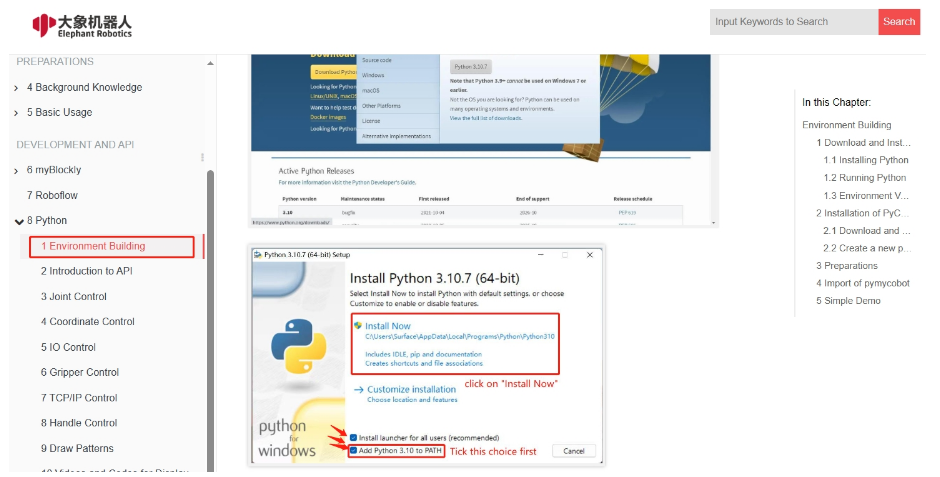
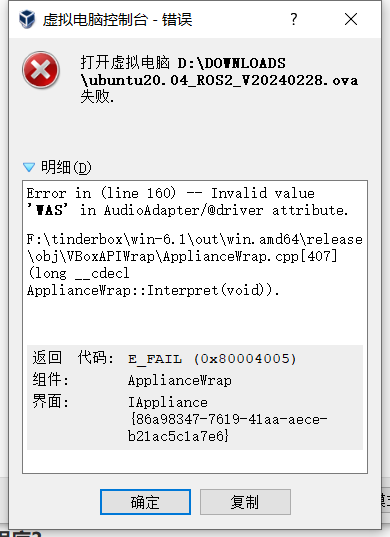
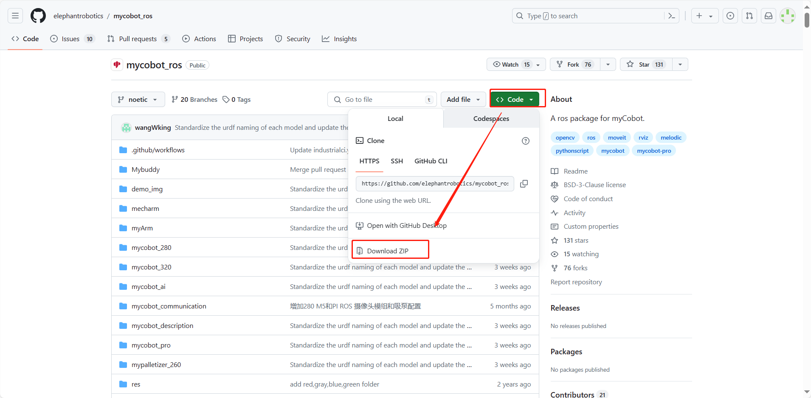
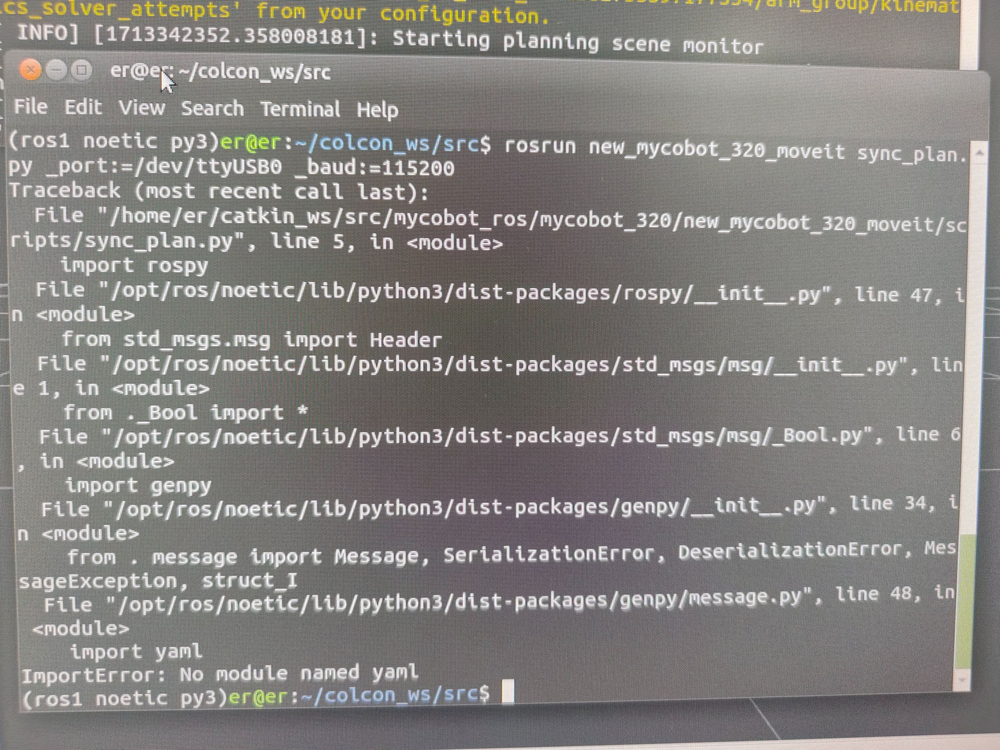
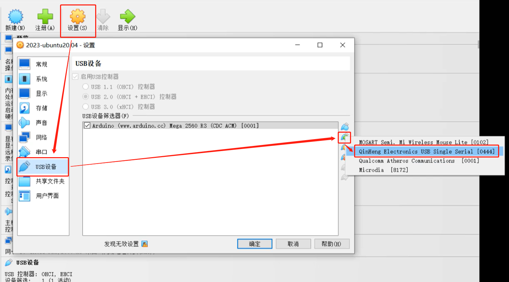

# Software Issues

## 1 myStudio related

**Q: What is myStudio?**
- A: It is our company's self-developed software. It is a tool for burning or modifying the firmware of the existing robotic arms launched by our company.

**Q: What is the method for troubleshooting the abnormal download of minirobot, Atom, and PICO firmware?**

1. Check whether the network connection is normal. During the firmware download process, you need to connect to the network first to download the firmware.

2. Check whether the line has been connected. The details are as follows:
In the M5/Arduino series machine, when burning the Atom firmware, you need to use a USB cable to connect the Atom interface at the end to the USB port of the computer; when the M5 series machine is burning the nimirobot firmware, use a USB cable to connect the side interface of the M5stack to the USB port of the computer. When the 320M5 machine is burning the PICO firmware, you need to use a USB cable to connect the PICO interface of the base to the USB port of the Raspberry Pi.

3. Select the firmware of the corresponding model, and don't choose the wrong model.

4. Download and install the driver. If it still cannot be recognized after downloading the driver, try to replace the latest [ch340 driver](https://www.wch.cn/download/CH341SER_EXE.html). If the port number still cannot be displayed after installing the driver and the system is a win11 model, try [How to install the CH340 driver in Win11 system](https://blog.csdn.net/m0_52242552/article/details/126219464).

5. Try to change a USB cable, USB port or computer to download it to avoid abnormal firmware download caused by the cable not having data transmission function.

6. Uninstall mystudio and reinstall mystudio in a non-C drive location, such as installing mystudio in the D drive. When mystudio is installed in the C drive, the file permissions are relatively strict, and the firmware may not be burned.

**Q: Why does the device not work properly after I burn the firmware to the ATOM terminal?**
- A: The firmware of the ATOM terminal needs to use our factory firmware. Other unofficial firmware cannot be changed during use. If the device accidentally burns other firmware, you can use "myCobot firmware burner" to select ATOM terminal-select serial port-select ATOMMAIN firmware to burn the ATOM terminal.

**Q: Can the drag teaching in the firmware record the gripper action?**
- A: It is temporarily impossible to use drag teaching to record the gripper action, because the gripper belongs to joint number 7, and our drag teaching can only record and play the movement of joints numbered 1-6.

**Q: Why can't drag teaching be performed after burning the minirobot firmware? **
- A: First check whether the M5Stack-basic firmware and atom firmware are burned, whether the burned firmware corresponds to the requirements to be implemented, and whether the burned firmware is the latest version of the firmware.
- It is recommended to burn the minirobot firmware to version v2.1 and the top atommain firmware to version v4.1 and above (need to support mystudio version v4.3.1 and above).

**Q: What should I do if mystudio cannot recognize the serial port of mycobot?**
- A: If your computer device does not prompt the connected robot arm, please install the serial port driver first.
- In addition, it should be noted that the Raspberry Pi, Arduino and Jetson nano series robot arms are **cannot be connected to the laptop using a data cable**, and you need to use mystudio in the built-in system to burn the firmware.

**Q: Can I save the trajectory recorded by dragging teaching to the card?**

- A: Currently, it cannot be saved to the memory card. And dragging teaching can only save one path at a time, and the next recording will overwrite the previous action.

## 2 myblockly related

**Q: What should I do if I encounter the error message: ModuleNotFoundError: No module named "pymycobot"?**


- A: The error message indicates that the pymycobot file is missing. For the reasons and solutions, please refer to the following 3 points:
①If pymycobot is not installed or pymycobot fails, the corresponding solution is to reinstall pymycobot. The command is pip3 install pymycobot --upgrade --user
②For M5 or AR series machines, please note that the "Add Pythonxx to" option in the figure below is not checked during the installation of Python. PATH", you need to uninstall python and reinstall python, and check this option



③If it is an M5 or AR series machine, please confirm whether there are multiple python versions in the PC. It is recommended to uninstall all python versions in the PC and reinstall a python version above 3.8. Note that there is only one python version above 3.8 in the PC. If multiple python versions are actually required, please specify the python version used by pymycobot and specify the python version when calling the pymycobot library

**Q: Cannot click to run myblockly, how to solve it?**

This is because the serial port is occupied and the run button cannot be clicked. You need to check whether the serial port tool of myblockly and other serial ports are occupied. If you want to run the code, you need to close the button in the figure below before clicking run.
You can only run after closing the serial port tool, otherwise there will be a serial port conflict.


**Q: Why is the connection rejected when selecting a certain com port? Or how to find the corresponding com port?**


The reason for the connection rejection is due to the wrong com port selection. When you have multiple devices connected to the computer USB, multiple serial ports will be displayed in myblockly, such as com4 and com5 in the above picture, but only one of them is the robot arm. You need to select the serial port of the robot arm to connect and use the robot arm normally. Obviously, com4 that can be connected normally is the serial port number corresponding to the current robot arm.
Regarding how to find the serial port corresponding to the robot arm among multiple serial ports, the corresponding method is: try to unplug and plug the serial port cable connected to the robot arm, and check which serial port number disappears in the serial port number option of myblockly after disconnecting the USB connection between the robot arm and the computer. When the USB is used again to connect the robot arm to the computer, this serial port number appears in the serial port number option of myblockly. The serial port number that disappears and reappears in myblockly synchronously with the disconnection and connection of the robot arm and the computer is the serial port number corresponding to the robot arm.
Note that the options for the robot arm's com port number are not always fixed. They may change when connected to different USB ports of different computers or different USB ports of the same computer. It is recommended to view the real-time com port number using the above method.

**Q: What should I do if myblockly's express delivery mobile tool cannot display the real-time angle?**

- A: This is generally caused by incorrect selection of device serial port information and abnormal pymycobot. It is recommended to troubleshoot according to the "First Use Self-Check" solution in this article. If the robot arm cannot be controlled normally, please try to update pymycobot. The corresponding update solution is to enter the command `pip install pymycobot --upgrade --user` in cmd or terminal.
Finally, if it still cannot be controlled normally, please try to update the myblockly software. Please refer to the following link for the update method:
https://drive.google.com/file/d/1yBWzhbSBUYsZPBl7PBdZKRwk3al71Dc7/view?usp=sharing

**Q: The result of running the program shows child process exited with code 1. Is it normal?**

- A: This is not an error. All programs have finished running and returned the binary number 1. It means that all have run successfully.

**Q: How to preset the code block content in myblockly, including the model, baud rate and other information after entering the system, which are all corresponding to the connected model?**

- A: Currently, the default model for the first startup in myblockly is mycobot and the baud rate is 115200. There is no way to change the initial baud rate for the time being, but you can make and save an initialization json file yourself. Load this file after entering myblockly next time to get the preset code block.
For the method of making and saving json files, please refer to the following: https://drive.google.com/file/d/1g_dd933TK1tptnisUad4PBfwSRsWWFeQ/view?usp=sharing

## 3 RoboFlow related

**Q: What should I do if I cannot download the Roboflow software and Roboflow cannot control the machine normally?**

- A: Currently, Roboflow software only supports the two Pro professional collaboration models 600/630, and no longer supports mycobot collaborative models or other models. The recommended control methods for mycobot series machines are myblockly, python and ros. It is worth mentioning that myblockly is a software with a similar graphical interface to Roboflow. If you need to use visual graphical programming, you can give priority to using myblockly software.
	​				
## 4 Python related

**Q: The running prompt shows that the library file is missingQ: The error message: ModuleNotFoundError: No module named "pymycobot", how to deal with it?**

- A1: Pymycobot is not installed. The corresponding solution is to reinstall pymycobot. The command is `pip3 install pymycobot --upgrade --user`

- A2: During the installation of Python, the "Add Pythonxx to PATH" in the figure below was not checked. You need to uninstall Python and reinstall Python, and check this option.

- 

- A3: If it is an M5 or AR series machine, please confirm whether there are multiple Python versions in the PC. It is recommended to uninstall all Python versions in the PC and reinstall a version higher than Python 3.8. Note that there is only one Python version higher than Python 3.8 in the PC. If multiple python versions are needed for actual use, please specify the python version used by pymycobot and specify the python version when calling the pymycobot library.

- A4: It is recommended to use version 3.9 of pyhton, as pyhton12 will be incompatible.

**Q: Why does coordinate control sometimes fail to respond after writing coordinates?**

1. Delays are required before and after joint movement to ensure that the robot has enough response time

2. Coordinate movement must first ensure that the coordinate can be reached through joint movement. Generally, the coordinate value is read after the joint moves to the specified point for control. Most of the manually written coordinates are invalid. It is recommended not to write the coordinates directly by yourself, but to release the joint and manually rotate the joint to the target position, use get_coords() to record the target position coordinates, and then use send_coords() to set the coordinates

You can refer to the following code:

```python
# Import the official python API
from pymycobot import MyCobot320
# Import the time module
import time

# Set the serial port connection, serial port, baud rate
# PI version
mc = MyCobot320('/dev/ttyAMA0', 115200)
# M5 version, the specific serial port number needs to be checked in the device manager
mc = MyCobot320('COM0', 115200)
# Set a short waiting time, 0.5 seconds
time.sleep(0.5)
# Release all joints of the robot arm, please hold the robot arm with your hands
mc.release_all_servos()
# Set the waiting time, which can be changed as needed. At this time, the robot arm can be moved to the target position.
time.sleep(5)
# Re-power the robot arm and fix it at the target position
mc.power_on()
# Read the coordinate information and angle information of the current position and output them to the console
print('coords:', mc.get_coords())
print('angles:', mc.get_angles())

```

**Q: Is there a more popular explanation of the mode in send_coords(coords, speed, mode)?**

- A: Linear 1 means that the end of the robot reaches the target position in a straight line. If it cannot go in a straight line due to limit, structure, etc., the instruction will not be fully executed;
Linear 0 means that the end reaches the target position in an arbitrary posture. Since there is no straight line restriction, it is not easy for the instruction to not be executed.

**Q: What is the difference between the interpolation and refresh modes of set_fresh_mode(mode)?**

- A: Interpolation 0 means that many dense points are planned between the starting point and the end point, so as to achieve the effect of controlling the middle segment trajectory.
How to achieve the effect of program parallelism: Non-interpolation 1 means that there is no planning of the middle segment, and the trajectory cannot be controlled, but the movement will be relatively smooth.

**Q: When only the Z axis is changed, the trajectory is not straight up and down, but the final landing point is that only the Z axis is changed. Is this normal? How to ensure that the middle trajectory is also a straight line?**


- Turn on interpolation and walk in a straight line to ensure the trajectory
```python
set_fresh_mode(0) # Turn on interpolation
send_coords(coords, speed, mode=1) # Walk in a straight line
```

Note that the intelligent planning route set in send_coords will only be useful after interpolation is turned on.
Interpolation means that many dense points are planned between the starting point and the end point, so as to achieve the effect of controlling the trajectory of the intermediate segment.
Non-interpolation means that there is no planning of the intermediate segment and the trajectory cannot be controlled.

**Q: What does the return value of get_error_information() of -1 mean?**

- A: The return value of `get_error_information()` is -1, indicating that communication is not possible. You need to check whether the power adapter and USB cable are connected, and whether the LCD screen stays on the Atom: ok interface. If the line is not connected successfully and does not display ok, communication abnormalities will occur. You need to reconnect and test again.

**Q: The drawing case using the 280 machine found that the shape trajectory is not very straight. Can it be optimized?**

- A1: It is normal to get a deviation in the trajectory when using a signature pen and hard stationery to use this drawing case. There are two main reasons for this deviation. First, because mycobot uses a servo motor, there is a certain accuracy deviation (if it is a machine that has been used for a long time, due to the aging of the joints, the deviation of its joints will be greater). Second, when using a hard pen to draw, the contact distance with the desktop is relatively demanding. If the distance is too high, the trajectory is prone to interruption. If the distance is too low, the pen tip resistance will be too large and stuck, so the drawing effect is not ideal. It is currently recommended to use soft stationery for painting, such as brushes and other tools, which will help improve the painting effect.

- A2: In addition, you can change the robot's motion mode to interpolation mode, so that the motion trajectory will be relatively straight.

```python
set_fresh_mode(0) # Enable interpolation
send_coords(coords, speed, mode=1) # Go in a straight line
```

Note that the intelligent planning route set in send_coords will only be useful after interpolation is enabled.
Interpolation means that a lot of dense points are planned between the starting point and the end point to achieve the effect of controlling the middle segment trajectory.

**Q: The target position identified cannot be reached at the end. How to determine whether this coordinate can be reached and then processed?**

- A: solve inv kinematics(target coords, current_angles) Use this interface to see if there is a solution.
solve_inv_kinematics(target_coords, current_angles)
- Function: Convert coordinates to angles.
- Parameters:
- target_coords: list A floating point list of all coordinates.
- current_angles: list A floating point list of all angles, the current angle of the robot
- Return value: list A floating point list of all angles.

## 5 ROS related

**Q: Is there a virtual machine image with a configured environment?**

- A: We have provided a virtual machine environment with configured ROS1 and ROS2 environments and built-in ROS source code. Users can download it through the following link and import the virtual machine file into VirtualBox, saving the trouble of configuring the environment by themselves. When testing ROS cases, it is recommended to use the virtual machine environment we have configured for verification to avoid some case operation errors due to environmental configuration reasons
Please refer to the operation steps video of importing virtual machine files into virtual machine software: https://drive.google.com/file/d/1KeYk_CUgDE46rVn7zbd0EhraIbgt3qZt/view?usp=sharing

[ROS1 virtual machine file download](http://download-elephantrobotics.oss-cn-shenzhen.aliyuncs.com/system_images/ubuntu20.04_ROS1_V20230731.ova.zip)

[Download ROS2 virtual machine file](https://download-elephantrobotics.oss-cn-shenzhen.aliyuncs.com/system_images/ubuntu20.04_ROS2_V20240228.zip)

[Download virtual machine software VirtualBox](https://www.virtualbox.org/wiki/Downloads)

**Q: How to deal with the error when importing ROS2 virtual machine file?**



- A: This is because the version of the virtual machine software Oracle VM VirtualBox is too low, and the virtual machine software version needs to be updated.

**Q: How to re-download the ROS source code package?**

- A: Use the command to pull:

```bash
git clone https://github.com/elephantrobotics/mycobot_ros.git
```

Or download manually. The download method is to enter the ROS source code package address and follow the steps below. Source code package address: https://github.com/elephantrobotics/mycobot_ros



**Q: What should I do if I get an error ImprotError: No module named yaml when running the ROS moveit case?**



- A: In the first line at the beginning of this script, change the Python interpreter to python3

**Q: What should I do if I can't find the serial port when running the virtual machine?**

- A: Use a USB cable to connect the M5 robot to the PC, open the virtual machine settings → USB device → Add USB device → Select the serial port number QinHeng xxxxx, which is the serial port device of the machine.
If there is no such device number, you can get the corresponding USB device number by re-plugging the device. The serial port number that changes after plugging and unplugging is the corresponding machine serial port device number



**Q: Use a mujoco-based environment for simulation training, so the robot's xml file is required**

- A: Currently, there is only the 280JN xml file on GitHub: [280JN](https://github.com/elephantrobotics/mycobot_mujoco)
- Provide customers with methods on how to convert dae and urdf files into xml files, and let them use [meshlab to convert them themselves]([https://blog.csdn.net/qq_43309940/article/details/128292151?spm=1001.2101.3001.6650.1&utm_medium=distribute.pc_relevant.none-task-blog-2defaultCTRLISTRate-1-128292151-blog-131092562.235^v38^pc_relevant_yljh&depth_1-utm_source=distribute.pc_relevant.none-task-blog-2defaultCTRLISTRate-1-128292151-blog-131092562.235^v38^pc_relevant_yljh&utm_relevant_index=2).

**Q: When the terminal switches to ~/catkin_ws/src and uses git to install and update mycobot_ros, the target path "mycobot_ros" already exists. What is the reason?**
- A: This means that there is already a `mycobot_ros` package in `~/catkin_ws/src`. You need to delete it in advance and then re-execute the git operation.

**Q: When rosrun is running, the terminal reports an error message `counld not open port /dev/ttyUSB0: Permission: '/dev/ttyUSB0'`, why?**

- A: The serial port permissions are insufficient. Enter `sudo chmod 777 /dev/ttyUSB0` in the terminal to grant permissions.

**Q: When rosrun is running, the terminal prompts `Unable to register with master node [http://localhost:11311]: master may not be running yet. Will keep trying`. Why?**

- A: Before running the ros program, you need to open the ros node. Enter `roscore` in the terminal.

**Q: When rosrun is running, the terminal reports an error message `counld not open port /dev/ttyUSB0: No such file or directory: '/dev/ttyUSB1'`, why?**

- A: The serial port is incorrect. You need to confirm the actual serial port of the current robot. You can check it through `ls /dev/tty*`.

## 6 C++ related

**Q: How to deal with various dll files that cannot be found?**

- A1: If myCobotCpp.dll is missing, put the myCobotCpp.dl previously placed in the lib directory into the directory where mycobotcppexample.exe is located.
- A2: If QT5Core.dll is reported missing, open qt command (search QT in the menu bar), select msvc2017 64-bit, and execute windeployqt--release the directory where myCobotCppExample.exe is located (such as: windeployqt --release D:lvs2019myCobotCpploutlbuildlx64-Releaselbin) After executing the command here, if the vs installation path cannot be found, please check the settings of the vs environment variables.

After executing the above steps, if the qt5serialport.dll file is reported missing, move this file in the gt installation directory (path such as: D:lgt5.12.1015.12.10msvc2017 64bin), copy it to the directory where myCobotCppExample.exe is located

**Q: Generate the myCobotCppExample.exe executable file, what could be the problem?**

Select Start in the figure below

