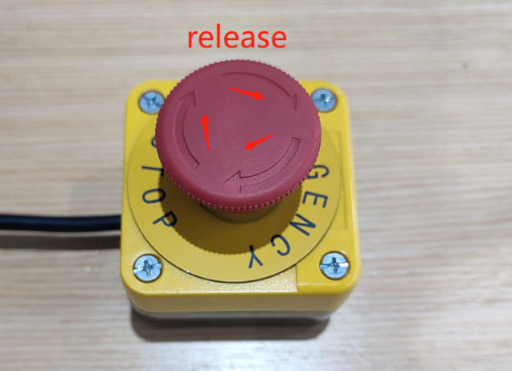
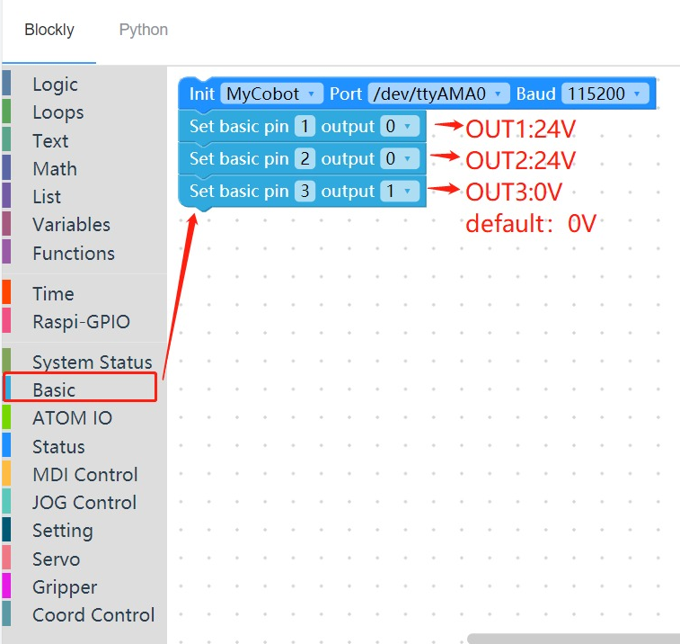
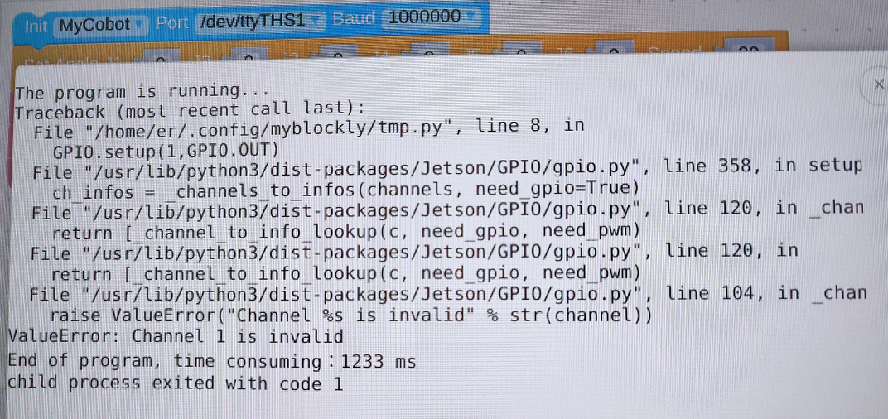

# Questions about the Structure

Q1:  What are the maximum angle of Joint 1 and Joint 6 of myCobot 320 M5?

A1:

| Joint | mino  | maxo  | max speedo /s| max accelerationo/s2|
| ----- | ---- | ---- | ------------ | ------------ |
| J1    | -170 | 170  | 150          | 200          |
| J2    | -120 | 120  | 150          | 200          |
| J3    | -148 | 148  | 150          | 200          |
| J4    | -120 | 135  | 150          | 200          |
| J5    | -169 | 169  | 150          | 200          |
| J6    | -180 | 180  | 150          | 200          |

Q2: What controls the six steering engine?

A2: They are controlled by Atom at the top of the robot.

Q3: What functions Atom performs?

A3: It serves to control the robot by algorithm, such as forward, inverse kinematics and coordinate switching. Atom is temporarily not open-sourced.

# Questions about the Communication

**Q1: Why the screen has no display although the robotic arm has been connected with HDMI cable? Does it need to download a port driver?**

A1: Check whether the connection is correct and the power has been turned on. Try to use another interface and plunge into the interface stably. There is no need to download a port driver.

**Q2: What are the versions of communication interface supported by different robotic arms?**

A2: The robotic arms of micro-processor supports TCP communication, and the robotic arms of micro-controller supports USB-port communication.

**Q3: How much is the frequency of the communication of robotic arm?**

A3: 10-20Hz.

**Q4: The M5 screen is not displaying anything. How can this issue be resolved?**

A4: 
   1. Check the connection between the power adapter and the device. Try unplugging and re-plugging the power adapter.
   2. Gently press the corners of the screen to ensure proper contact between the M5stack and the internal expansion board.
   3. Refer to the gitbook and download the corresponding minirobot firmware.
   4. For the 280m5 model from 2021, it is recommended to flash AtomMain2.8 with basic1.0 firmware.  

# Questions about Parameters

Q1: What's the unit of measurement of the speed of robotic arm?

A2: 180°/s.

# Solutions to Hardware Problems

**Q1: How to deal with the shaking of robotic arms?**

   **Step 1:** Burn the latest version of ATOM via myStudio.

   **Step 2:** Upgrade pymycobot. Click on Win+R, and type cmd to enter in the terminal. Type `pip install pymycobot --upgrade --user` and then press on Enter Key.

   **Step 3:** Go to [GitHub](https://github.com/elephantrobotics/pymycobot/tree/main/demo) to download pid_read_write.py. Reset each parameter of the steering engine according to the prompt message. And then, operate the system again.

   **Notice:  Set the parameters according to the data given in the pictures below.**

**Q2: How to resolve the issue when the joints cannot be locked after powering up the robotic arm?**

A: 
   1. Check if the original power adapter is connected and if it is properly plugged in. Try unplugging and re-plugging the power adapter.

   2. Check if the joints can move freely when powered off and if there are any excessive resistance or lack of resistance issues. Preliminary assessment can determine if there are any internal structural fractures. If no physical fractures are found, proceed with further checks.  
   3. For 320 series products, ensure the emergency stop switch is in the released position. Joints can only function properly when the emergency stop switch is released. If the emergency stop switch is in the stopped position (pressed), the device cannot be powered on or communicate normally. Turn the switch clockwise to release it.

   4. Check the Atom firmware using the following methods:  
   Under normal circumstances, the robotic arm will self-lock and the Atom will light up in green after powering on, as shown in the following image (note that mechArm does not display any light status).

If the Atom does not light up green or the joints do not self-lock, follow these steps for troubleshooting:  
- Gently press the Atom screen to ensure proper contact between Atom and the internal components of the robotic arm.
- Download the corresponding Atom firmware using Mystudio, please refer to the instructions in the Gitbook for using Mystudio. When downloading, ensure that the model and version information matches your device. If you encounter any issues during the flashing process, please consult the troubleshooting steps under "Firmware Download Abnormal" in this document for assistance.
- After successfully burning the Atom firmware and with the robotic arm not connected to power, connect Atom using a type-C cable. If Atom lights up green but turns off after removing the type-C cable, it indicates a normal Atom but a problem with internal wiring or damage within the robotic arm, requiring technical assistance.
- If Atom does not light up green when connected via type-C cable without power, it indicates hardware damage to Atom, necessitating replacement through technical support.

**Q3: After pressing the emergency stop switch and releasing it again, the joints of the robotic arm cannot lock. How can the robotic arm be locked again?**

- A: The machine needs to be powered up again, for example, by using myblockly to power on the robot arm.

**Q4: How can joint jitter, excessive joint angle deviation, or weak joint dropping be optimized?**

- A:
   1. Refer to the robot parameter introduction section to check if the actual load is within the effective load range of the robotic arm. Excessive load can cause joint jitter. Reduce the load on the actual joints appropriately.
   2. Change the motion mode to refresh mode to make the robotic arm's motion trajectory relatively smooth. For specific API, refer to set_fresh_mode(0).
   3. Adjust the PID using the following link： 
      > https://drive.google.com/file/d/1UWhaaSTuwLFImuEGY1J2tvgxTQDwWxK_/view?usp=sharing  
   4. Refer to Chapter 5 of the gitbook to calibrate the robotic arm's zero position. Alternatively, refer to the calibration steps in the following link:

      > https://drive.google.com/file/d/1XtKH-ykKWPH0q9Z_YHwzkgwNKRhstHhi/view?usp=sharing

   5. Refer to the gitbook chapter for downloading the corresponding version of Atom firmware using mystudio.
   6. Machines that have been used for a long time (over 3 months) may experience joint wear, resulting in joint gaps. You can manually move the joints as shown in the following video to check for any looseness:
   
      > https://drive.google.com/file/d/1tXDUALmfw1z0u6lM9uH5hOHivjbRoWxW/view?usp=sharing  

If there is joint wear and looseness, this kind of shaking is due to the natural aging of the machine and is unavoidable.

**Q5: What is the joint zero position?**

- A: In the example below, there is a curved groove designed between the joint and the edge of the joint shell, which is the joint zero position.

After calibration, the zero position posture is as follows:

Special attention should be paid to the zero position posture of joint 270:

**Q6: Is there a method for zero position calibration?**

- A: Please refer to Chapter 5 of the gitbook or the following link: 

   > https://drive.google.com/file/d/1XtKH-ykKWPH0q9Z_YHwzkgwNKRhstHhi/view?usp=sharing

**Q7: How to use the GPIO at the bottom of the mycobot320 robot?**

- A: Please refer to the following usage.

**Q8: How to use the GPIO on mycobot260/270/280 series PI/JN robots?**

- A: Take 280JN as an example, please refer to the source code in the following figure. For other models, please pay attention to changing the device serial port information.

  

- And be sure not to use occupied pins, such as GPIO0, 1, 3 on 280JN. Please refer to the GPIO instructions in the corresponding robot's GitBook documentation for details.

**Q9: Why do I get the following error message when using GPIO pins 0, 1, 3 on mycobot280 Jetson Nano?**

- A: These three pins are already occupied, causing conflicts when used. It's recommended to use other GPIO pins that are not occupied.Please refer to the pin function description in the Gitbook for specific available pins.

**Q10: Can the IO at the bottom of mycobot320 control a 5V LED light?**

- A:  Currently, we do not have any cases of using bottom IO to control LEDs.
Please refer to the examples of the IO pins at the bottom of the Raspberry Pi, where the high level output is 24V. If you want to use 5V to control the LED, it is recommended to use an external step-down module.

# Questions about Gripper & End

Q1: Can the gripper close completely?

A1: Due to the thickness of the gripper, it cannot close completely. You resort to a shim to make it completely closed.

Q2: What is the kind of communication of adaptive gripper?

A2: It is TTL communication.

Q3: What is the communication of the end of myCobot 320 M5？

A3: 485 communication interface.

Q4: How to fix a camera at the end of a robotic arm?

A4: A flange is required to fix a camera.

# Other Questions

Q1: Why the electric engine powers off during usage?

A1: Because the engine is too hot to be used. Please wait for a few minutes and reuse again.

Q2: Does the robotic arms support the development based on Android?

A2: We doesn't support Android development. If you want to develop it by yourself, we can provide you with port protocol.

[← Previous Page](./2_software.md) | [Back FAQs Page →](../4-FAQ/3.2_320_M5_userNotes.md)