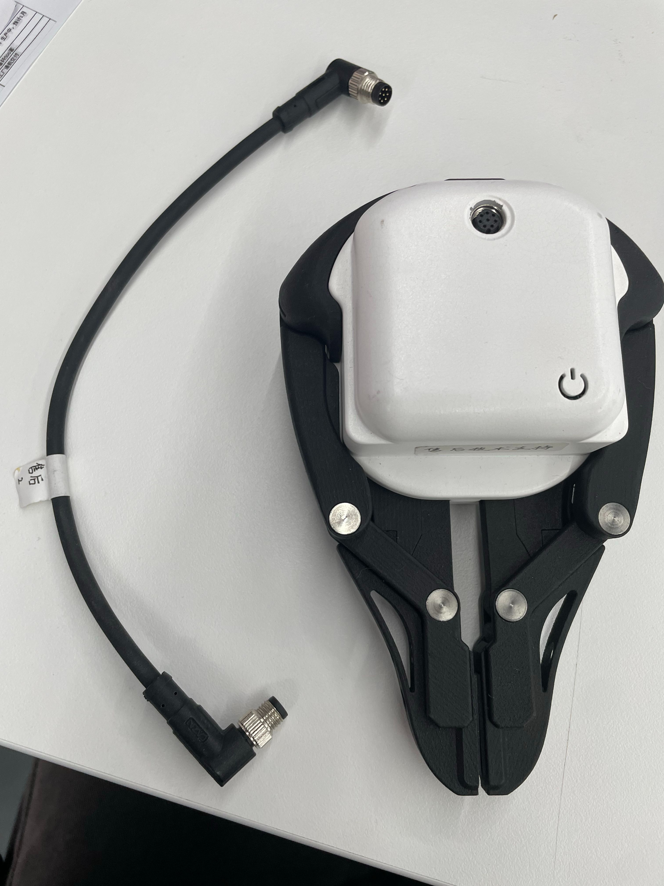
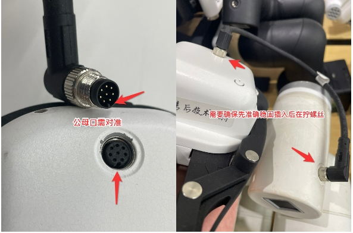

# Accessory related questions

**Q: Does the bulge pointed by the arrow on the modular suction cup need to be cut off**

- A: It needs to be removed manually

**Q: What is the pin sequence and connection method of the mycobot pro adaptive gripper?**

Pin introduction of mycobot adaptive gripper refers to the figure below:

Gripper connection method:

**Q: The value read by 320pro adaptive gripper using get_gripper_value() fails to read 0-100 correctly, and sometimes it is 255. Is this normal? Does pro adaptive gripper have an interface for reading angles?**

A: Normal, currently 320pro adaptive gripper does not have an interface for reading angles, and get_gripper_value() is a dedicated angle reading interface for mycobot280 adaptive gripper.

**Q: Is there anything to pay attention to between the gripping object and the movement of the robot arm?**

When the load is > 500g, the speed needs to be less than 50%.

**Q: Is there a video of using 320 with cylinder and modular suction cup?**

Reference link: https://drive.google.com/file/d/1Ei0JRjXn_YWDyYPPZeBVrAW_VzPUlx6e/view?usp=sharing

**Q: Is there a video of using 320 with pneumatic gripper?**

Reference link: https://drive.google.com/file/d/1nL4mgUf0OYOyCJPf4d5GNkWmbkuWBoup/view?usp=sharing

**Q: Is there a video of using 320 with pro adaptive gripper?**

Reference link: https://drive.google.com/file/d/1nL4mgUf0OYOyCJPf4d5GNkWmbkuWBoup/view?usp=sharing