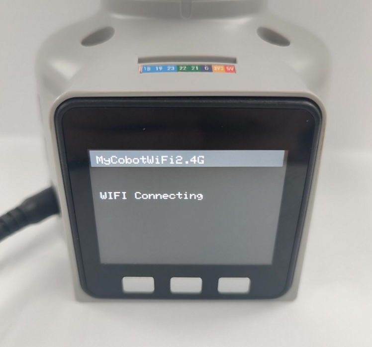
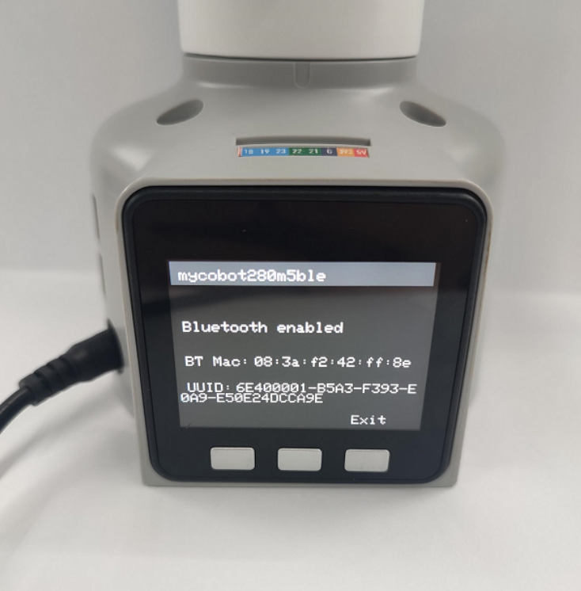
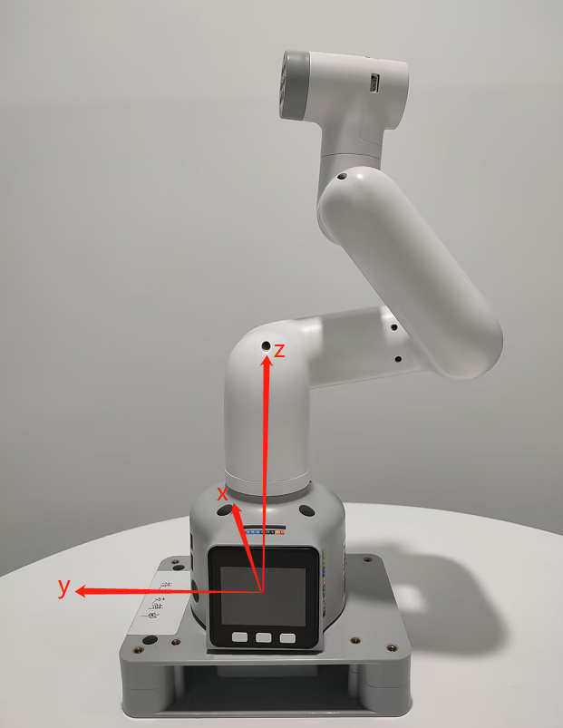
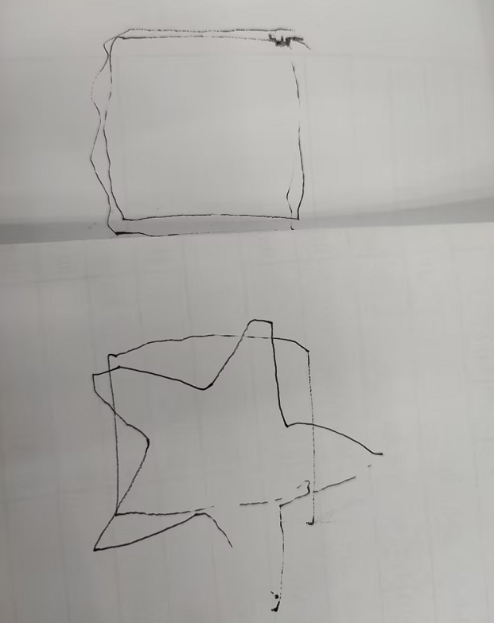

# Other issue

**Q: When prompted for a password on Raspberry Pi or Jetson Nano, what is the password?**

- A: You can try the following passwords:
    Elephant
    elephant
    aibot1234
    123
    123456
    123321
    aaa
    If none of the above passwords work, the password may not be one we set. You may need to consider resetting the system and password. Refer to Chapter 5 of the gitbook for the reset method.

**Q: How to reset the machine to factory settings when it's malfunctioning?**

- A: Restoring to factory settings mainly involves resetting firmware, images, PID, and zero positions. Below are the reset solutions:  

    Regarding firmware reset: It is recommended to ensure that mystudio is updated to the latest version, then download the latest Atom version firmware, minirobot firmware (only available on M5 series machines), and pico firmware (only available on 320 series models). Refer to the mystudio chapter in the Gitbook for firmware reset methods.  
    Regarding image reset: Resetting the image will clear all contents in the original system. If there are important files, please save them in advance. Refer to the system usage chapter in the Gitbook for image reset methods.  

    Regarding PID reset: In general, when the machine experiences severe joint shaking, abnormal joint movement speed, or joints curling together, you can reset the PID. Refer to the following link for the reset method:  

    > https://drive.google.com/file/d/1UWhaaSTuwLFImuEGY1J2tvgxTQDwWxK_/view?usp=sharing  

    Regarding zero position reset: In general, when the machine's zero position is incorrect or there are abnormal joint limits, you can recalibrate the zero position. Refer to the following link for the reset method:   

    > https://drive.google.com/file/d/1XtKH-ykKWPH0q9Z_YHwzkgwNKRhstHhi/view?usp=sharing


**Q: How to use the mycobot test tool?**

- A：The "mycobot test tool" is intended for factory use only, and we do not recommend users to use it. Using this tool may lead to abnormalities in the zero position or PID, resulting in damage to the robot. Please delete this tool directly.   

    If you have already used this tool and it has caused abnormal movement of the robot, please refer to the following instructions to readjust the PID and zero position. Furthermore, refrain from continuing to use this factory test tool in future operations.  

    Resetting PID method reference link:  

    > https://drive.google.com/file/d/1UWhaaSTuwLFImuEGY1J2tvgxTQDwWxK_/view?usp=sharing

    Zero position calibration method reference link:  

    > https://drive.google.com/file/d/1XtKH-ykKWPH0q9Z_YHwzkgwNKRhstHhi/view?usp=sharing

**Q: Why can't I see the corresponding Raspberry Pi or Jetson Nano system interface when I connect them to my personal computer using an HDMI cable or USB?**

- A: Since the Raspberry Pi series devices come with a pre-installed factory system and function as mini computers, connecting them to another computer via HDMI or USB will only display the system interface of the current computer, not the Raspberry Pi system interface. This is normal.  
    To properly access the Raspberry Pi system, you need to connect an HDMI monitor to the Raspberry Pi using an HDMI cable. This way, you will be able to see the Raspberry Pi system interface.  
    If you wish to remotely access the Raspberry Pi from your computer in the future, it is possible using VNC remote tools. For detailed instructions, please refer to the GitBook system usage documentation.

**Q: What is the transmission delay for controlling motors using the robot controller via usb serial or socket communication? Are there communication timing diagrams available? How is the real-time performance?**

- A: We do not have data on the delay of serial or socket communication. Based on feedback from our development team, real-time performance is generally high, and significant lag is not observed.

**Q: How to troubleshoot when unable to control the robotic arm when using Bluetooth or WiFi?**

- A: The M5 robotic arm supports three communication modes: USB serial port, WiFi, and Bluetooth. The most commonly used mode is the USB serial port. Before using each communication mode, ensure that the M5's LCD screen is set to the corresponding mode and maintain this communication status to control the robotic arm normally.   

    **WiFi Communication Mode:**

    - When using TCP/IP examples in the Python section, make sure the M5's LCD screen remains in the WiFi communication interface.

      

    **Bluetooth Communication Method:**

    - When controlling with a mobile app, ensure that the M5's LCD screen stays in the Bluetooth communication interface.

    

    After ensuring that the communication mode status is correctly selected, try controlling the robotic arm again.


**Q：Is there more explanation about the understanding of coordinates?**

- A: The API for controlling coordinate movement is `send_coords([x, y, z, rx, ry, rz], speed)`.

    x、y、z coordinates: Control the position of the end effector of the robotic arm in space. Changing these coordinate values will move the robotic arm to different spatial positions, allowing for positioning in three-dimensional space.

    rx, ry, rz orientation angles: Control the orientation or direction of the end effector of the robotic arm. These values are typically given in the form of Euler angles, the Euler angle sequence is ZYX，describing the rotation of the end effector relative to the base coordinate system. Changing these values will rotate the end effector of the robotic arm to different angles or directions.

    For example:  
    When you adjust +X, it means moving the position of the current end effector of the robotic arm along the positive X-axis of the current end effector by a certain distance. This action will cause the robotic arm to move in a certain direction.  

    When you adjust RX, it means rotating the orientation of the current end effector of the robotic arm around the X-axis of the current end effector by a certain angle. This action will cause the robotic arm to rotate as a whole, changing the direction of the end effector.  

    In summary, adjustments to +X and RX will directly affect the motion state of the robotic arm. +X controls the movement of the position, while RX controls the change in orientation.  

    For a more intuitive understanding of the changes, we recommend using the myblockly serial control tool. Adjust one parameter at a time and observe its changes in the coordinate system. Please note that when observing rx, ry, rz, if you want a more intuitive view, pay attention to adjusting x and ry when joint 1 is at 0, and adjusting y and rx when joint 1 is at 90.

    You can refer to the coordinate system diagram in the following document for more information.

    

    


**Q:Is there more explanation about Offset of DH parameter, is Offset rotating around z?**

- A: The DH parameters describe the geometric and motion relationships between adjacent links in a robotic arm. In the DH parameter table, the Offset parameter represents the influence of the rotation of the previous link around its z-axis on the position of the next link, i.e., the offset when connecting two links.

    For the Offset parameter in a robotic arm, generally, it represents the effect of the rotation of the previous link around its own z-axis on the position of the next link, rather than rotating around the z-axis of the next link. Therefore, Offset does not rotate around zi but signifies the displacement when connecting two links.

**Q：How to deal with the error report when updating pandas?**

- A：If you encounter a "no suitable distribution found" error while trying to install pandas in Python, there are a few steps you can take to address this:
Update pip: Make sure you have the latest version of pip installed by running:  

    ```pip install --upgrade pip  ```

    Translate: "Use the latest version of Pandas as they typically include the newest features and fix known bugs."  

    ```pip install pandas --upgrade  ```

    Use a specific version: Instead of installing the latest version, try installing a specific version of pandas that is known to be compatible with your Python version. For example:  

    ```pip install pandas==1.1.5```

    Use a virtual environment: Create a virtual environment for your project and try installing pandas within that environment. This can help isolate dependencies and avoid conflicts with other packages.  

    ```bash
    python -m venv myenv
    source myenv/bin/activate  # Activate the virtual environment on Unix/Linux
    myenv\Scripts\activate     # Activate the virtual environment on Windows
    pip install pandas
    ```

    Note that you should check internet connection and repository: Ensure that your internet connection is stable and that you're able to access the Python Package Index (PyPI) repository where pandas is hosted.


***Q：The drawing case with the 280 machine is to find that the shape trajectory is not very straight, how can this be optimised?***



- A: Using hard stationery such as signature pens may result in trajectory deviations, which is quite normal. There are mainly two reasons for such deviations. Firstly, because MyCobot uses servo motors, there is a certain precision deviation (especially for machines that have been used for a long time, as joint aging may lead to greater deviations). Secondly, the contact distance with the desktop is crucial when using hard pens for drawing. If the distance is too large, interruptions in the trajectory may occur easily; if it's too small, there may be issues with excessive resistance and pauses of the pen tip. Therefore, the resulting drawing effect may not be ideal. Currently, it is recommended to use soft stationery such as brushes, which may help improve the drawing effect.
