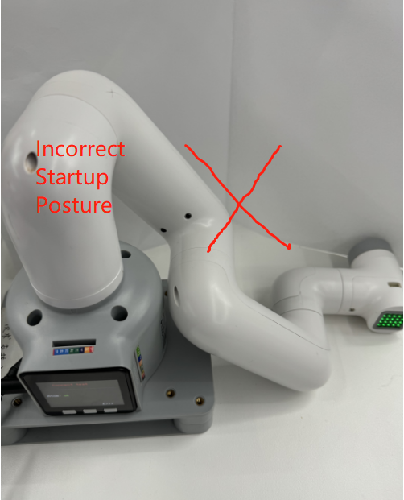
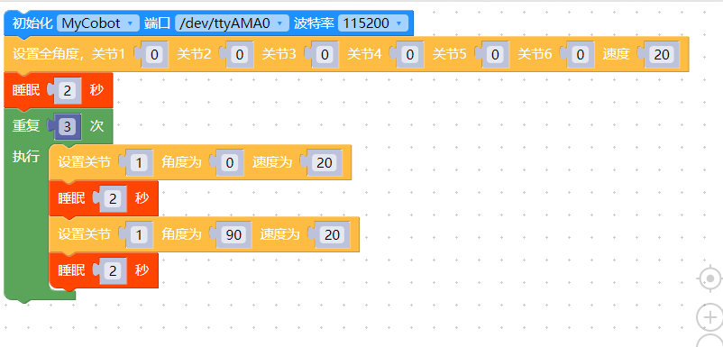

# Self-check for the first use - machine joint function test

>> **Note:** When starting the robot arm, please be careful not to let the robot arm be in a curled-up or touching posture between joints. It is recommended that the robot arm posture should be as shown in Figure 1 below when starting. Figures 2 and 3 are both incorrect starting postures:

|  |  |  |
|---------------|---------------|---------------|
| Figure 1 (correct posture) | Figure 2 (wrong posture) | Figure 3 (wrong posture) |

## Joint control method and steps

### 1. Hardware connection

- Hardware connection of PI series machines:

For mycobot320PI machine, you need to make sure that the power adapter and emergency stop switch are connected, and make sure that the emergency stop switch is in the released state (if the emergency stop switch is not used correctly, mycobot320 cannot be used normally). It is recommended to connect 320pi to the HDMI screen via an HDMI cable, and connect the keyboard and mouse to the USB interface of 320pi. Please refer to the figure below for the emergency stop switch:


### 2. Install and configure the software environment

When using PI or JN version machines, you need to prepare an HDMI screen, but you don’t need to bring your own computer. After connecting the HDMI screen, you can directly enter the system interface of the 320pi machine. Since the factory system has configured the software environment, you do not need to install tools such as python, pymycobot and USB driver yourself, and you can use the robot arm use case.

### 3.USB communication example

Please use myblockly or python source code examples to verify the joint motion of the robot arm.

**Pay special attention to the need to select the corresponding serial port and baud rate when using the USB serial port opening method so that the robot arm can communicate with the computer normally and thus control the robot arm normally:**

| Machine model | Serial port number | Baud rate |
| :-----------: | :---------: | :---------: |
| 320 PI | /dev/ttyAMA0 | 115200 |

#### 3.1 Robot arm joint movement myblockly source code



When you see the effect of the robot arm's joint 1 moving 3 times in a 0-90 degree cycle, it means that the robot arm joint 1 responds normally. You can try to change the joint ID to test other joints and learn to use other cases in gitbook step by step or use the robot arm to do various interesting things!
It is worth mentioning that if you are not familiar with the code block development method of myblockly, there is also a relatively quick way to verify the joints: use the myblockly fast movement tool to perform simple joint movement control. For specific usage, please refer to: [Myblockly fast movement tool usage](https://drive.google.com/file/d/1pDR-WBjkGrLcRdeshDmAMIWbEpu_jsJW/view?usp=sharing)


#### 3.2 Robot arm joint movement joint python source code

```python
#The movement effect is that the robot arm moves around the zero position, and the 1-6 joints move one by one by ±20 degrees
import time
from pymycobot.mycobot320 import MyCobot320

if __name__ == "__main__":
cobot = MyCobot320('/dev/ttyAMA0',115200)#Select the corresponding port number and baud rate according to the model
cobot.set_fresh_mode(1)
cobot.send_angles([0, 0, 0, 0, 0, 0], 20)
time.sleep(2)
print("start")
for i in range(1,7):
cobot.send_angle(i, (-30), 20)
time.sleep(2)
cobot.send_angle(i, (30), 20)
time.sleep(2)
cobot.send_angle(i, (0), 20)
time.sleep(2)

```

When you see the robot arm moving around the zero position and the 1-6 joints moving one by one ±20 degrees, it means that the joints 1-6 respond normally. You can learn to use other cases in gitbook step by step or use the robot arm to do various interesting things!

**If you do not see the corresponding effect when executing the case, please refer to the common problem solutions below. In addition, please make sure you have checked the following 5 points before contacting technical support personnel:**

1. Can the robot arm lock normally after power-on? If it cannot be locked, please refer to the FQA hardware-related question: "Q: How to solve the problem that the robot arm cannot be locked after power-on?" for troubleshooting

2. If you have an M5 series robot arm, is your computer connected to the USB port on the side of the M5stack via type-c?

3. If you have an M5 series robot arm, is your screen LCD now stuck on the Atom: OK interface?

4. If yours is an M5 series robot arm, and the LCD screen displays Atom: no, please refer to "Q: How to solve the problem of the robot arm not being able to lock when powered on?" for troubleshooting
5. Is there any error message when running the code?

Please describe the usage details as detailed as possible. If it is convenient, please provide an operation video, which will help to quickly analyze and locate the problem. Thank you in advance!