# Software Problem

**Q: Why can't my compiler find the corresponding device?**
- A: You need to build a development environment and install the corresponding project library before you can develop the device.


## 1 About myStudio

**Q: What is myStudio?**

- A: It is the firmware burner. [About more](../../5-BasicApplication/5.2-ApplicationUse/5.2.2-mystudio/320pi/README.md)

**Q: Is there any difference between the firmware used by MyCobot 320 Pi-2020 and 2022 models?**

A:
- Firmware requirements for the earlier version myCobot 320 Pi are as follows:
  - ubuntu18.04
  - atommain 4.1
 - Firmware requirements for the new version myCobot 320 Pi are as follows:
    - ubuntu18.04
    -  picomain 1.3
    -  atommain 5.0

    This firmware combination is up to mystudio version v3.5.7

**Q: Why can't the device run normally after I burn the firmware to the ATOM terminal?**
- A: The firmware of the ATOM terminal needs to use our factory firmware. Other unofficial firmware cannot be changed during use. If the device accidentally burns other firmware, you can use the [myStudio](../../5-BasicApplication/5.2-ApplicationUse/5.2.2-mystudio/320pi/README.md) reburn ATOM firmware.

**Q: Error message when downloading firmware, how to deal with it?**

- A1: Check if the network connection is normal. It is necessary to connect to the network to download the firmware.  
- A2: Select the firmware corresponding to the model of the robot, and do not select the wrong model.  
- A3: Download and install the driver. If the driver cannot be recognized after downloading, try to replace it with the latest CH340 driver. Driver link: https://www.wch.cn/download/CH341SER_EXE.html  
- A4: Finally, you can try using another USB cable or computer to download.


## 2 About Roboflow


**Q: Can robotstudio software be used for programming?**
- A: Our own industrial programming software roboflow can be used. RobotStudio is owned by ABB.


**Q: What is the reason for the Quickmove of the roboflow software beyond the limit?**

- A: It may be that a joint or multiple joints exceed the limit.


**Q: How does roboflow load the already written program?**

- A: After logging in, select program robot and click load program. Directly clicking run program cannot be used, only pro600 can.


## 3 About mycobot phone controller


**Q: What version of firmware should myCobot phone controller app be programmed with?**
- A: You need to burn the atom firmware version atommain 2.5 in myStudio.
  > As of 2023/2/4, the mobile APP control function has been disabled, please pay attention to the release of mystudio firmware version when restarting.


## 4 About myblockly

**Q: What is myblockly?**
 - A:[About myblockly](../../5-BasicApplication/5.2-ApplicationUse/5.2.1-myblockly/320pi/README.md)

**Q: Why does a pop-up box always appear when myblockly is running?**

- A: Before running the myblockly program, close the serial port occupation.

**Q: myblockly always appears child process exited with code 0 when running, why?**

- A: This is not an error. Real errors need to be analyzed on a case-by-case basis. This string of characters represents the end of the program, and returns the binary number 0, representing termination.

**Q: Encounter error message: ModuleNotFoundError: No module named "pymycobot", how to deal with it?**

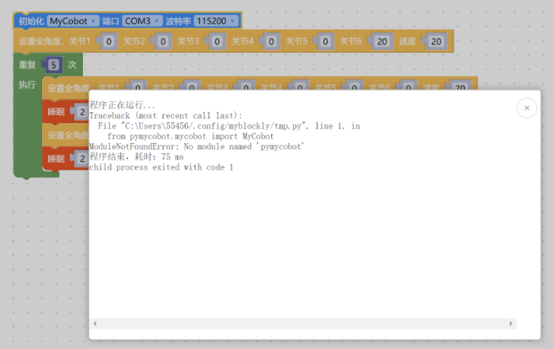

- A: The error message indicating the lack of the pymycobot file package includes the reasons and solutions as follows:   

- 1. If pymycobot is not installed, the corresponding solution is to reinstall pymycobot with the command pip3 install pymycobot --upgrade --user.   
- 2. If "Add Pythonxx to PATH" is not selected during the installation of Python, you need to uninstall Python and reinstall it, and select this option.

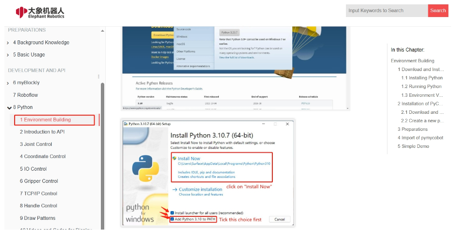

**Q: Unable to click run myblockly, how to solve it?**

- A: This is because the serial port is occupied, resulting in the inability to click the run button. You need to check if there is serial port occupation in the serial port tool of myblockly and other serial ports. If you want to run the code, you need to close the buttons in the figure below before clicking run. The serial port tool needs to be turned off before it can be run, otherwise there will be a serial port conflict.

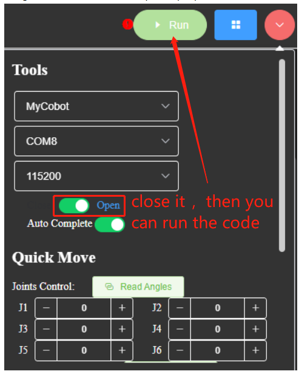

**Q: How to use the serial port tool of myblockly?**

- A: Please refer to the link:  
  > https://drive.google.com/file/d/1pDR-WBjkGrLcRdeshDmAMIWbEpu_jsJW/view?usp=sharing

**Q: How to deal with the situation when the express moving tool of myblockly fails to display real-time angles?**

- A: This is usually caused by incorrect selection of device serial port information or abnormalities in pymycobot. It is recommended to troubleshoot according to the "Initial Use Self-Check" plan in this document. If you are unable to control the robotic arm normally, try updating pymycobot. The corresponding update method is to enter the command ```pip install pymycobot --upgrade --user``` in the command prompt or terminal. Finally, if you still cannot control it normally, try updating the myblockly software. Please refer to the link below for the update method:  

  > https://drive.google.com/file/d/1yBWzhbSBUYsZPBl7PBdZKRwk3al71Dc7/view?usp=sharing

**Q: Is it normal for the program result to display "child process exited with code 1"?**

- A: This is not an error. It means that all the programs have run to completion and returned binary number 1, indicating that they have all run successfully.

**Q: Error MyCobot.int() takes 2 positional arguments but 3 were given.**

- A: This error occurs in older versions of myblockly because the versions of myblockly and pymycobot do not match. You can solve it by updating myblockly and pymycobot driver libraries. For M5 version robots, download the latest myblockly directly from the official software download page; for PI and JN versions of robots, please refer to the link for updating myblockly: 

  > https://drive.google.com/file/d/1E7uEbzN4nNuvYyJDgD3z72SSA3nyH0eG/view?usp=sharing  

The command for updating pymycobot is **pip3 install pymycobot --upgrade --user**.

**Q: Myblockly programs saved in PI or JN are not effective or cannot be found?**

- A:
  1. After saving the file, the file extension should be added ".json", for example: "pump.json".
  2. Confirm the saved path and find the saved file in the saved path.

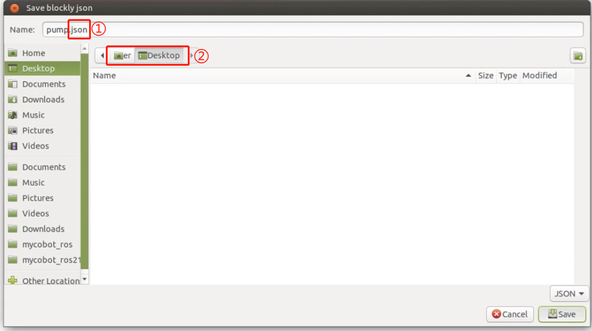

**Q: Why am I refused connection when selecting a certain COM port? Or, how do I find the corresponding COM port?**

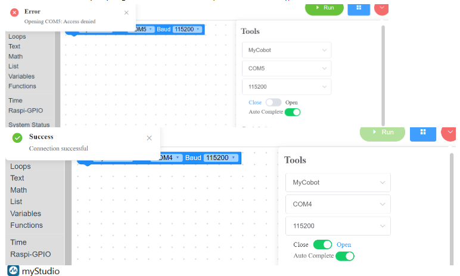

- A: The reason for the connection refusal is due to selecting the wrong COM port. When you have multiple devices connected to the USB ports of your computer, MyBlockly will display multiple serial ports as well, such as COM4 and COM5 in the example above. However, only one of them is for the robotic arm. You need to select the serial port corresponding to the robotic arm to connect and use it properly. Clearly, the COM4 port, which can be connected normally, is the current serial port corresponding to the robotic arm.  
To find the serial port corresponding to the robotic arm among multiple serial ports, you can try unplugging and re-plugging the serial cable connected to the robotic arm and observe which serial port disappears from the COM port options in MyBlockly when the connection between the robotic arm and the computer is disconnected. When you reconnect the robotic arm to the computer via USB, this serial port reappears in the COM port options in MyBlockly. The serial port that disappears and appears in sync with the disconnection and reconnection of the robotic arm in MyBlockly is the serial port corresponding to the robotic arm.  
Please note that the COM port number for the robotic arm is not always fixed. It may change when connected to different USB ports on the same computer or when connected to USB ports on different computers. It is recommended to use the above method to check the real-time COM port number.

## 5 About python

**Q: Encounter error message: ModuleNotFoundError: No module named "pymycobot", how to deal with it?**

- A: The error message indicating the lack of the pymycobot file package includes the reasons and solutions as follows:  
  1. If pymycobot is not installed, the corresponding solution is to reinstall pymycobot with the command pip3 install pymycobot --upgrade --user.
  2. If "Add Pythonxx to PATH" is not selected during the installation of Python, you need to uninstall Python and reinstall it, and select this option.

  

**Q: How to handle the situation where sometimes there is no response after writing coordinates in coordinate control?**

- A: For coordinate motion, first ensure that the coordinate can be reached by joint motion. Generally, it is achieved by moving the joint to the specified point and then reading the coordinate value for control. Most artificially written coordinates are invalid. It is recommended not to write coordinates directly, but to release the joint and manually rotate the joint to the target position. After recording the coordinates using get_coords(), use send_coords() to set the coordinates. You can refer to the following code:

```python
# Import the official python API
from pymycobot.mycobot import MyCobot
# Import the time module
import time

# Set the serial connection, serial port, baud rate
# PI version
mc = MyCobot('/dev/ttyAMA0', 115200)
# M5 version, specific serial port number needs to be checked in the device manager
mc = MyCobot('COM0', 115200)
# Set a short wait time, 0.5 seconds
time.sleep(0.5)
# Release all joints of the robotic arm, please hold the robotic arm with your hand
mc.release_all_servos()
# Set the wait time, which can be changed as needed. At this time, the robotic arm can be moved to the target position.
time.sleep(5)
# Power on the robotic arm again and fix it in the target position
mc.power_on()
# Read the current position's coordinate information and angle information, and output it to the console
print('coords:', mc.get_coords())
print('angles:', mc.get_angles())
```

**Q: Could you provide a more accessible explanation for the "mode" parameter in the function send_coords(coords, speed, mode)?**

- A: Certainly. The "mode" parameter in the function send_coords(coords, speed, mode) determines the movement behavior of the robotic arm's end effector when reaching the target position. When "mode" is set to 1 (linear mode), the end effector follows a straight-line path to reach the target position. However, if obstacles, mechanical constraints, or structural limitations prevent the arm from moving in a straight line, the instruction may not be executed entirely. On the other hand, when "mode" is set to 0 (non-linear mode), the end effector reaches the target position in any orientation, without the constraint of following a straight-line path. This mode reduces the likelihood of instructions not being executed due to path restrictions.

**Q: What is the difference between interpolation and refresh modes in the function set_fresh_mode(mode)?**

- A: The "interpolation" mode, denoted by 0, involves planning numerous densely spaced points between the starting and ending points of a trajectory. This enables control over the trajectory of the intermediate segments and facilitates parallel programming. Conversely, the "non-interpolation" mode, represented by 1, lacks the planning of intermediate segments, thereby limiting control over the trajectory. However, movements in this mode tend to be relatively smooth due to the absence of trajectory segmentation.

**Q: Is it normal for the trajectory not to be straight up and down when only the Z-axis is changed, but the final landing point is adjusted only in the Z-axis? How can the middle trajectory be ensured to be straight?**

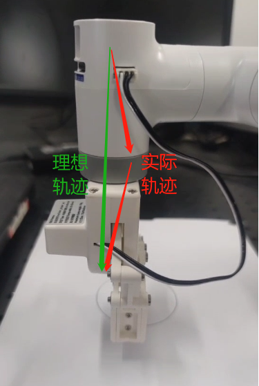

To ensure a straight trajectory, activating interpolation (set_fresh_mode(0)) facilitates trajectory planning between the starting and ending points. By specifying linear motion (mode=1) in the send_coords(coords, speed, mode) function after enabling interpolation, the straight-line trajectory is maintained.   

- set_fresh_mode(0): Enable interpolation
- send_coords(coords, speed, mode=1): Move in a straight line  

It's crucial to activate interpolation before setting the intelligent planning route in **send_coords** to be effective. Interpolation involves planning densely spaced points between the start and end points of the trajectory, ensuring control over the intermediate segment's trajectory.  
Enabling interpolation and moving in a straight line ensures trajectory accuracy.

**Q: What does it mean when the return value of get_error_information() is -1?**  
- A: When the return value of get_error_information() is -1, it indicates a communication failure. This typically occurs when the robot controller is unable to establish communication with the device. To resolve this issue, you should check the following:  
  1. Ensure that the power adapter and USB cable are properly connected to the device.
  2. Verify if the LCD screen displays the "Atom: ok" interface. If the screen does not show this interface, it indicates a potential connection problem.
  3. If the connections are not successful and the "ok" message is not displayed, it is recommended to reconnect the cables and retest the communication.

## 6 About Arduino
**Q: Are there any joint control examples for 280arduino?**  

- A: Yes, such examples are available. Please refer to the following link: 

  > https://drive.google.com/file/d/1S5CifuYYcSMBFbzfVFws4AuSNjEr6cxn/view?usp=drive_link

**Q: Can Arduino UNO be controlled via serial communication?**

- A: No, Arduino UNO boards can only be controlled using the provided routines and by calling the API interfaces we offer. To enable serial communication control, either replacing the mainboard or using a USB to TTL module is necessary.

**Q: How can Arduino be controlled via serial communication?**  

- A: Without any main control board, connecting a USB to TTL module (TX, RX, GND) allows serial communication. You can use a serial assistant tool to send the serial commands we provide, facilitating control over joint movements, among other functions. 

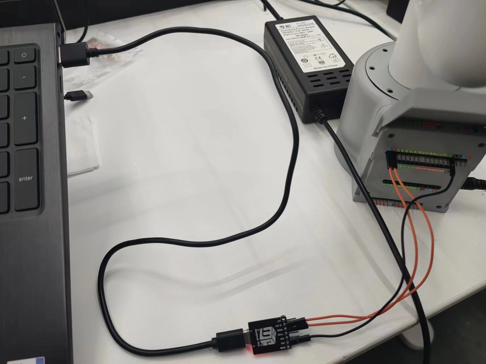

When using this method, ensure the baud rate is set to 1000000 and the corresponding port is selected. 

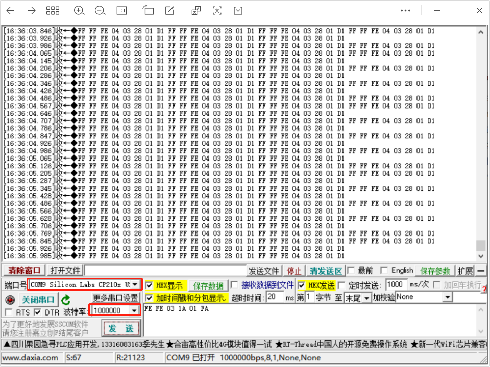

In robot free mode (with all torque outputs turned off), sending the example command FE FE 03 1A 01 FA via serial ensures joint movement, requiring the Atom button to be held after the Atom light turns yellow.

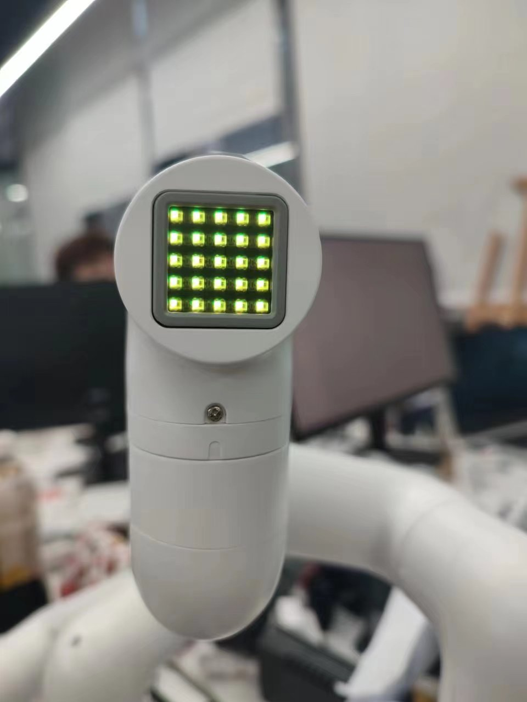

## 7 About ROS1

**Q：When a terminal switches to `~/catkin_ws/src` and uses git to install and update `mycobot_ros`, it appears that the target path "mycobot_ros" already exists. Why?**

- A：A `mycobot_ros` package already exists in `~/catkin_ws/src`, so you need to delete it beforehand and run git again.

**Q: When rosrun is running, a terminal error is reported saying `counld not open port /dev/ttyUSB0: Permission: '/dev/ttyUSB0'`. Why?**

- A: The serial port permission is insufficient. Enter `sudo chmod 777 /dev/ttyUSB0` to grant the permission.

**Q: Why can't ros programs run in vscode?**

- A：Since the vscode terminal cannot be loaded into the ros environment, it needs to run on the system terminal.

**Q: ` Unable to register with master node [http://localhost:11311]: Unable to register with master node. master may not be running yet. Will he keep trying`?**

- A: Before running the ros program, start the ros node and enter `roscore` on the terminal.

**Q: When rosrun runs, the terminal error shows `counld not open port /dev/ttyUSB0: No such file or directory: '/dev/ttyUSB1'`. Why?**

- A: The serial port is incorrect. Check the actual serial port of the manipulator. To view the value, run `ls /dev/tty*`.

**Q: Failure in Ubuntu18.04 `catkin_make` building code, terminal prompt `Project 'cv_bridge specifies'/usr/include/opencv' as an include dir, which is not found`. Wait for an error message**

- A: The opencv path in the configuration file is inconsistent with the actual path in the system. Need to use sudo to modify the configuration file (path is`/opt/ros/melodic/share/cv_bridge/cmake/cv_bridgeConfig cmake`), the system actual opencv path in the`/usr/include/`directory.

**Q: I cloned the mycobot_ros package and ran the rosrun program directly. package 'mycobot_280' not found or can't find the file?**

A: The newly cloned mycobot_ros needs to build code to compile to the ros environment. The input terminal

```bash
cd ~/catkin_ws/
catkin_make
source devel/setup.bash
```

**Q: After compiling, why does the following error occur when a new terminal runs launch command?**


- A1: The system has not added ros environment variable, so every time a new terminal is started, the source is required:

```bash
cd ~/catkin_ws/
source devel/setup.bash
```

- A2: ros environment variable is added to the system. There is no need to execute source after starting a new terminal:

```bash
# The noetic is Ubuntu20.04 system
echo "source /opt/ros/noetic/setup.bash" >> ~/.bashrc
source ~/.bashrc
```

- A3: The file name in the instruction may not be the same as the file name in the mycobot_ros package. Please carefully check whether the instruction is incorrect.

**Q: Are there any pre-configured virtual machine images available?**

- A: We provide a pre-configured virtual machine environment with ROS1 and ROS2 environments pre-installed, as well as ROS source code. Users can download the virtual machine file from the following links and import it into VirtualBox, saving the trouble of configuring the environment themselves. When testing ROS examples, it is recommended to use our pre-configured virtual machine environment to avoid potential errors caused by environment setup.
ROS1 virtual machine file:   
  > http://download-elephantrobotics.oss-cn-shenzhen.aliyuncs.com/system_images/ubuntu20.04_ROS1_V20230731.ova.zip  
  ROS2 virtual machine file:   
  > https://download-elephantrobotics.oss-cn-shenzhen.aliyuncs.com/system_images/ubuntu20.04_ROS2_V20240228.zip

**Q: How to import the virtual machine file into virtual machine software?**

- A: Please refer to the operation steps in the video tutorial on importing virtual machine files into virtual machine software:  
  > https://drive.google.com/file/d/1KeYk_CUgDE46rVn7zbd0EhraIbgt3qZt/view?usp=sharing

**Q: How to handle errors when importing the ROS2 virtual machine?**

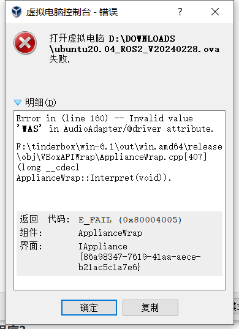

- A: This is due to the virtual machine software Oracle VM VirtualBox being outdated. You need to update the version of the virtual machine software.

**Q: How to re-download the ROS source code package?**

- A:  Use the command to pull: git clone 
  > https://github.com/elephantrobotics/mycobot_ros.git  

  Or download manually by accessing the ROS source code package address and following the instructions in the image below.  
  Source code package address:   
  > https://github.com/elephantrobotics/mycobot_ros


**Q: What to do if I encounter an ImportError: No module named yaml when running ROS moveit examples?**

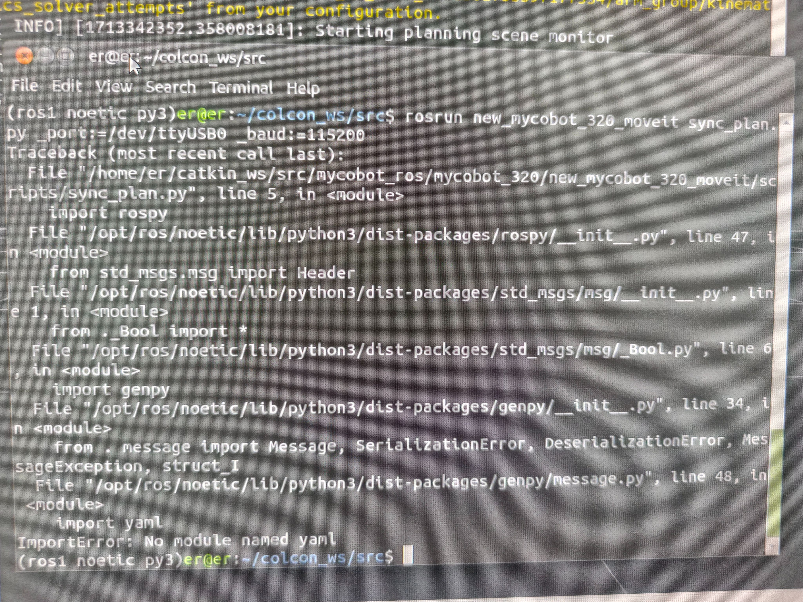

- A: At the beginning of this script, change the Python interpreter to python3.

**Q: Raspberry Pi and Jetson Nano machines experience occasional lags when using ROS.Are there optimization methods available?**  

- A: Raspberry Pi and Jetson Nano, despite their powerful functionalities as small-scale computers, may experience lags due to their limited hardware configurations. This is particularly evident when executing tasks requiring substantial computational resources, such as image recognition, during ROS development. Performance issues primarily stem from inadequate hardware capabilities and insufficient computing power. To address this, consider the following optimization methods:  
  1. Code optimization: Enhance code efficiency by reducing unnecessary computations to alleviate the burden on Raspberry Pi and Jetson Nano.  
  2. Hardware upgrade: Consider upgrading to higher-performance Raspberry Pi models or alternative hardware platforms with superior computing capabilities, such as NVIDIA NX series mainboards.  
  3. Distributed computing: Distribute tasks across multiple devices to distribute the workload and enhance overall system performance.  


---


[← Previous Page](./1_driver.md) | [Next Page →](./3_hardware.md)