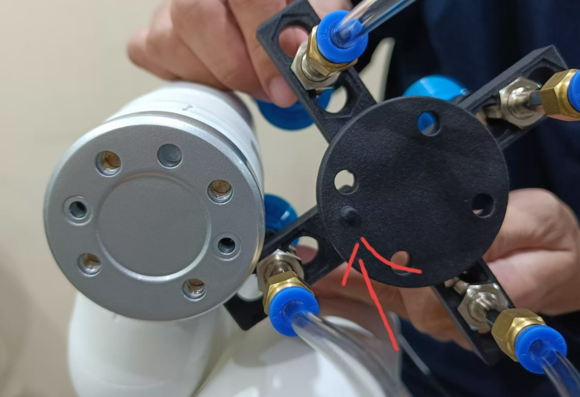

# 配件相关问题

**Q：模块化吸盘上箭头指向的这个凸起是否需要割掉**

- A: 需要手动去掉的

**Q：mycobot pro自适应夹爪的引脚线序与连接方式是怎样的？**

mycobot自适应夹爪的引脚介绍参考下图：

夹爪连接方式：

**Q：320pro自适应夹爪使用get_gripper_value()读取的数值未能正确读取0-100，有时是255这些正常吗？pro自适应有读取角度的接口吗？**

A：正常的，目前320pro自适应夹爪没有读取角度的接口，而get_gripper_value()是mycobot280的自适应夹爪专用的角度读取接口。

**Q：关于夹持物体与机械臂运动之间有什么需要注意的吗？**

当负载 > 500g时，速度需要低于 50%。

**Q：请问有320与气缸和模块化吸盘的使用视频吗？**

参考链接：https://drive.google.com/file/d/1Ei0JRjXn_YWDyYPPZeBVrAW_VzPUlx6e/view?usp=sharing 

**Q：请问有320与气动夹爪的使用视频吗？**

参考链接：https://drive.google.com/file/d/1nL4mgUf0OYOyCJPf4d5GNkWmbkuWBoup/view?usp=sharing 

**Q：请问有320与pro自适应夹爪的使用视频吗？**

参考链接：https://drive.google.com/file/d/1nL4mgUf0OYOyCJPf4d5GNkWmbkuWBoup/view?usp=sharing 

