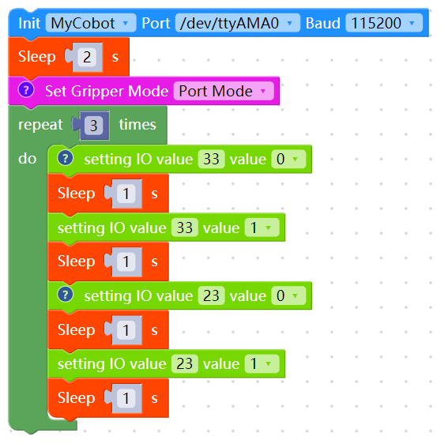
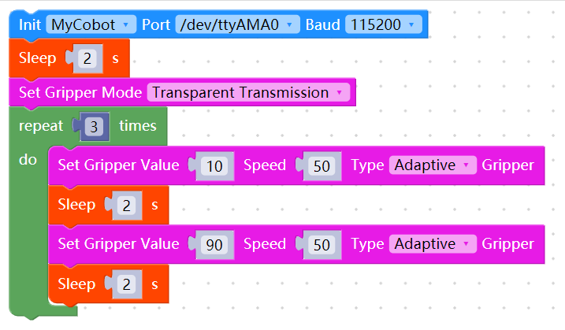
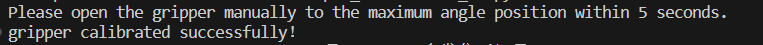

# Accessory related questions

**Q: Does the bulge pointed by the arrow on the modular suction cup need to be cut off**


- A: It needs to be removed manually

**Q: What is the pin sequence and connection method of the mycobot pro adaptive gripper?**

For the pin introduction of the mycobot adaptive gripper, please refer to the figure below:


Gripper connection method:


**Q: What to do if the 320+ adaptive gripper cannot be controlled to open and close?**

A: Check according to the following methods:

1. Check whether the robot arm can be controlled. If it cannot be controlled, please refer to this document "First-time joint verification" for troubleshooting

2. Use mystudio to burn PICO1.3, Atom5.0 version firmware (note that the versions are consistent). If the firmware cannot be burned normally, please refer to this document**Q: What is the method for troubleshooting abnormal downloads of minirobot, Atom, and PICO firmware?**
3. Use the following command to update pymycobot to version 3.9.7:

```bash
pip install pymycobot==3.9.7
```

4. When the robot arm can be controlled normally, open the gripper manually to the maximum angle, then connect the power cord and refer to the following control source code:

- **myblockly control gripper source code:**
- IO mode (note that when switching from transparent mode to IO mode, the gripper needs to be powered off and reconnected):
- 
- Transparent mode
- 

- **pyhton control gripper source code:**

```python
# coding=utf-8
from pymycobot import MyCobot320
import time

# You need to change the serial port number to the actual serial port number of the computer, open the gripper to the maximum, and then run this script
mc = MyCobot320('/dev/ttyAMA0',115200)

# Initialize the gripper
# mc.set_init_gripper("CAG-1")

# #IO mode
# # # # Gripper full open and full closed control code. Note that when the gripper is transparently switched to IO mode, you need to shut down the machine and restart the robot once before switching back to the gripper IO mode
mc.set_gripper_mode(1)#IO mode
for i in range(3):
mc.set_digital_output(33,0)#IO restores low level
time.sleep(1)
mc.set_digital_output(33,1)
time.sleep(1)
mc.set_digital_output(23,0)#Close the gripper
time.sleep(1)
mc.set_digital_output(23,1)#IO returns to low level
time.sleep(1)

# #Transparent transmission mode
# mc.set_gripper_mode(0)
# time.sleep(2)#Must have a delay
# for i in range(3):
# mc.set_gripper_value(26,20)
# time.sleep(1)
# mc.set_gripper_value(86,20)
# time.sleep(1)

```

5. Note that the default setting of the gripper is the port mode. If transparent transmission is used, it needs to be switched to transparent transmission mode. In addition, if you want to switch from transparent transmission back to port mode, you need to use power_off() or unplug the gripper cable. The gripper can only be switched after restarting. Otherwise, the switch is invalid and the port mode control cannot be used.
6. If the gripper is abnormal, zero calibration is required. Under normal circumstances, the gripper can be fully opened to the maximum position. If the gripper is used normally, please ignore the following content. If the gripper cannot be fully opened, please refer to the following source code for zero calibration:

```python
# coding=utf-8
from pymycobot import MyCobot320
import time

# You need to change the serial port number to the actual serial port number of the computer,
# open the gripper to the maximum, and then run this script.
mc = MyCobot320('COM4',115200)
time.sleep(1)
mc.release_all_servos()
print("Please open the gripper manually to the maximum angle position within 5 seconds.")
time.sleep(5)
mc.power_on()
# #Tranmission mode
mc.set_gripper_mode(0)
time.sleep(1)
mc.set_gripper_calibration()
print("gripper calibrated successfully！")
```

You can run it several times until you see the following message, which means the calibration is complete.



**Q: The value read by 320pro adaptive gripper using get_gripper_value() cannot read 0-100 correctly, and sometimes it is 255. Is this normal? Does pro adaptive gripper have an interface for reading angles?**

A: Normally, 320pro adaptive gripper does not have an interface for reading angles, and get_gripper_value() is a dedicated angle reading interface for mycobot280 adaptive gripper.

**Q: Is there anything I need to pay attention to between the gripping object and the movement of the robot arm?**

When the load is > 500g, the speed needs to be less than 50%.

**Q: Is there a video of using 320 with cylinder and modular suction cup?**

Reference link: https://drive.google.com/file/d/1Ei0JRjXn_YWDyYPPZeBVrAW_VzPUlx6e/view?usp=sharing

**Q: Is there a video of using 320 with pneumatic gripper?**

Reference link: https://drive.google.com/file/d/1nL4mgUf0OYOyCJPf4d5GNkWmbkuWBoup/view?usp=sharing

**Q: Is there a video of using 320 with pro adaptive gripper?**

Reference link: https://drive.google.com/file/d/1nL4mgUf0OYOyCJPf4d5GNkWmbkuWBoup/view?usp=sharing