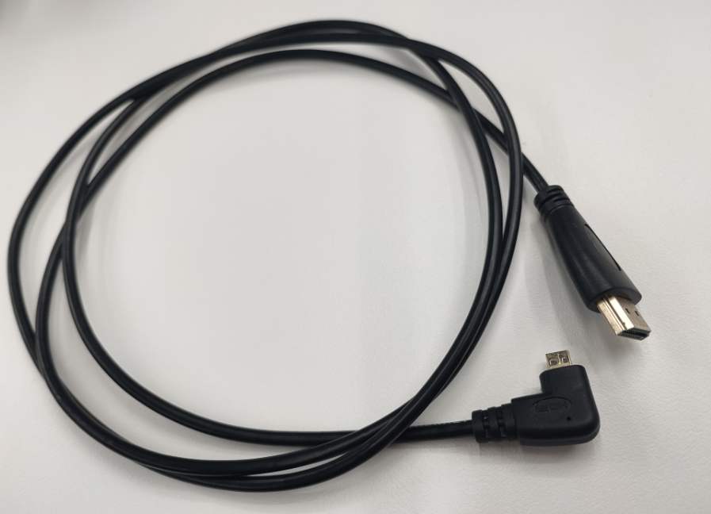
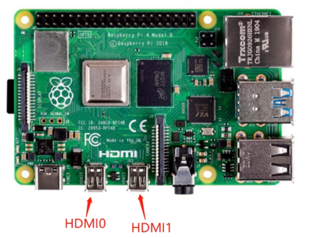
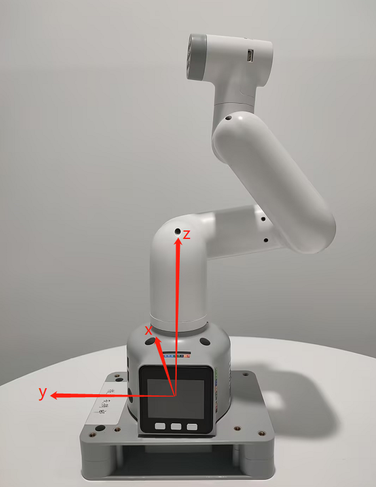
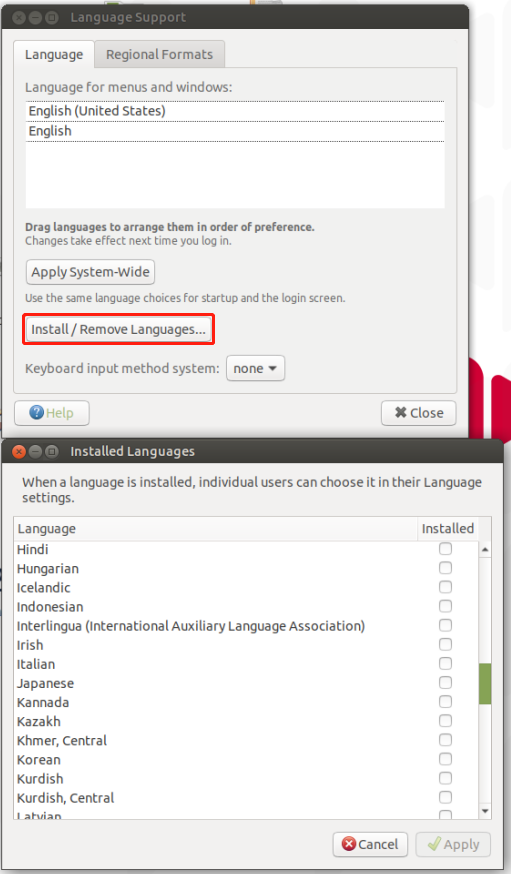
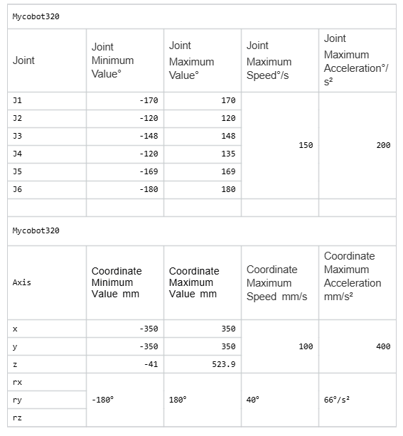
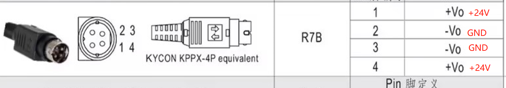
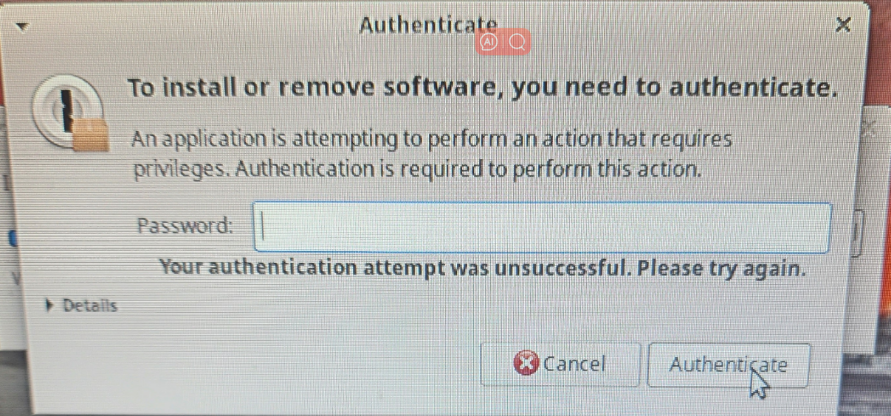
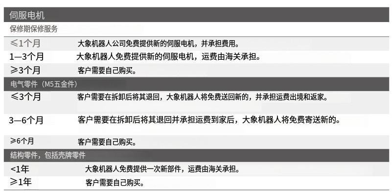
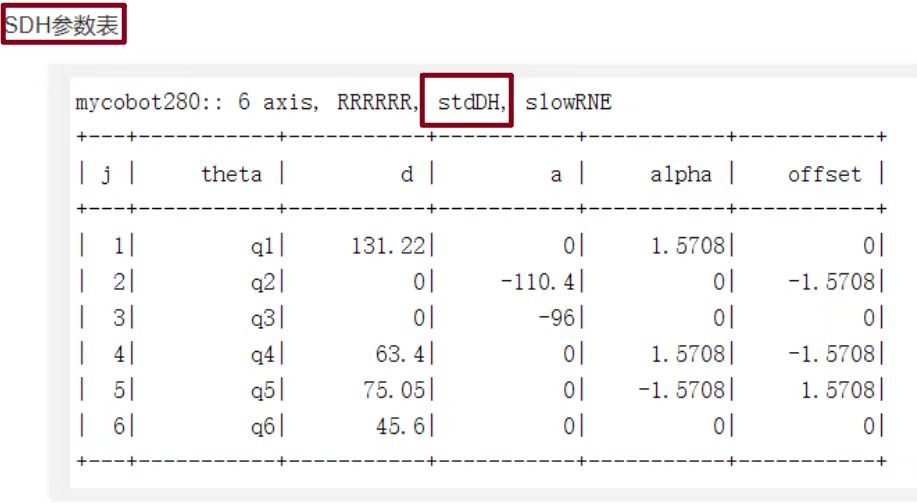

# Others

**Q: How to completely turn off the hotspot auto-start function?**

- A: If you want to completely turn off the hotspot auto-start function, you can move the hotspot_on.desktop folder in the ~/.config/autostart/ folder to another folder directory and restart the machine.

**Q: Raspberry Pi or jetson nano mentions that a password is required. What is this password?**

You can try the following passwords:
```bash
Elephant
elephant
aibot1234
123
123456
123321
aaa
```
If the above passwords are invalid, then the password should not be the password we set. You need to try to reset the system to reset the password. For the reset method, please refer to Section 5 of gitbook.

**Q: How to use mycobot test tool?**

The mycobot test tool is factory-used and is not recommended for users. It may cause zero or pid abnormalities after use, causing damage to the machine. Please delete this tool directly.
If the robot arm has been abnormally moved by using this tool, please refer to the following to readjust the pid and zero position, and do not continue to use this factory test tool in the subsequent use process.
Reference link for resetting pid method:
https://drive.google.com/file/d/1UWhaaSTuwLFImuEGY1J2tvgxTQDwWxK_/view?usp=sharing
Reference link for zero position calibration method:
https://drive.google.com/file/d/1XtKH-ykKWPH0q9Z_YHwzkgwNKRhstHhi/view?usp=sharing

**Q: How to reset to factory settings when the machine is abnormal?**

Restoring to factory settings mainly involves resetting firmware, image, pid and zero position. The following is the reset solution:
- **About resetting the firmware**: It is recommended to ensure that mystudio is updated to the latest version, and then download the corresponding latest Atom version firmware, minirobot firmware (only available in M5 series machines) and pico firmware (only available in 320 series models). For the method of resetting the firmware, please refer to the mystudio chapter of gitbook

- **About resetting the image**: When resetting the image, all contents in the original system will be cleared. If there are important files, please save them in advance. For the method of resetting the image, please refer to the system usage chapter of gitbook

- **About resetting pid**: Generally, when the machine has severe joint shaking, abnormal joint movement speed, and joints curled up, the pid can be reset. For the reset method, refer to: https://drive.google.com/file/d/1UWhaaSTuwLFImuEGY1J2tvgxTQDwWxK_/view?usp=sharing

- **About resetting zero position**: Generally, when the machine has an incorrect zero position and the joint limit is abnormal, the zero position can be recalibrated. For the reset method, refer to: https://drive.google.com/file/d/1XtKH-ykKWPH0q9Z_YHwzkgwNKRhstHhi/view?usp=sharing

**Q: Why can't I see the corresponding Raspberry Pi or Jetson Nano system interface when I connect the Raspberry Pi or Jetson Nano to a personal computer using an HDMI cable or USB?**

A: Since the Raspberry Pi series machines are devices with their own factory systems, which are equivalent to a microcomputer, when two computers are connected via HDMI or USB, only the system interface of the current computer will be displayed, and the Raspberry Pi system interface will not be displayed. This is normal.
Regarding how to correctly enter the Raspberry Pi system, you need to prepare an HDMI screen and connect the HDMI screen to the HDMI interface of the Raspberry Pi via an HDMI cable so that you can see the Raspberry Pi system interface.
If you want to remotely control the Raspberry Pi on your computer later, this is also feasible. You can check the VNC remote tool. For specific usage methods, please refer to the gitbook system usage information.

**Q: What should I do if the Raspberry Pi cannot boot into the system?**

- A: Please follow the steps below to check:

1. Check whether the HDMI interface cable is loose. It is recommended to straighten the HDMI cable. The bending state will affect the signal transmission.



2. Try to replace an HDMI cable or HDMI interface test (there are two HDMI ports on the Raspberry Pi 4b, HDMI0 and HDMI1).



3. Confirm whether it is an HDMI screen (1080p is recommended). The VGA screen will be incompatible and sometimes cannot display the Raspberry Pi screen. It is recommended to try to replace an HDMI screen to test whether there is a screen display.
4. Complete the HDMI wiring first, and then restart the machine several times. The restart interval and boot waiting time are recommended to be 3-5 minutes
5. Check Chapter 5 of gitbook and re-flash the corresponding image file.
6. If the machine still cannot be powered on after burning the image, if you have an Ethernet cable and a router, please connect the Ethernet cable to the Raspberry Pi's network port while the robot is powered on, log in to the router to see if there is a Raspberry Pi device IP, if there is no Raspberry Pi IP, then the Raspberry Pi is damaged.

**Q: Where is the urdf file download path?**

- A: Please refer to the following path, the urdf of all mycobot models are in this path: https://github.com/elephantrobotics/mycobot_ros/tree/noetic/mycobot_description/urdf

**Q: How long is the command transmission delay when the motor is controlled by the robot controller through serial port or socket communication? Is there a communication sequence diagram? How is the real-time performance?**

There is no delay test data for serial port or socket communication here. According to the feedback from our development and use, the real-time performance is still quite high and there will not be a lot of lag

**Q: What is the base coordinate system of the 280M5 robot arm like?**


**Q: Are the joints of 280 controlled by serial bus?**

A: Yes

**Q: Is there more explanation about the understanding of coordinates?**

A: The API for controlling coordinate movement is send_coords([x,y,z,rx,ry,rz], speed)
**x, y, z coordinates:** Controls the position of the end effector of the robot arm in space. Changing these coordinate values ​​will move the robot arm to different spatial positions, thereby achieving positioning in three-dimensional space.
**rx, ry, rz attitude angles:** Controls the attitude or orientation of the end effector of the robot arm. These values ​​are usually given in the form of Euler angles, describing the rotation of the end effector of the robot arm relative to the base coordinate system. The order of Euler angles is zyx. Changing these values ​​will rotate the end effector of the robot arm to different angles or directions.
For example:
When you adjust +X, this means that the position of the end effector of the current robot arm moves a certain distance along the positive direction of the X axis of the current end effector. This action will cause the robot arm to move in a certain direction as a whole. And when you adjust RX, this means that the attitude of the end effector of the current robot arm rotates a certain angle around the X axis of the current end effector. This action will cause the robot arm to rotate as a whole, and the direction of the end effector will change.
In general, the adjustment of +X and RX will directly affect the motion state of the robot arm. +X controls the movement of the position, while RX Control the change of posture.
If you want to see the change more intuitively, we recommend that you use myblockly's serial control tool, adjust a parameter at a time, and observe its change in the coordinate system. Please note that when observing rx, ry, and rz, if you want to be more intuitive, please pay attention to adjusting x and ry when the J1 joint is 0, and adjusting y and rx when the joint is 90.
You can refer to the coordinate system diagram below:




**Q: How to solve the problem of lag when using vscode on Raspberry Pi?**

- A: Reference link: https://blog.csdn.net/u011296285/article/details/121121118
Reference link (En): https://ratticon.com/how-to-fix-slow-visual-studio-code-on-raspberry-pi-4/

**Q: How to use the serial port protocol of the PI/JN series robot?**

- A: In the python code, you can directly send serial port commands to control the joints without external devices

```python
from pymycobot import MyCobot280
import serial
import time

ser=serial.Serial("/dev/ttyAMA0", 1000000)

command1=bytes.fromhex('FE FE 06 21 01 23 28 14 FA')#J1:90
command2=bytes.fromhex('FE FE 06 21 01 00 00 14 FA')#J1:0

ser.write(command1)
time.sleep(3)
ser.write(command2)
ser.close()
```

**Q: Is there any more explanation about the Offset of DH parameter? Offset Is it rotating around z?**

A: DH parameters describe the geometric and kinematic relationship between adjacent links in a robot.
In the DH parameter table, the Offset parameter indicates the effect of the previous link rotating around its z-axis on the position of the next link, that is, the offset when connecting two links. For the Offset parameter in a robot, it generally indicates the effect of the previous link rotating around its own z-axis on the position of the next link, rather than rotating around the z-axis of the next link. Therefore, Offset is not rotating around z, but rather indicates the displacement when connecting two links.

**Q: Can the system add other languages, such as Korean?**

A: Yes, just download the language installation package and apply it




**Q: Which API has trajectory planning?**

A: Please refer to the API for setting coordinates and joints: send_coords(), send_angles(), which comes with motion planning

**Q: If the robot calls the API for controlling coordinates, will there be multiple solutions?**

A: Because inverse kinematics has multiple solutions, the same coordinate position may arrive at different joint angles, which will happen.

**Q: What is the maximum current output of the 24v output pin on the base of the mycobot 320 PI 2022 robot?**

A: Maximum 2A, the duration cannot exceed 1S

**Q: If you want to control the angle and obtain feedback of each axis servo, what is the shortest communication cycle?**

A: This needs to be determined according to the speed. The minimum response time is 50ms

**Q: Does the mycobot series machine have collision detection?**

A: 280 has algorithm collision self-interference, which has been integrated into the API for setting joint angles and coordinates

**Q: What are the input parameters of Atom's USB interface?**

A: 5V @ 500mA

**Q: What are the maximum and minimum joint movement speeds and coordinate movement speeds of 320? What is the acceleration limit?**

A: Refer to the following:



**Q: What is the difference between the 320PI and 320M5 versions?**

A:M5 is more suitable for beginners and can be directly connected to a computer for programming

Pi has stronger computing power than M5. It cannot be directly connected to a computer for development. It is suitable for users who want to use it independently and connect to a display screen for developmenthttps://docs.elephantrobotics.com/docs/gitbook/2-serialproduct/2.0-m5-pi.html

**Q: I need to repair the machine myself. Is there a repair video?**

A: 320 disassembly and assembly video:
https://youtu.be/zP2gvLD3kYs

**Q: Schematic diagram of voltage parameters of 320 and mybuddy power adapter**

A: As shown in the figure below



**Q: Is joint torque information provided?**

A: Our machines only provide the overall information of the joints, not the internal torque, voltage and current of the servos and motor actuators. The parameters disclosed are the overall parameters of the robot arm, such as repeatability, power supply voltage, etc.

**Q: How do you understand the relationship between the two coordinates in the figure below?**


A: It means that if you want to view the transformation relationship between the coordinate system named "turtle1" and the coordinate system named "turtle2", you can use this command. In layman's terms, when you run this command, it will tell you the position and direction information of an object ("turtle1") relative to another object ("turtle2"). Just like you can know the position of a city relative to another city on a map

**Q: At the same position, after the robot arm is in place, how to solve the problem of excessive repeatability deviation?**

Both new and old machines can adjust pid to reduce deviation as much as possible.

Appendix: https://docs.qq.com/doc/DU0VhT2JNVUdNUEJS, https://drive.google.com/file/d/1UWhaaSTuwLFImuEGY1J2tvgxTQDwWxK_/view?usp=sharing
However, the old version of the machine has gear gaps in the 2nd and 4th joints of the robot arm, which is easy to produce joint deviations under the action of gravity, and ultimately affects the end precision. The forces of the 2nd and 4th joints in these four sets of joint values ​​are inconsistent, so the precision is also different. It is currently recommended to adjust through the program. When the machine reaches the point, you can read the point again at this point to check if there is a deviation. On this basis, adjust the specific deviation value of the single joint to achieve the effect of reaching the specified point.

**Q: How to verify whether the camera of the Raspberry Pi version of the robot arm can work properly?**

A: Refer to this for verification: https://blog.csdn.net/Mark_md/article/details/107494841

**Q: What is the difference between API and serial port commands to directly control joints?**

A:
1. Serial port commands:
   - a. Serial port commands are sent to the robot controller in the form of raw binary data.
   - b. It is usually necessary to manually encode the angle, speed, acceleration and other parameters of each joint, and then convert them into hexadecimal form and send them.
   - c. It is necessary to understand the format and meaning of each command and ensure that it is sent to the controller correctly.
   - d. Directly sending serial port commands is more flexible, but also more complicated, and requires a deep understanding of the communication protocol of the robot controller.
2. API control:
   - a. API provides an advanced function interface that can more conveniently control the movement of the robot.
   - b. Instead of manually encoding binary commands, call the API function and pass the required parameters to the function.
   - c. API usually hides the underlying communication details, provides a simpler and easier-to-use interface, and reduces the complexity of use.
   - d. Usually provides a variety of convenient functions, such as path planning, motion interpolation, etc., making the control more flexible and efficient.

In general:
Using serial port instructions to directly control the robot arm is more flexible, but also more complicated, requiring a deep understanding of the communication protocol; while using API control is simpler and more convenient, but may be limited by the functions and performance provided by the API.

**Q: Click to open a program or application prompt password, what is this password?**



A: Password: aibot1234

**Q: What is the difference between MDI and JOG?**

A: MDI (Manual Data Input) is called the set value direct given operation mode. That is, after the upper controller directly sets the target position, speed, acceleration and deceleration, the axis automatically moves to the target position. MDI is also the most commonly used positioning function in practical applications.
JOG moves continuously in a certain direction.

**Q: Overseas maintenance policy form**




**Q: What is the latest supported version of pymycobot for each model?**


**Q: DH table How to distinguish between standard and improved**

sdh, std, standard mdh, modify, improved
We provide the standard DH table. Customers can convert it by themselves if necessary. It is just two different description methods.



**Q: How to check the data transmission speed?**
A: Use the following code:

```python
import time
from pymycobot import MyCobot320
mc = MyCobot320("COM8",115200, debug = True)
while 1:
mc.get_angles()
```


write indicates the issued acquisition instruction, read is the returned message, and the left side is the time. Here it shows 518write +611read, indicating that the read of get_angles is completed in about 100ms, and the frequency is 10hz.

**Q: The indicator light of the adapter is not on**

A: It is possible that the adapter has been powered off for self-protection after a short circuit. Disconnect the adapter for a few minutes before using it. If it does not work after a few minutes, wait a little longer for 15 minutes and then power on the adapter separately to see if it lights up.

**Q: A joint of the robot arm cannot move. How to deal with it?**

A: You can use a python script to read the angle in a loop, and then manually turn the joint to see if the angle changes.

If there is a return value, check the following points and return the information to the technical support staff.

1. Use get_servo_status to check if the J2 servo has hardware problems such as undervoltage/overvoltage

2. Manually turn J2 to see if there is obvious resistance, and compare it with other joints; enable focus_servo(2) on J2 separately

3. Use the script to check if there is any problem with the parameters


**Atom abnormal LED lights up red**

320:
Next cutecom, serial assistant sends fefe 02 19 fa

**Q: End zero position abnormality**

A: After using the adaptive gripper to grip objects for a long time, the gripper and end zero position will be abnormal, and the gripper needs to be stationary.

**Q: What are forward kinematics and inverse kinematics?**

A: Forward kinematics refers to solving the position and posture of the robot's end effector (such as the gripper of the robot arm) in Cartesian space when the angles (or displacements) of each joint of the robot are known. It is implemented in the get_coords() API, but the specific algorithm is not public.
Inverse Kinematics is the opposite of forward kinematics. It refers to solving the angles (or displacements) of each joint of the robot when the position and posture of the robot end effector in Cartesian space are known. write_coords(), send_coords()