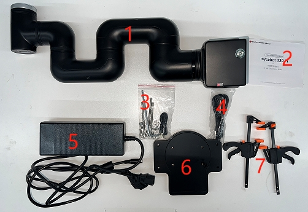

# 产品标准清单

## 1 产品列表图片

每件产品都有编号和详细说明，以确保您能准确参考您的清单。

## 2 产品标准清单对照表

| 序列号 | 产品                                                                  |
| ------ | --------------------------------------------------------------------- |
| 1      | MyCobot 320 Pi 机械臂                                                 |
| 2      | 产品手册                                                              |
| 3      | 产品套件，包括 USB-Type C、跳线、M6\*35、杯形六角头、全螺纹不锈钢螺钉 |
| 4      | Micro HDMI 线缆                                                       |
| 5      | 24V 9.2A 支持电源                                                     |
| 6      | 平底                                                                  |
| 7      | 夹具支架                                                              |

**注：** 包装箱到位后，请确认机器人包装完好无损。如有损坏，请及时联系物流公司和您所在地区的供应商。开箱后，请根据物品清单检查箱内的实际物品。

---

[← 上一节](4.1_320_PI_firstUse.md) | [下一节 →](4.1.2-UNbox.md)
