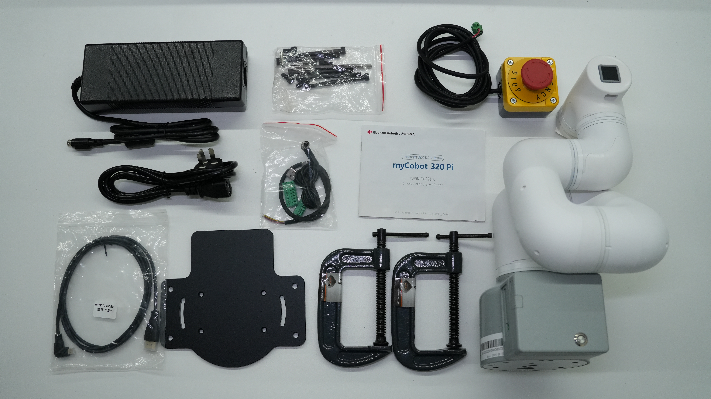

# 产品标准清单

## 1 产品列表图片

每件产品都有编号和详细说明，以确保您能准确参考您的清单。

## 2 产品标准清单对照表

| 序列号 | 产品                                                                  |
| ------ | --------------------------------------------------------------------- |
| 1      | MyCobot 320 Pi*1                                                     |
| 2      | 电源适配器*1                                                           |
| 3      | 产品手册*1                                                             |
| 4      | 夹持器*2                                                              |
| 5       | 固定底座*1                                                             |
| 6       | 急停开关*1                                                             |
| 7       | HDMI线缆*1                                                             |
| 8       | USB线缆*1                                                              |
| 9       | M8末端线缆*1                                                             |
| 10      | 插拔式接线端子排*2                                                        |
| 11      | 螺丝包*1                                                                |
| 12      | 内六角扳手*1                                                             |

**注：** 包装箱到位后，请确认机器人包装完好无损。如有损坏，请及时联系物流公司和您所在地区的供应商。开箱后，请根据物品清单检查箱内的实际物品。

---

[← 上一节](4.1_320_PI_firstUse.md) | [下一节 →](4.1.2-UNbox.md)
