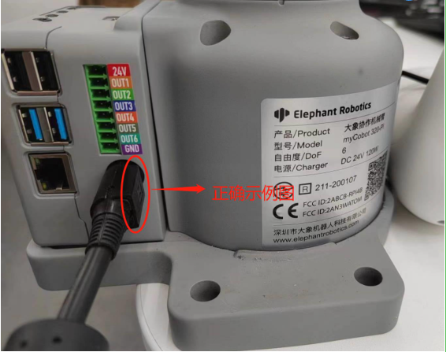
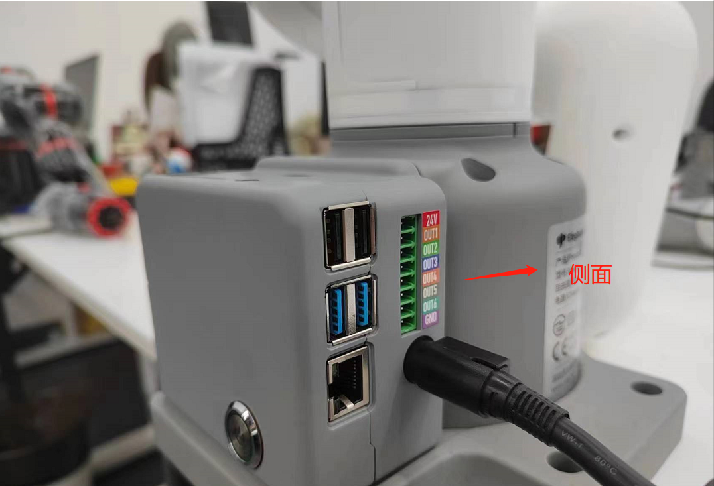
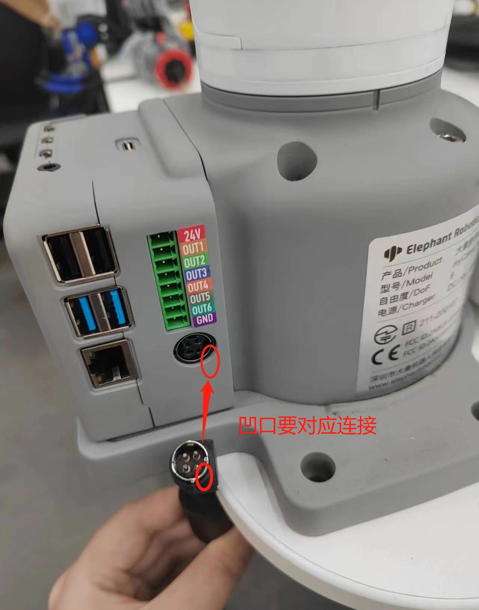

# 外部电缆连接

## 1 图文引导

操作前，请确认您已阅读 **第 3 章安全说明**，以确保操作安全。同时，将电源适配器与机械臂连接，并将机械臂底座固定在桌面上。连接方法如图 3-1 所示。

图 3-1 电源连接器的位置

myCobot 必须使用外部电源供电，以提供足够的电力：

- 额定电压: 24V

- 额定电流: 9.4A

- 插头类型: R7B

**请注意，不能只使用插入 M5Stack-basic 的 TypeC 供电。** 请使用官方认可的电源，以免损坏机械臂。

用例图如下图所示：（请仔细对齐用例图，以便进行连接）

    

 

 

---

[← 上一页](1_StructuralInstallation.md) | [下一页 →](3_PowerOnStatusDisplay.md)
