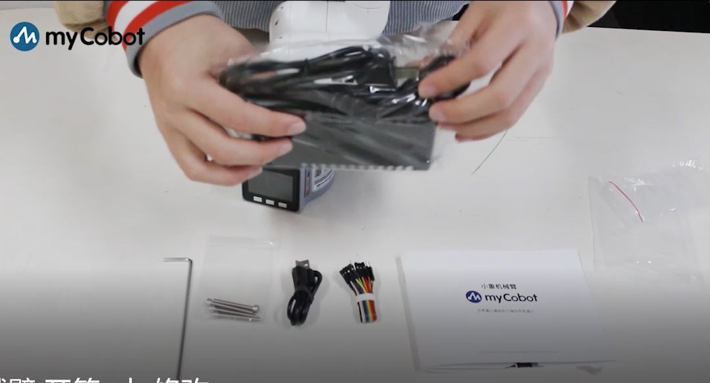
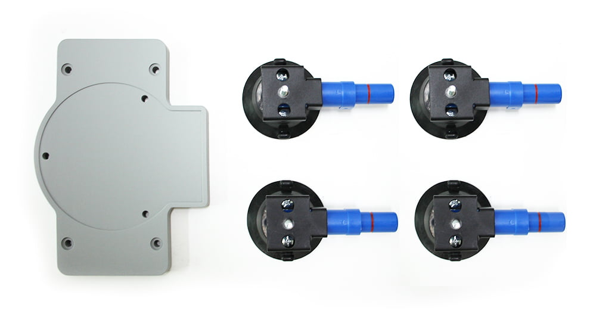

# Use for the first time

## Step 1: Unpacking

After receiving the packing box of the robot, first check that the box is intact. **If it is lost or damaged, contact the logistics company and the local supplier.** After opening the box, check the inside items by referring to the packing list.

**1 Items included in myCobot robot arm \[standard kit\]**

-   myCobot robot arm (Model: myCobot -280)

-   Product catalog

-   Power supply

-   USB-Type C

-   Jumper

-   M4*35, cup head hexagon socket, full thread, stainless steel screw

-   Allen wrench

**2 Confirming the operational environment and indicators**

Install the robot system in the environment that meets the conditions described in the table in order to give full play to and maintain the performance of this machine and to use it safely.

|Environment   |ndex  |
------------ | -------------- 
|Temperature	|-10~45℃
|Relative humidity	|20%~70%|
|Indoor and outdoor requirements	|Indoor|
|other environmental requirements	|Do not expose it to the sunshine Keep it away from dust, oil fume, salt, iron chips, etc  Keep it away from flammable and corrosive liquids and gases It should not come into contact with water Do not apply shock, vibration, etc Keep it away from strong electromagnetic interference sources|

## Step 2:  Connection

Connect the power adapter as shown in the figure.

Connecting the computer

## Step 3: Power supply

The power for myCobot must be supplied by an **external power supply** to provide it with sufficient power: 
- **rated voltage**: 8.4-12V
- **rated current**: 3-5A
- **plug type**: DC 5.5mm x 2.1

Note: **Do not supply power for myCobot only using TypeC inserted into
Basic**

Use the power supply officially provided by the manufacturer to avoid damage to the robot arm.

## Step 4: Fixing myCobot

**1 How to fix myCobot**

During the movement of the robot arm, if **the bottom surface of myCobot is not connected to the table top or other bottom surface**s, myCobot will **shake or overturn**.

There are three common ways to fix the robot arm:

- 1.Fix it on a stand with a LEGO interface by using a LEGO inserting key 
    We provide two types of stands: flat sucking disc and G-clamp,  which can be found in [myCobot peripheral stand](https://docs.elephantrobotics.com/docs/acc-en/2-serialproduct/2.7-accessories/2.7-accessories.html).
    
    -   Flat stand
    **adaptive models**: myCobot 280
    
    
       -   1.Install a sucking disc on the four corners of the stand and tighten  them.
       -   2.Connect the flat stand and the bottom of the robot arm by using accompanying LEGO parts.
       -   3.Fix the four sucking discs on a flat and smooth surface before use.
    
        **Tip:** A small amount of **non-conductive liquid** can be applied under the sucking discs to fill the gap between the  sucking discs and the table top for the best suction effect.
    
    
    
    -  G-stand
    **adaptive models**: myCobot 280 and myPalletizer 260
    
    
       -   1.Fix the stand to the edge of the table with a G-clamp.
       -   2.Connect the stand and the bottom of the robot arm by using accompanying LEGO parts.
       -   3.Do not use it until it becomes stable.
    
    
- 2.Pass **a screw provided for the robotic arm stand** through such  stand, and fasten it to a threaded stand.

    -   Sucking disc stand
	**adaptive models**: myCobot 320
	
	

    **Suitable for flat and smooth surfaces**

    -   1.First open the sucking discs of the self-priming pump, align the four  holes in the stand bottom plate with the self-priming pump, then place the nuts in the four holes and tighten them, and finally fix the bottom  plate and sucking discs.

    -   2.Remove the cover at the bottom of the sucking discs, place it on a  smooth table, and press the sucking discs to pump air. After pumping air  from the four sucking discs, you can test whether the bottom plate has  been fixed, and then tighten the nuts again.

    -   3.Next, fix the robot arm to the bottom plate and align the robot arm with the groove of the bottom plate. After placing them in position,  place three M6x90 screws in three holes of the robot arm, place the corresponding nuts on the bottom plate at the same position, and then  tighten the screws with an Allen key to fix the robot arm on the bottom plate. 
	  

**2 Connecting the screw hole of myCobot stand**

The robot should be fixed on a solid stand before it can be used normally. Stand weight requirements: fixed stand or mobile stand.

Before installation, make sure that there are corresponding threaded
holes on the fixed stand.

Before formal installation, confirm the following:

-   The environment in which the stand is to be installed should meet
    the requirements in the table \"Working Environment and Conditions\"
    above.

-   The installation position should not be smaller than the working
    range of the robot, and sufficient space should be reserved for
    installation, use, maintenance and repair.

-   Put the stand in a suitable position.

-   Installation-related tools, such as screws, wrenches, etc. should be
    ready.

**After confirming the above points**, move the robot onto the stand mounting table, adjust the robot position, and align the fixing holes of the robot stand with the holes in the table. After aligning the holes, align the screws with the holes and tighten them.

**Notice**: When adjusting the robot position on the table, don\'t push and pull the robot on the table directly as much as possible to avoid scratches. When manually moving the robot, don\'t apply external force to the vulnerable parts of the body so as to avoid unnecessary damage to the robot.

## Video Tutorial

[**Opening the box of myCobot quickly**](https://www.bilibili.com/video/BV1To4y1f71P/)
[**Opening the box of myCobot Pro quickly**](https://www.bilibili.com/video/BV1bL411p7dY/)
