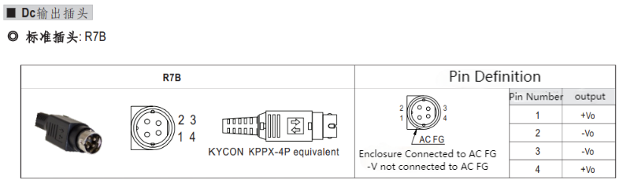

# Boot detection guide

## 1 Structural installation and fixation

myCobot weights 3.3 kg. Due to the fact that the center of gravity will change along with the movement of the robot during utilization, robot is required to be fixed on a solid base at the beginning. A fixed base, or mobile base are both acceptable.

#### Base Interface Size

- The base fixing holes act as the interface between robot and other bases or planes. The specific hole size is shown in the figure below. There are 4 countersunk holes with a diameter of 4.5 mm, which can be fixed with M6 bolts.

  

- The end is mounted with flange and is compatible with both LEGO component holes and screw threaded holes. Please make sure that there are corresponding threaded holes on the fixed base before installing.

#### _Before the installation, please confirm:_

- The environmental condition meets the requirements listed in Section 2.2.1.3.1 above.

- The installation position is no smaller than the working range of the robot, and there is enough space for installation, use, maintenance and repair.

- Put the base in a suitable position.

- Installation-related tools are prepared, such as screws, wrenches, etc.

- After confirming the above, please move the robot to the base installation table, adjust the robot position, and align the fixing holes of the robot base with the holes on the base mounting table. After aligning the holes, align the screws with the holes and tighten them.

  > **Notice:** When adjusting the position of the robot on the base installation table, do not pushing or pulling the robot directly on the base installation table to avoid scratches. When manually moving the robot, do not applying external force to the fragile parts of the robot body, so as to avoid unnecessary damage to the robot.

**For more installation details, scan the code to watch the video:**

## 2 External cable connection

Before operation, confirm that you have read **Chapter Safety Instructions** to ensure safe operation. At the same time, connect the power adapter with the robotic arm, and fix the base of the robotic arm on the table.

myCobot must be powered on with an external power supply to provide sufficient power:

- Rated voltage: 24V
- Rated current: 9.4A
- Plug Type: R7B
  

**Note that you cannot just use the TypeC plugged into the M5Stack-basic for power.** Use an officially adapted power supply to avoid damage to the robotic arm.

The use case diagram is shown in the following figure: (Please carefully align it with the use case diagram for connection)

**Step 1:** 

 

**Step 2:** 

 

**Step 3:** 

 

**Step 4:** 

 

**Step 5:** 

 

**Step 6:** 

 

## 3 Power on status display

Make sure that the power adapter and emergency stop switch are connected, press the power switch **Start button (round)**, then the **LED light panel of ATOM at the end of the robot arm will light**, and the **LED light panel at the bottom of the robot arm will light up**. **BASIC interface** will display **Atom communication status**.

## 4 Basic function detection

When performing this operation, please refer to section [5.1-4 Robot Information](/5-BasicApplication/5.1-SystemUsageInstructions/320m5/4.2.4.1-micro_controller.md) for guidance. Prior to proceeding, ensure that you have followed the electrical connection instructions mentioned above and confirm that your device is securely installed. Failure to properly connect the cables or secure the device may result in accidents. Thank you for your cooperation.

---

[← Previous Page](4.2.2-UNbox.md) | [Next Chapter →](../../5-BasicApplication/README.md)
