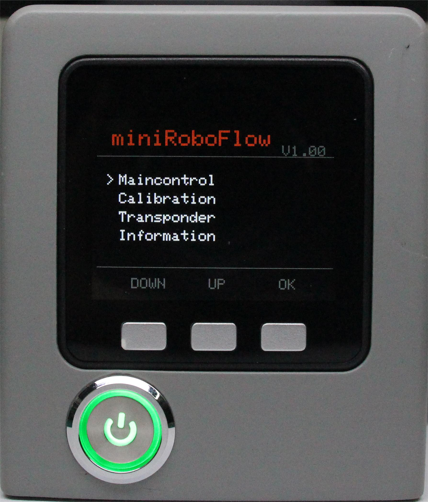

# 开机状态显示

## 1 图文引导

### 1.1 打开电源

确保电源适配器和急停开关已连接，按下电源开关**启动按钮（圆形）**.

### 1.2 机器人启动

然后机械臂末端的 ATOM**LED 灯板将点亮**，表示正在启动。

### 1.3 状态展示

机械臂末端的**LED 灯板将点亮**。底部屏幕将显示相关信息。

---

[← 上一页](2_ExternalCableConnection.md) | [下一页 →](4_BasicFunctionDetection.md)
