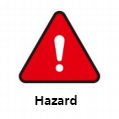
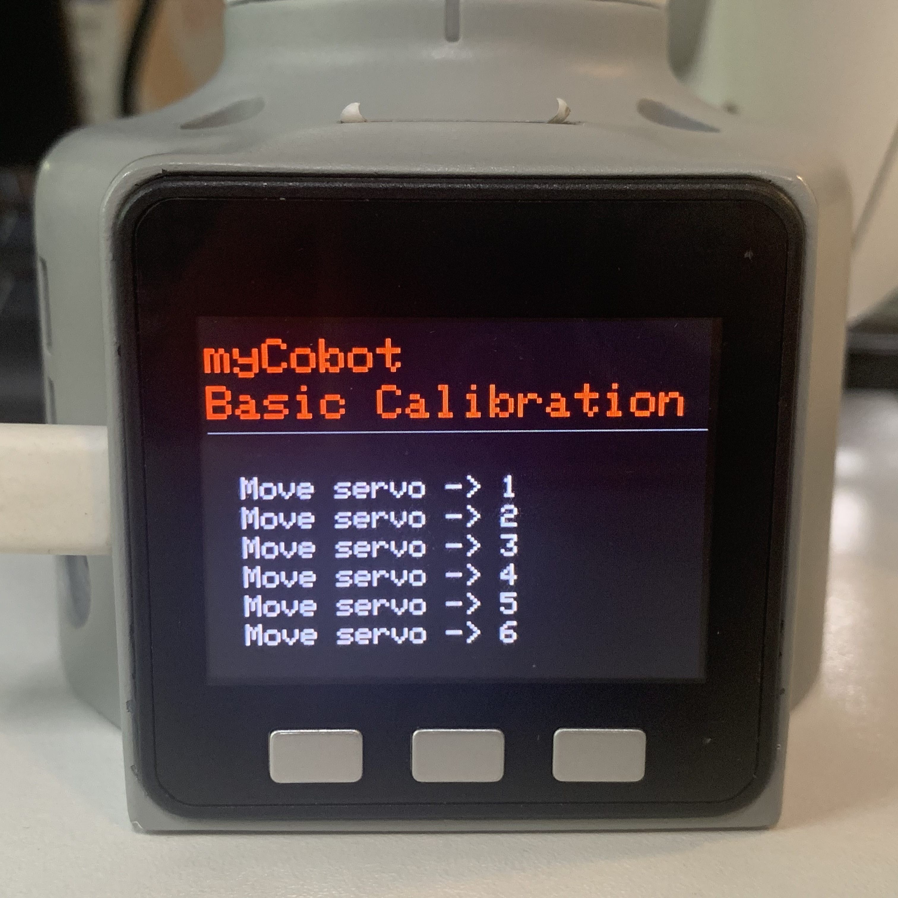
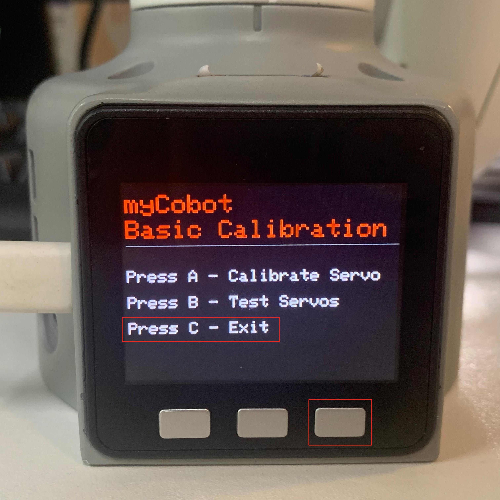

# Robot arm Calibration

|        | This operation has been performed before the default robot is delivered. You do not need to repeat the operation. Incorrect use of this function may cause damage to the robot. If your robot works without abnormal conditions, **please do not use it**. Thank you for your cooperation.  |
|------------------------|-------------------|
| |This chapter uses photos of the myCobot 280 M5 model for reference. The operating steps for the myCobot 320 model are the same, so there is no need to worry.|

 

Calibrating the robot arm is the precondition for precise control of the robot arm, and setting joint zero and initializing the potential of the motor are basic jobs for subsequent advanced development.

**Different types of equipment have different operating methods**. They have the approximate steps below: 
- Burn the latest version of **atomMain** for **Atom**, and the **minirobot** for **M5Stack-basic**. 
- Choose the **Calibration** function (It is unnecessary to burn **Basic** for micro-CPU devices)
- move all joints of the robot arm to their zero positions (align them with the scale line of zero positions)
- Press the calibration button and get started with robot arm calibration
- press the test button to test the zero positions
- press the exit button to exit this function

In this chapter, we will teach you how to calibrate the robot arm and to test and verify the joints.

## Calibration Demonstration

### 1 Applicable Robotic Arms

- myCobot 320 M5

### 2 Steps to Operate the Arm

**Step 1:** Burn the latest **atomMain** for **Atom**.

**Step 2:** Burn the **minirobot** for **M5Stack-basic**, and press **Calibration**.

 

**Step 2:** Press **A** to start robot arm calibration.

 

**Step 3:** Align each joint with zero-position line in sequence.

 

**Step 4:** After finishing calibrating all joints, a signal **Already Calibrate all !!** emerges on the screen.

 

**Step 5:** Press **EXIT** to stop calibration and then press **B** to test the zero positions of all joints.

 

 

**Step 6:** Press **C** to exit this function. Calibration completes.

 

<!-- ### 3 Tutorial Video 

Video Address: [https://www.bilibili.com/video/BV1FT4y1P7BV/](https://www.bilibili.com/video/BV1FT4y1P7BV/) -->

----
[← Previous Page](..//320m5/) | [Next Page →](../320m5/4.2.2.1-micro_controller.md)

