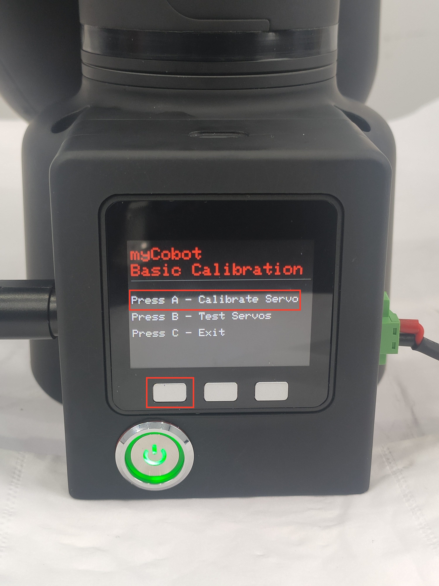
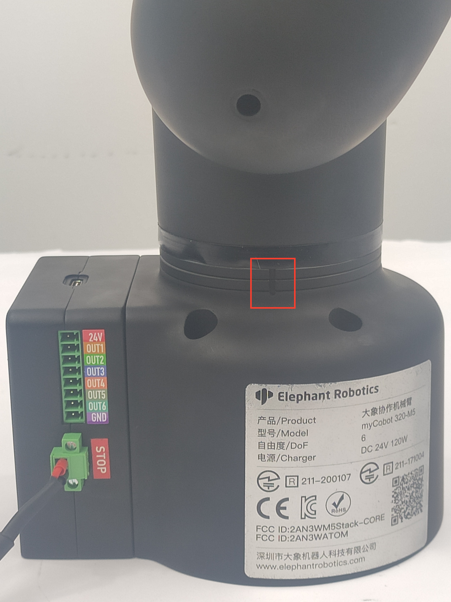

# 机器人手臂校准

|  | 默认机器人交付前已执行过此操作。无需重复操作。错误使用此功能可能会损坏机器人。如果您的机器人在无异常情况下工作，**请勿使用**。感谢您的合作。 |
| ------------------------------------------------------------------------------------------------------------------- | -------------------------------------------------------------------------------------------------------------------------------------------- |

 

校准机械臂是精确控制机械臂的前提，而设置关节零点和初始化电机电位则是后续高级开发的基本工作。

**不同类型的设备有不同的操作方法**。它们的大致步骤如下：

- 为**Atom**刻录最新版本的**atomMain**，为**M5Stack-basic**刻录**minirobot**。
- 选择**校准**功能（微型 CPU 设备无需刻录**基本**）。
- 将机械臂的所有关节移动到零位（与零位刻度线对齐）
- 按下校准按钮，开始机器人手臂校准
- 按下测试按钮测试零位
- 按退出键退出此功能

在本章中，我们将教您如何校准机械臂以及测试和验证关节。

## 校准演示

### 1 适用的机械臂

- myCobot 320 M5

### 2 操作手臂的步骤

**Step1:**

- 请确认您已了解产品安全说明，并确保已按照第 4 章所述使用电缆连接设备。
- 打开电源开关，确保紧急停止开关已连接且未按下。
- 确认机器人末端执行器上的 Atom LED 灯板是否亮起，机器人的关节是否有扭矩输出，使关节无法旋转。

**Step 2:** 按 **OK** 选择 **Calibration**.

 

**Step 2:** 按 **A** 开始机器人手臂校准。

 

**Step 3:** 依次将每个接头与零位线对齐。

 

**Step 4:** 完成所有关节校准后，屏幕上会出现**已校准所有关节！！**的信号。

 

**Step 5:** 按**退出**停止校准，然后按**B**测试所有关节的零位。

> 关节将正反旋转 15-30 度，然后返回零位。

 

 

**Step 6:** 按 **C** 退出此功能。校准完成。

 

<!-- ### 3 Tutorial Video

Video Address: [https://www.bilibili.com/video/BV1FT4y1P7BV/](https://www.bilibili.com/video/BV1FT4y1P7BV/) -->

---

[← 上一页](..//320m5/4.2.1.1-micro_controller.md) | [下一页 →](../320m5/4.2.3.1-micro_controller.md)
