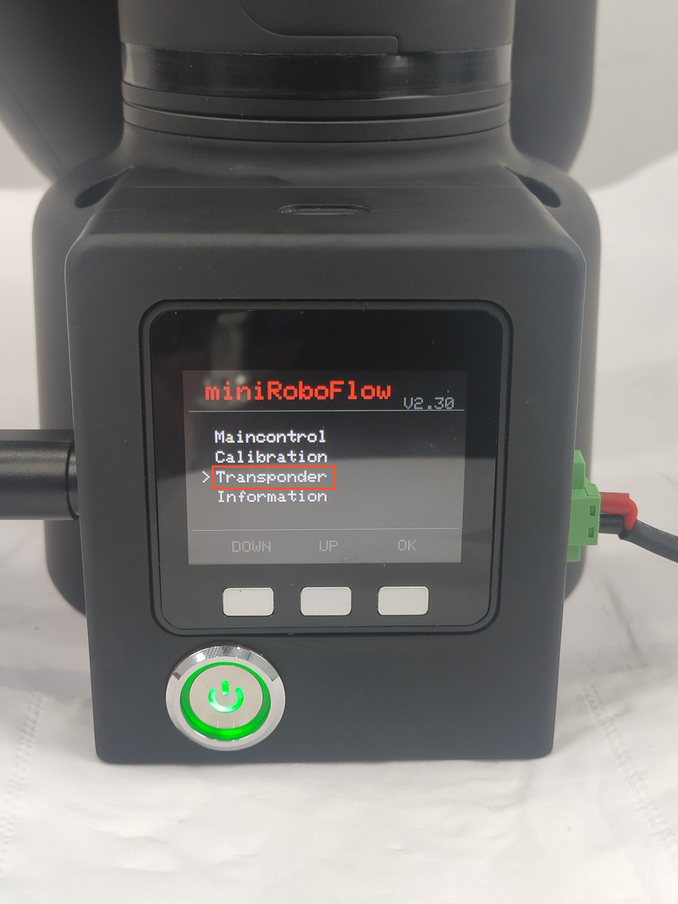
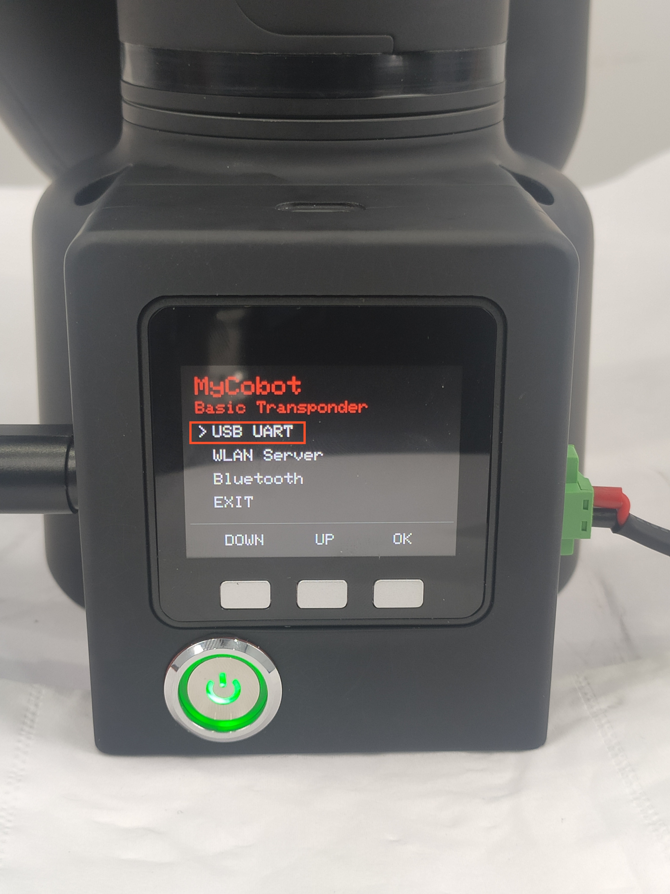
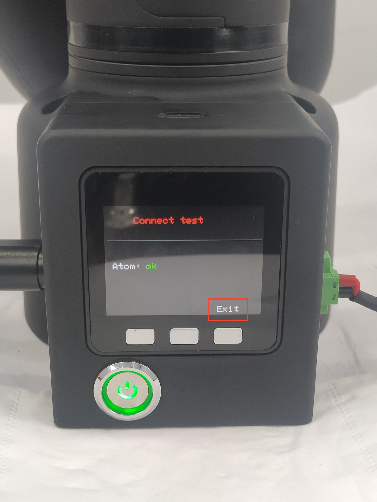

# Communication

 

This chapter describes the use of the built-in software's extended development capabilities. This feature allows you to expand the device's connectivity options and support different development environments and methods.

At present, communication forwarding supports three connection methods: USB, Wi-Fi, and Bluetooth. They are applied to different functional development scenarios.   
- USB and Wi-Fi are used to connect to other master control devices, and through the robot communication protocol, you can control the robot to execute corresponding commands.     
- Bluetooth is used to connect to mobile control software, enabling quick mobile control from your phone.   

## 1 Applicable Robotic Arm

- myCobot 320 M5

## 2 USB Port Control

**Step1:**  
- Please confirm that you are aware of the product safety instructions and ensure that the device has been connected with cables as described in Chapter 4.
- Turn on the power switch and ensure that the emergency stop switch is connected and not pressed.
- Confirm that the Atom LED light board at the robot's end-effector is illuminated and that the robot's joints have torque output, making the joints unable to rotate.

**Step 2:** Press **OK** Select **Transponder** to Transponder Main Page.

 

**Step 3:** Choose the function you want to use, with USB connection as an example below.

 

**Step 3:** Check Atom State

 

`atom: ok` means that Atom is connected normally.

> If all your output statuses are 'no,' please ensure that your device's firmware is correct. Check the power connections and emergency stop switch connections again, and confirm that the emergency stop switch has not been pressed. After confirming, restart the device and repeat the current step.

**Step 4:** Choose the appropriate development method and try communicating with the robot. For more details, you can refer to the [SDK Development](/6-SDKDevelopment/README.md) chapter.

**Step 5:** If you want to modify the connection method Press **C** to exit.

 

----
[← Previous Page](./4.2.2.1-micro_controller.md) | [Next Page →](./4.2.4.1-micro_controller.md)