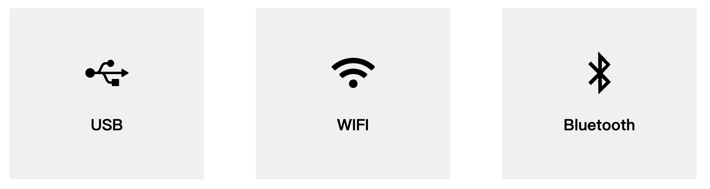

# Communication

 

This chapter describes the use of the built-in software's extended development capabilities. This feature allows you to expand the device's connectivity options and support different development environments and methods.

At present, communication forwarding supports three connection methods: USB, Wi-Fi, and Bluetooth. They are applied to different functional development scenarios.   
- USB and Wi-Fi are used to connect to other master control devices, and through the robot communication protocol, you can control the robot to execute corresponding commands.     
- Bluetooth is used to connect to mobile control software, enabling quick mobile control from your phone.   

## 1 Applicable Robotic Arm

- myCobot 320 M5

## 2 Steps to Operate

| |This chapter uses photos of the myCobot 280 M5 model for reference. The operating steps for the myCobot 320 model are the same, so there is no need to worry.|
|------------------------|-------------------|

**Step 1:** Please make sure that your device's software version and firmware version are both unchanged (factory default versions) before use. If you have made any modifications to the software or firmware, ensure that your actions comply with the requirements outlined in the [myStudio firmware update](/5-BasicApplication/5.2-ApplicationUse/5.2.2-mystudio/320m5/3-flash_firmwares.md) section.

**Step 2:** Press the **Transponder**

**Step 3:** Choose the function you want to use, with USB connection as an example below.

**Step 3:** Check Atom State

`atom: ok` means that Atom is connected normally.

> If all your output statuses are 'no,' please ensure that your device's firmware is correct. Check the power connections and emergency stop switch connections again, and confirm that the emergency stop switch has not been pressed. After confirming, restart the device and repeat the current step.

**Step 4:** Choose the appropriate development method and try communicating with the robot. For more details, you can refer to the [SDK Development](/6-SDKDevelopment/README.md) chapter.

**Step 5:** If you want to modify the connection method Press **C** to exit.

