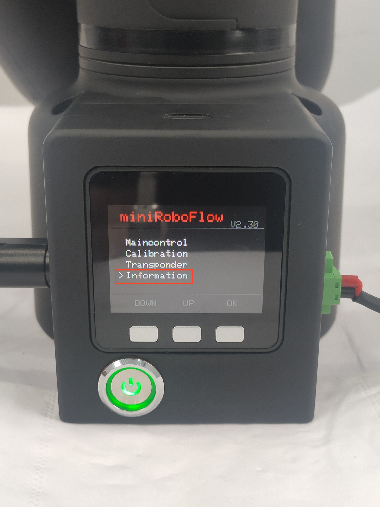
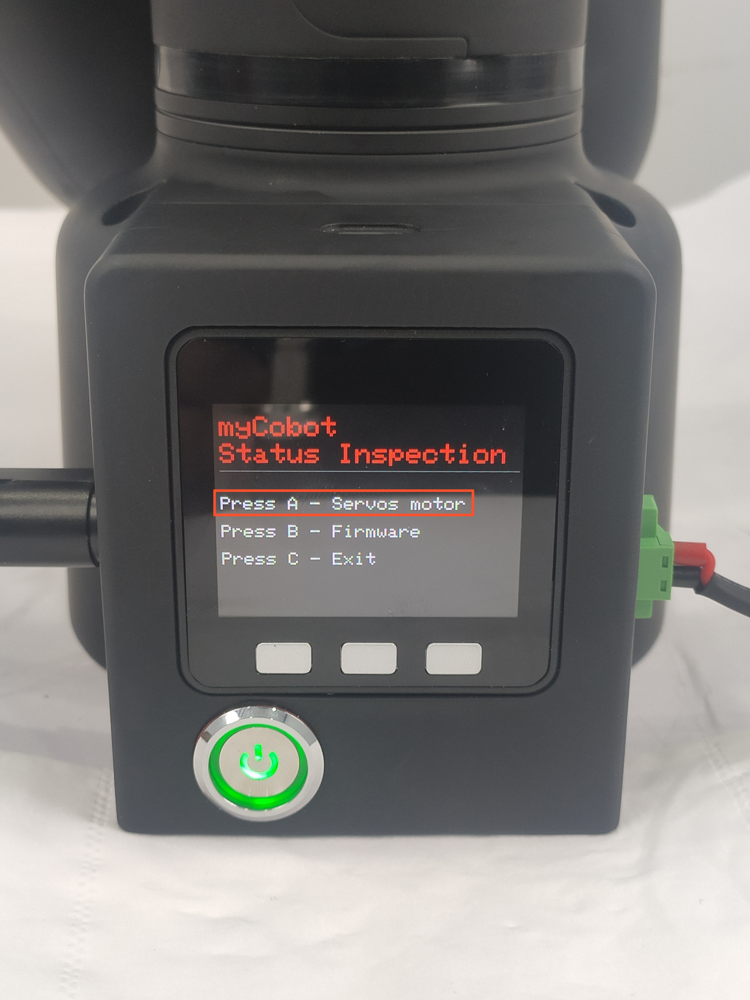
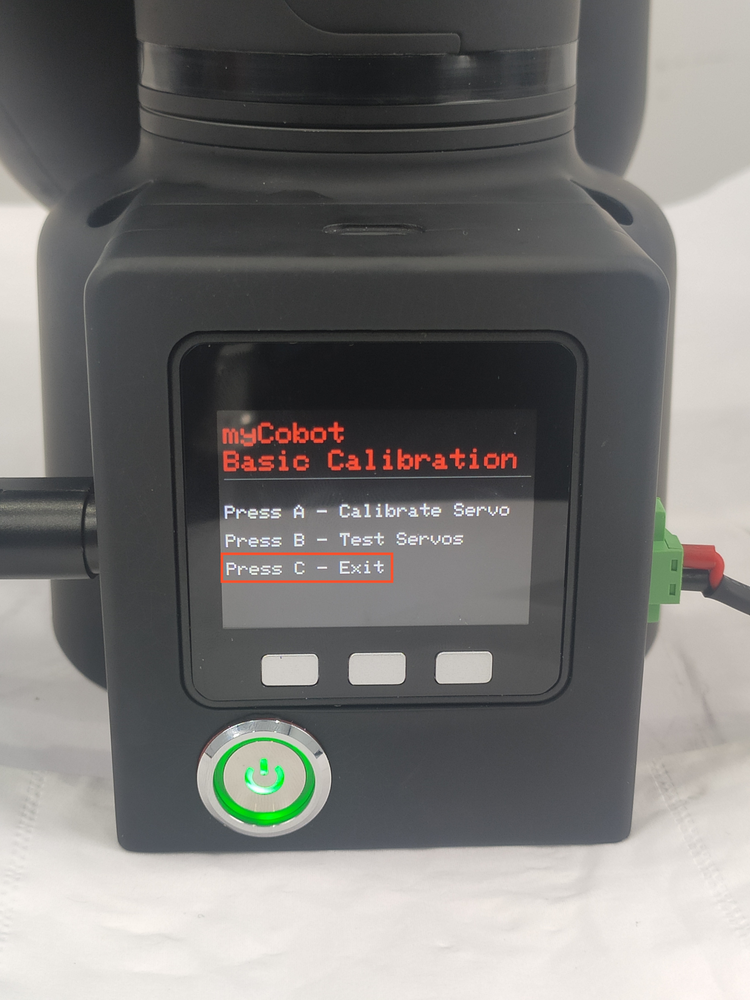

# Connection detection

This chapter explains how to use the basic software to check your device's status. Please make sure that your device's software version and firmware version are both unchanged (factory default versions) before use. If you have made any modifications to the software or firmware, ensure that your actions comply with the requirements outlined in the [myStudio firmware update](/5-BasicApplication/5.2-ApplicationUse/5.2.2-mystudio/320m5/3-flash_firmwares.md) section.

## Connection Detection

### 1 Applicable Robotic Arms

- myCobot 320 M5

### 2 Steps to Operate the Arms

**Step1:**  
- Please confirm that you are aware of the product safety instructions and ensure that the device has been connected with cables as described in Chapter 4.
- Turn on the power switch and ensure that the emergency stop switch is connected and not pressed.
- Confirm that the Atom LED light board at the robot's end-effector is illuminated and that the robot's joints have torque output, making the joints unable to rotate.

**Step 2:** Press **OK** Select **Information** to Information Main Page.

**Step 2:** Press the **Information**.  
 

**Step 2:** Press the **Button A**  

 

**Step 3:** Check Atom & Servo Motor State

`atom: ok` means that Atom is connected normally.

`servo x: ok` means that six motors are connected normally.

 

> If all your output statuses are 'no,' please ensure that your device's firmware is correct. Check the power connections and emergency stop switch connections again, and confirm that the emergency stop switch has not been pressed. After confirming, restart the device and repeat the current step.

**Notice:** Press **B** for the version information.

 

> You can refer to the recommended firmware version in myStudio or the firmware documentation section.

**Step 4:** Press **C** to exit this function.

 

----
[← Previous Page](./4.2.3.1-micro_controller.md) | [Next Page →](../../5.1-SystemUsageInstructions/320m5/README.md)