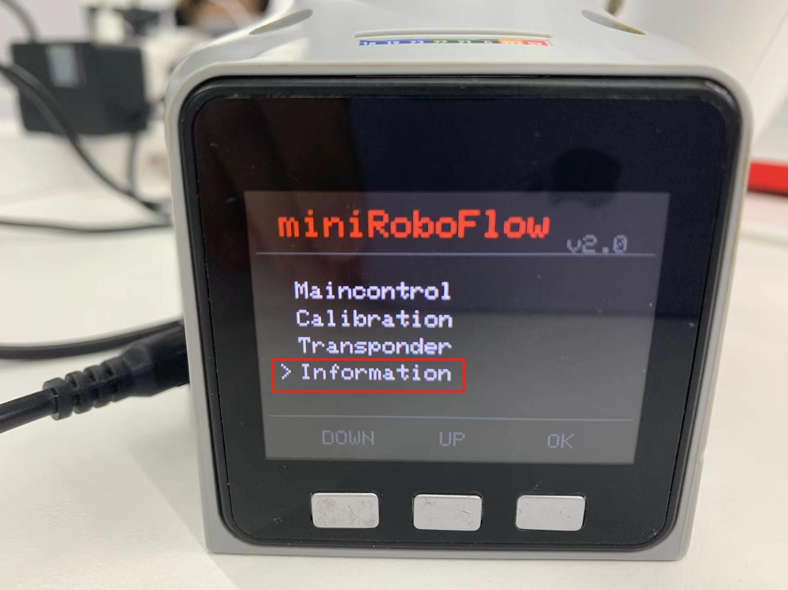
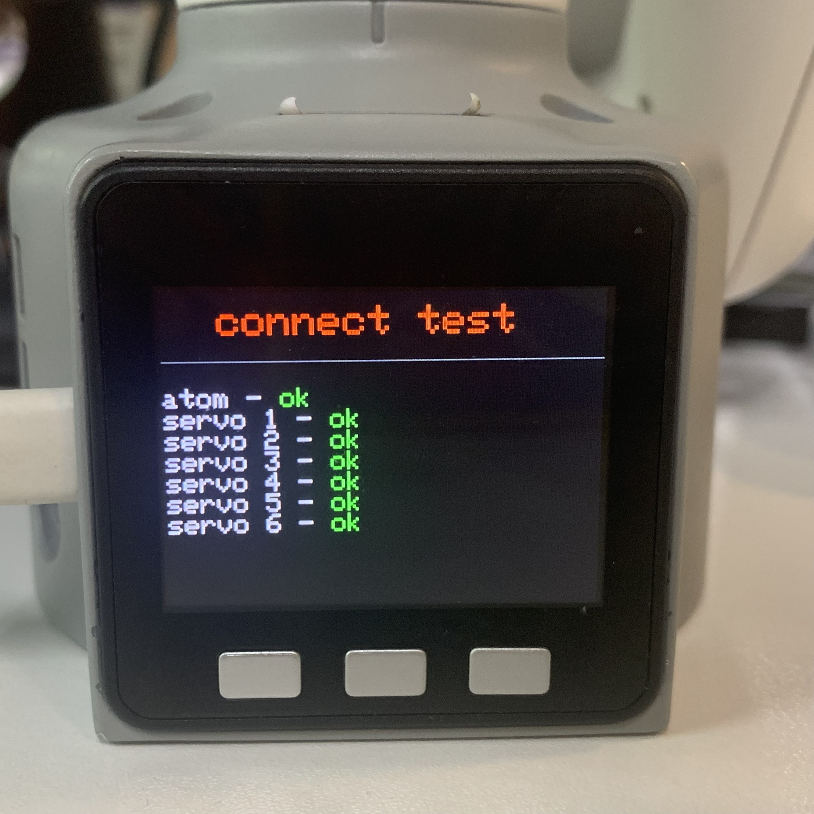

# Connection detection

This chapter explains how to use the basic software to check your device's status. Please make sure that your device's software version and firmware version are both unchanged (factory default versions) before use. If you have made any modifications to the software or firmware, ensure that your actions comply with the requirements outlined in the [myStudio firmware update](/5-BasicApplication/5.2-ApplicationUse/5.2.2-mystudio/320m5/3-flash_firmwares.md) section.

## Connection Detection

### 1 Applicable Robotic Arms

- myCobot 320 M5

### 2 Steps to Operate the Arms

| |This chapter uses photos of the myCobot 280 M5 model for reference. The operating steps for the myCobot 320 model are the same, so there is no need to worry.|
|------------------------|-------------------|

**Step 1:** Please make sure that your device's software version and firmware version are both unchanged (factory default versions) before use. If you have made any modifications to the software or firmware, ensure that your actions comply with the requirements outlined in the [myStudio firmware update](/5-BasicApplication/5.2-ApplicationUse/5.2.2-mystudio/320m5/3-flash_firmwares.md) section.

**Step 2:** Press the **Information**.

 

**Step 2:** Press the **Button A**

 

**Step 3:** Check Atom & Servo Motor State

`atom: ok` means that Atom is connected normally.

`servo x: ok` means that six motors are connected normally.

 

> If all your output statuses are 'no,' please ensure that your device's firmware is correct. Check the power connections and emergency stop switch connections again, and confirm that the emergency stop switch has not been pressed. After confirming, restart the device and repeat the current step.

**Notice:** Press **B** for the version information.

 

**Step 4:** Press **C** to exit this function.

