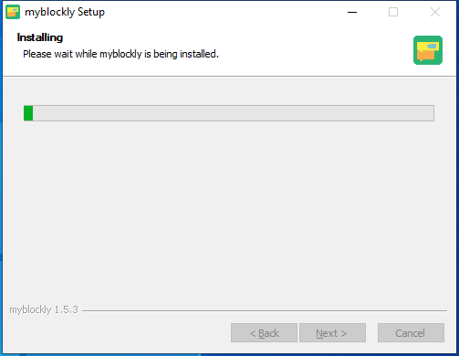
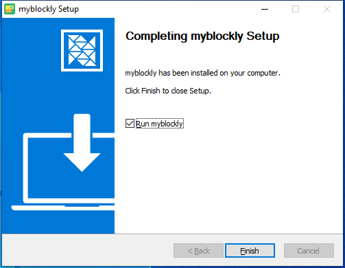
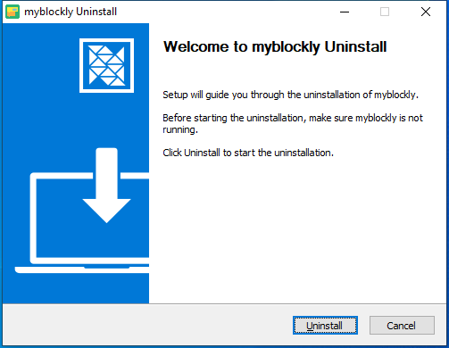

# myBlockly download and install

### Download

download link **[Official website address](https://www.elephantrobotics.com/en/downloads/)**

You need to download different installation packages according to your operating system.

Different suffixes represent different systems, please download the corresponding version:

- *.AppImage  : Linux system

* *.dmg : Mac system
* *.exe : Window system

## Install

#### For Windows installation

Double-click to open the file named`myblockly-Setup-latest.exe`

Click to `Run`

After clicking `Install`, wait for `**myblockly`installation to complete

The installation is complete, click the `Finish` button to open and run myblockly

### For Linux systems install myblockly

Download the Linux version of `myblockly` from the official website and you will get an installation package as shown below

Select `myblockly-arm64-latest.AppImage`, right-click to open it, click `Properties` to open it

Click to enter `Permissions`

In the `Permissions` page, check `Allow executing file as program`, and then click the `Close` button to close the pop-up window

After closing the pop-up window, double-click the installation package `myblockly-arm64-latest.AppImage` to open myblockly

### For MacOS install myblockly

Download the Mac version of myblockly from the official website to get an installation package as shown below. Double-click to open it.

**Note**: For MacOS, make sure system "Preferences->Security & Privacy->General" and Allow Apps from App Store and Recognized Developers are enabled before installing.

## Uninstall

### For Linux uninstall myblockly

**Just delete the installation package directly**

>The default name of the installation package is `myblockly-arm64-latest.AppImage`

### Uninstall myblockly for Mac

**Just move myblockly to the Trash in the app**

### For Windows uninstall myblockly

Enter the file directory of myblockly and click to run `Uninstall myblockly.exe`

Click `Uninstall`

myblockly has been uninstalled, click `Finish` to exit

## Update

If you want to update myblockly, please go to the [official website](https://www.elephantrobotics.com/en/downloads/) to download the latest version.

## Serial Driver Installation

Before using myStudio to burn, you need to download the serial driver, i.e. CP210X or CP34X driver zip.There are currently two driver chip versions, CP210X (for CP2104 version) / CP34X (for CH9102 version) driver zip. If you are not sure which USB chip your device uses, you can install both drivers at the same time. (CH9102_VCP_SER_MacOS may report an error during the installation process, but the installation is actually complete, so just ignore it). Please click the link below to download the driver according to your computer system (please refer to [5.2.2-myStudio driver installation](../../5.2.2-mystudio/320m5/2-install_driver.md) for detailed installation steps).

- Download the **M5Stack-basic** serial port driver at the bottom

  - **CP210X**
    - [ **Windows10** ](https://download.elephantrobotics.com/software/drivers/CP210x_VCP_Windows.zip)
    - [ **MacOS** ](https://download.elephantrobotics.com/software/drivers/CP210x_VCP_MacOS.zip)
    - [ **Linux** ](https://download.elephantrobotics.com/software/drivers/CP210x_VCP_Linux.zip)

    - **CP34X**

      - [ **Windows10** ](https://download.elephantrobotics.com/software/drivers/CH9102_VCP_SER_Windows.exe)

      - [ **MacOS** ](https://download.elephantrobotics.com/software/drivers/CH9102_VCP_MacOS.zip)

[← Previous Page](./1-myBlocklyFirstUse.md) | [Next Page →](./3-interface_description.md)