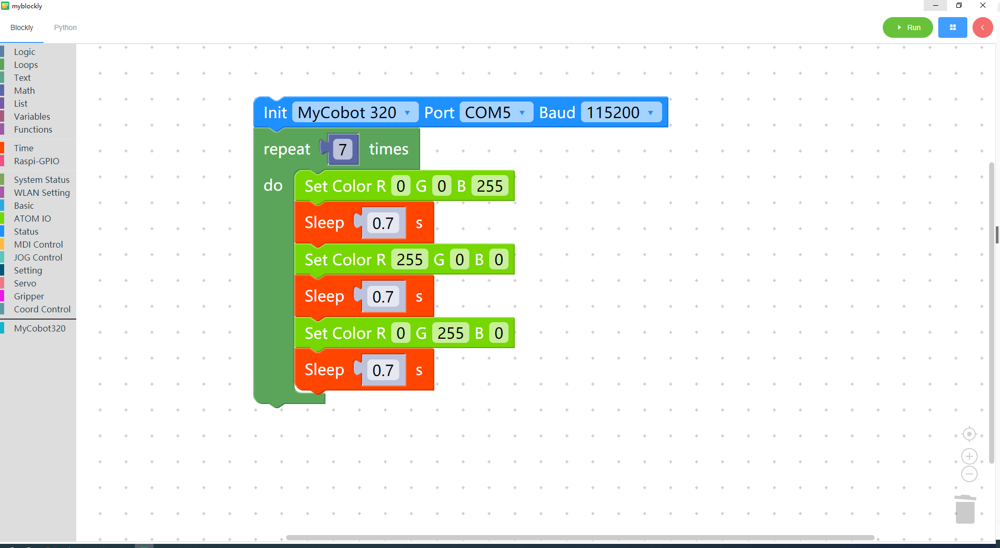

# 4 Control RGB light panel

<i>Preparation before you begin</i>

- Make sure the robotic arm is connected to the computer

- Make sure the machine is normal

- Make sure the machine is power on

### Learning content of this chapter

How to control RGB light panel using myBlockly

#### API introduction

* method module：`Set color`

  

* Parameter introduction:

  * The parameters that need to be set are R (`x`), G (`x`), and B (`x`). Different values represent different colors.

  * Parameter range (for details, please refer to the RGB parameter table):

  *

    R：0~255

    G：0~255

    B：0~255

* Purpose: Control the color of RGB light panel.

#### Simple demonstration

The graphics code is as follows:

* What is implemented:

  The color of the robotic arm RGB light panel is controlled to change sequentially from "blue-red-green", and the whole process is cycled seven times.次。

[← Previous Page](./3-interface_description.md) | [Next Page →](./5-ControlRoboticArmBackZero.md)