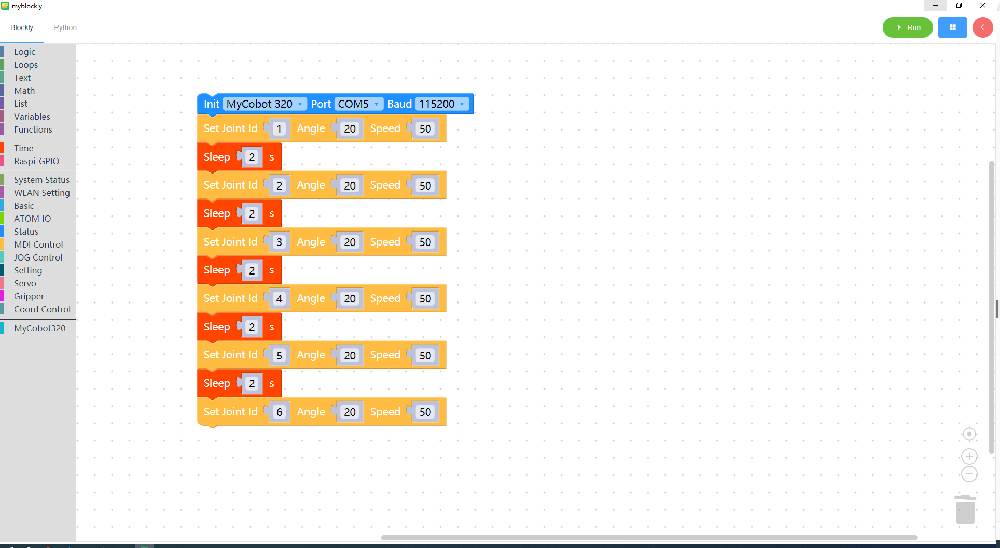

# 7 Control single joint movement

<i>Preparation before you begin</i>

- Make sure the robotic arm is connected to the computer

- Make sure the machine is normal

- Make sure the machine is power on

### Learning content of this chapter

How to use myBlockly to control the single joint movement of the robotic arm

#### API introduction

* method module：`Set Joint`

  

  

* Parameter introduction:

  This method has three parameters that can be adjusted:

  * Joint parameters: The parameter range is: 1-6 (corresponding to the 6 joints of the robotic arm);

  - Angle parameters: refer to the parameters of the corresponding model
  - Speed: Controls the speed of the robot arm movement. The parameter range is: 0~100

* Purpose: Control the single joint movement of the robotic arm

#### Simple demonstration

* The graphics code is as follows:

  

* Implementation content:

  Control joint 1 of the robotic arm to run at a speed of 50 to the position of joint 1 with an angle of 20. After one second,

  Control the 2nd joint of the robotic arm to move at a speed of 50 to the position of the 2nd joint angle of 20. After one second,

  Control the 3 joints of the robotic arm to run at a speed of 50 to the position of the 3 joint angle of 20. After one second,

  Control the 4 joints of the robotic arm to run at a speed of 50 to the position of the 4 joint angle of 20. After one second,

  Control the 5 joints of the robotic arm to run at a speed of 50 to the position of joint 5 with an angle of 20. After one second,

  Control the 6 joints of the robotic arm to run at a speed of 50 to the position of the 6 joint angle of 20

[← Previous Page](./5-ControlRoboticArmBackZero.md) | [Next Page →](./7-ControlSinglesJoint.md)