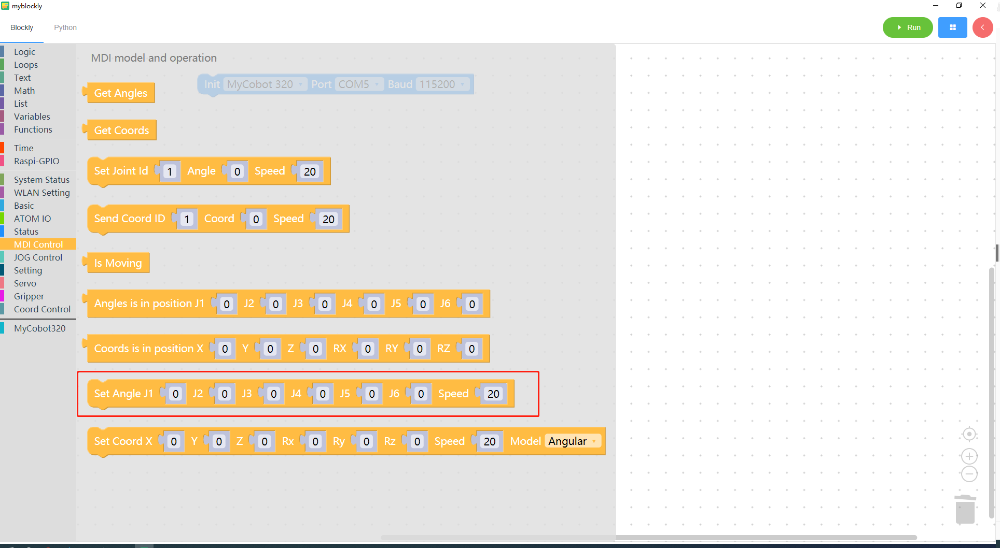
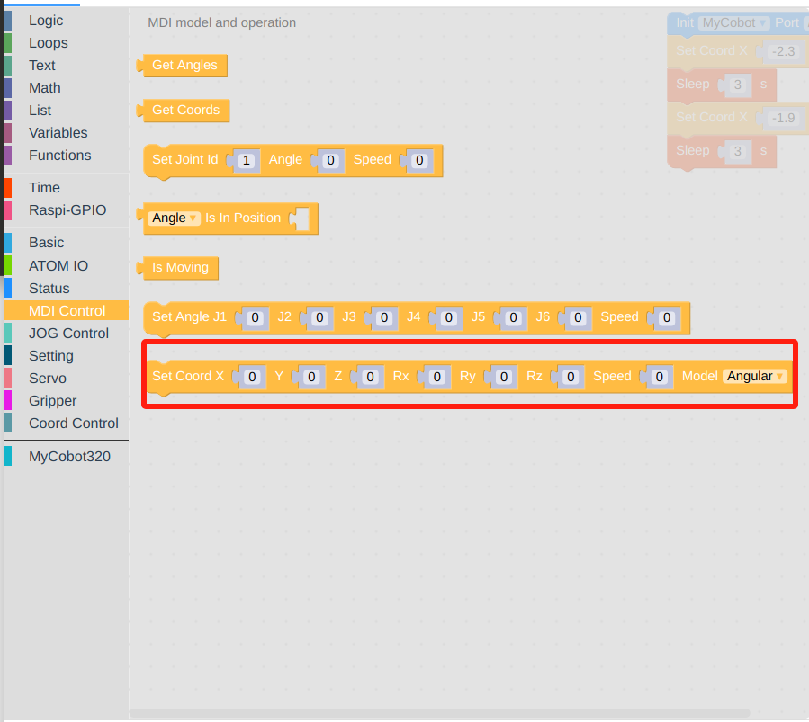
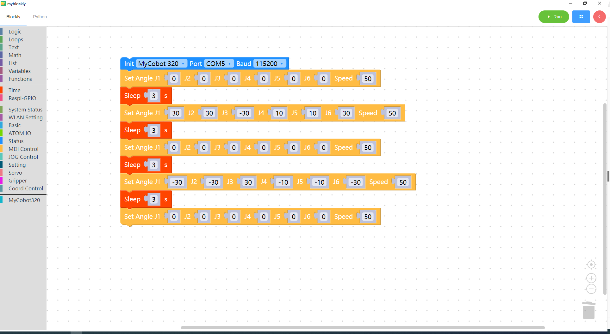
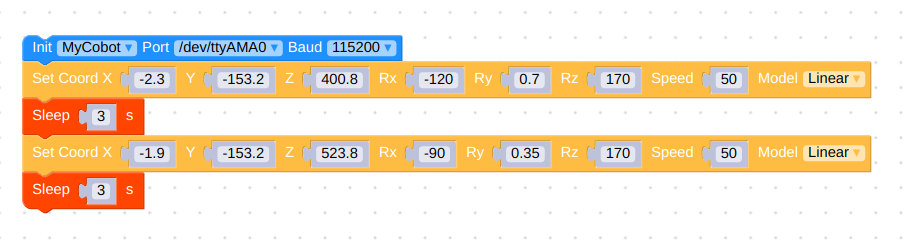

# Control multiple joints

<i>Preparation before you begin</i>

- Make sure the robotic arm is connected to the computer

- Make sure the machine is normal

- Make sure the machine is power on

### Learning content of this chapter

How to use myBlockly to control multiple joint movements of a robotic arm

#### API introduction

- Method 1: Control by joint angle
  * Method module: `Set angles`

    

  

  * Parameter introduction:

    This module has two parameters that can be adjusted:

    - Joint angle parameters

    - Speed parameters

  - Purpose: To control the movement of multiple joints of the robotic arm

- Method 2: Control by coordinates
  * Method module: `Set Coord`

    

  

  * Parameter introduction:

    This module has two parameters that can be adjusted:

    - coord parameters

    - Speed parameters

    - Route planning approach

  - Purpose: Controls the head to arrive at the specified coordinates in a certain attitude.

#### Simple demonstration

- Method 1: Control by joint angle

  The graphics code is as follows:

  

  * Implementation content:

    Control all joints of the robotic arm to return to the origin. After three seconds,

    At the same time, control the 1 joint, 2 joint, 3 joint, 4 joint, 5 joint, and 6 joint of the robotic arm to move at a speed of 50 to the positions of 30 degrees, 30 degrees, -30 degrees, 10 degrees, 10 degrees, and 30 degrees respectively. After three seconds,

    Return all joints of the robotic arm to the origin at a speed of 50. After three seconds,

    Simultaneously control the 1 joint, 2 joint, 3 joint, 4 joint, 5 joint, and 6 joint of the robotic arm to run at a speed of 50 to -30 degrees, -30 degrees, 30 degrees, -10 degrees, -10 degrees, and -30 degrees respectively. position, after three seconds,

    Control all joints of the robotic arm to return to the origin

- Method 2: Control by coordinates

  The graphics code is as follows:

   
  
  > Note that the parameter at port should be changed to COM8 for the M5 version of the machine.

  Intelligent planning of the route, allowing the head to reach the coordinates of [-2.3, -153.2, 400.8] in a linear manner, and maintain the posture of [-120.0, 0.7, 170], with a speed of 50mm/s

  Set the waiting time to 3 seconds

  Intelligent planning of the route, allowing the head to reach the coordinates of [-1.9, -153.2, 523.8] in a linear manner, and maintain the posture of [-90, 0.35, 170], with a speed of 50mm/s

  Set the waiting time to 3 seconds

  [← Previous Page](./6-ControlSingleJoint.md) | [Next Page →](./8-GripperUse.md)
