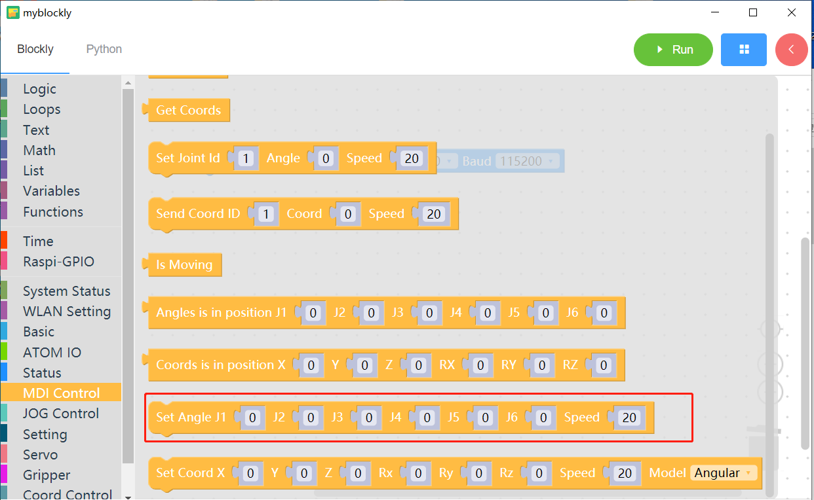
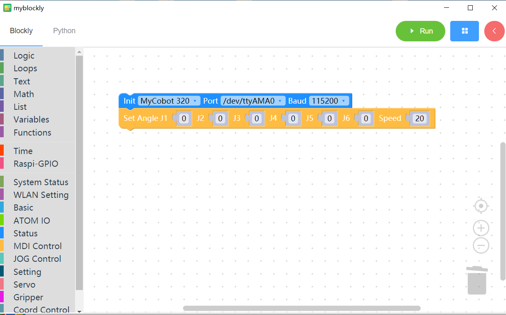

# 5 Control the robotic arm to return to the origin

<i>Preparation before you begin</i>

- Make sure the robotic arm is connected to the computer

- Make sure the machine is normal

- Make sure the machine is power on

### Learning content of this chapter

How to use myBlockly to control the robot arm to return to the origin

#### API introduction

* Method module: `Set angle`

  

* Parameter introduction:

  This module has two parameters that can be adjusted:

  - Joint angle parameters: If the robot arm returns to the origin, all joint angle parameters need to be set to 0

  * Speed parameter: 0-100

* Purpose: Control the robotic arm and return the angles of all axes of the robotic arm to the origin (angle is 0)

#### 简单演示

* Implementation content: Control the movement of the robotic arm to return to the origin, so that the angles of all axes of the robotic arm are 0

 [← Previous Page](./4-ControlRGB.md) | [Next Page →](./6-ControlSingleJoint.md)