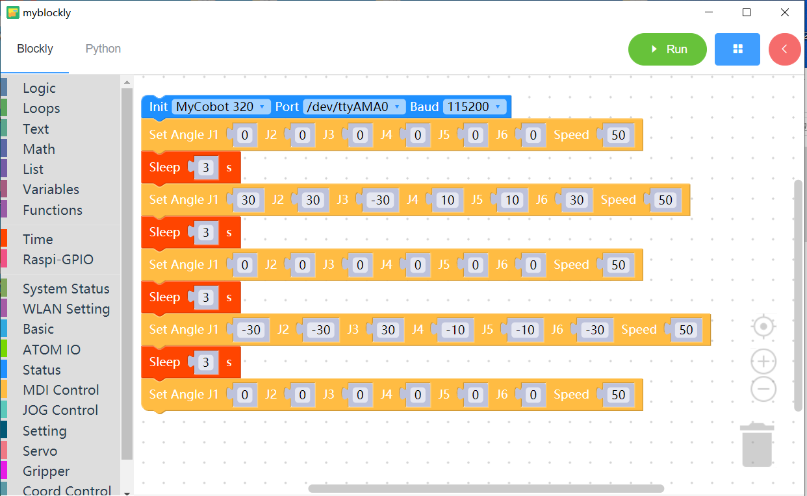

# 7 Control multiple joints

<i>Preparation before you begin</i>

- Make sure the robotic arm is connected to the computer

- Make sure the machine is normal

- Make sure the machine is power on

### Learning content of this chapter

How to use myBlockly to control multiple joint movements of a robotic arm

#### API introduction

* Method module: `Set angles`

  

* Parameter introduction:

  This module has two parameters that can be adjusted:

  - Joint angle parameters

* Speed parameters

- Purpose: To control the movement of multiple joints of the robotic arm

- The graphics code is as follows:

* Implementation content:

  Control all joints of the robotic arm to return to the origin. After three seconds,

  At the same time, control the 1 joint, 2 joint, 3 joint, 4 joint, 5 joint, and 6 joint of the robotic arm to move at a speed of 50 to the positions of 30 degrees, 30 degrees, -30 degrees, 10 degrees, 10 degrees, and 30 degrees respectively. seconds later,

  Return all joints of the robotic arm to the origin at a speed of 50. After three seconds,

  Simultaneously control the 1 joint, 2 joint, 3 joint, 4 joint, 5 joint, and 6 joint of the robotic arm to run at a speed of 50 to -30 degrees, -30 degrees, 30 degrees, -10 degrees, -10 degrees, and -30 degrees respectively. position, after three seconds,

  Control all joints of the robotic arm to return to the origin

 [← Previous Page](./6-ControlSingleJoint.md) | [Next Page →](./8-GripperUse.md)