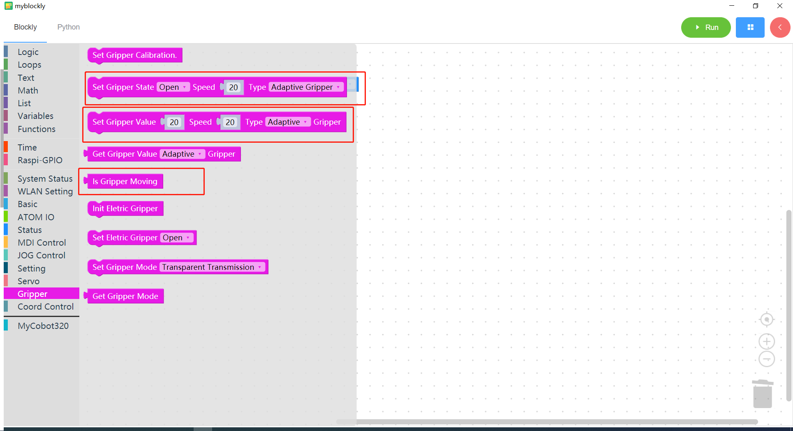
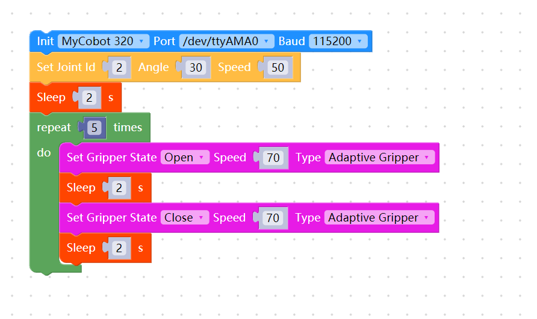
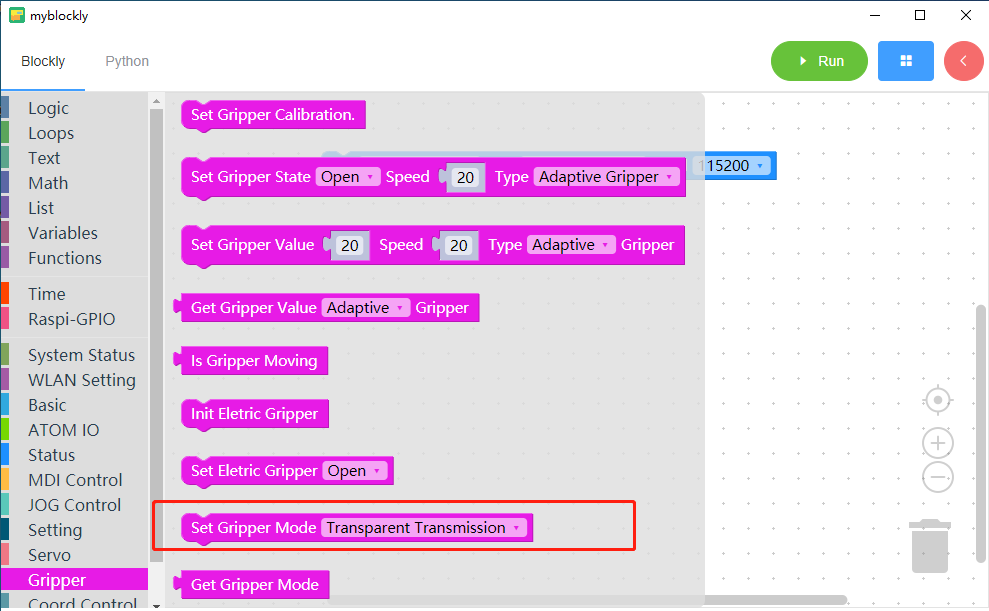
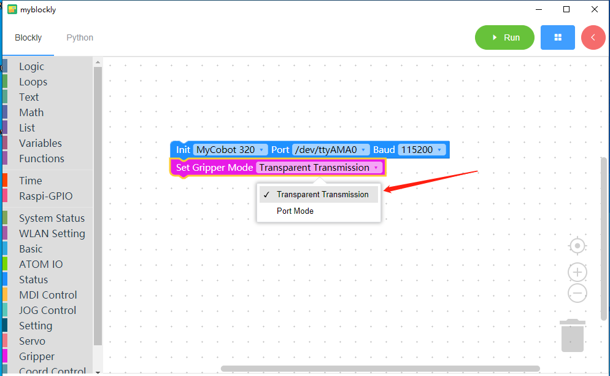

# 8 Use of gripper

<i>Preparation before you begin</i>

- Make sure the robotic arm is connected to the computer

- Make sure the machine is normal

- Make sure the machine is power on

Grippers include adaptive grippers, electric grippers and pneumatic grippers. Here we take the adaptive gripper as an example to explain how to use myBlockly to control the gripper.

### Learning content of this chapter

How to use myBlockly to control the adaptive gripper attached to the myCobot 320 M5Stack robotic arm

#### API display

- Method module **1**: `Set gripper status`

  

- Parameter introduction:

  This module has two parameters that can be adjusted:

  * Clamp status parameter: 1 indicates the clamp claws closed state, 0 indicates the clamp claws open state
  * Speed parameter: indicates the speed at which to rotate, the value range is 0~100
  * Clamp type parameter: select adaptive clamp here

- Purpose: Make the gripper enter the specified state (open or closed) at a specified speed

- Method module **2**: `Set the value of the gripper`

  

- Parameter introduction:

  This module has two parameters that can be adjusted:

  * The parameter of the clamping jaw value: indicates the position that the clamping jaw wants to reach, and the value range is 0~100.
  * Speed parameter: indicates the speed at which to rotate, the value range is 0~100.
  * Clamp type parameter: select adaptive clamp here

* Purpose: Make the gripper rotate to a specified position at a specified speed.

* Method module **3**: `Is the gripper in motion`

  

* Purpose: To determine whether the gripper is running

#### Simple demonstration

The graphics code is as follows:

* Implementation content:

  Move joint 2 of the robotic arm to 30 degrees at a speed of 50. After two seconds,

  The clamping jaw opens at a speed of 70. After two seconds,

  The jaws close at speed 70,

  After the process of opening and closing the jaws is cycled 5 times, the program ends.

**Note**:

If you can't control the girpper from the above example, maybe you need to set the gripper mode

And run the program

 [← Previous Page](./7-ControlSinglesJoint.md) | [Next Page →](./9-api.md)