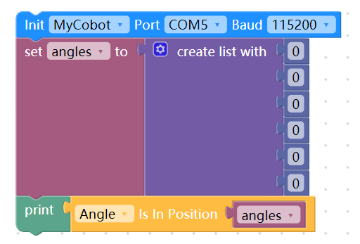

# myblockly

**This is myblockly`python` API for mycobot.**

<details>
<summary>Catalogue:</summary>

<!-- vim-markdown-toc GFM -->

- [myblockly](#myblockly)
- [MyCobot / Mypalletizer / MechArm](#mycobot--mypalletizer--mecharm)
  - [Overall status](#overall-status)
    - [power\_on](#power_on)
    - [power\_off](#power_off)
    - [is\_power\_on](#is_power_on)
    - [release\_all\_servos](#release_all_servos)
    - [is\_controller\_connected](#is_controller_connected)
    - [get\_error\_information](#get_error_information)
    - [clear\_error\_information](#clear_error_information)
  - [MDI mode and operation](#mdi-mode-and-operation)
    - [get\_angles](#get_angles)
    - [set\_fresh\_mode(mode)](#set_fresh_modemode)
    - [get\_fresh\_mode()](#get_fresh_mode)
    - [send\_angle](#send_angle)
    - [send\_angles()](#send_angles)
    - [get\_coords](#get_coords)
    - [send\_coord](#send_coord)
    - [send\_coords](#send_coords)
    - [is\_in\_position](#is_in_position)
    - [is\_moving](#is_moving)
  - [JOG mode and operation](#jog-mode-and-operation)
    - [jog\_angle](#jog_angle)
    - [jog\_coord](#jog_coord)
    - [jog\_stop](#jog_stop)
    - [pause](#pause)
    - [resume](#resume)
    - [stop](#stop)
    - [is\_paused](#is_paused)
    - [set\_encoder](#set_encoder)
    - [get\_encoder](#get_encoder)
  - [Running status and Settings](#running-status-and-settings)
    - [get\_speed](#get_speed)
    - [set\_speed](#set_speed)
    - [set\_joint\_min](#set_joint_min)
    - [set\_joint\_max](#set_joint_max)
    - [get\_joint\_min\_angle](#get_joint_min_angle)
    - [get\_joint\_max\_angle](#get_joint_max_angle)
  - [Servo control](#servo-control)
    - [is\_servo\_enable](#is_servo_enable)
    - [is\_all\_servo\_enable](#is_all_servo_enable)
    - [set\_servo\_data](#set_servo_data)
    - [get\_servo\_data](#get_servo_data)
    - [set\_servo\_calibration](#set_servo_calibration)
    - [release\_servo](#release_servo)
    - [focus\_servo](#focus_servo)
  - [Atom IO](#atom-io)
    - [set\_color](#set_color)
    - [set\_pin\_mode](#set_pin_mode)
    - [set\_digital\_output()](#set_digital_output)
    - [get\_digital\_input()](#get_digital_input)
    - [set\_pwm\_output()](#set_pwm_output)
    - [set\_gripper\_calibration](#set_gripper_calibration)
    - [set\_gripper\_mode](#set_gripper_mode)
    - [get\_gripper\_mode](#get_gripper_mode)
    - [get\_gripper\_value](#get_gripper_value)
    - [set\_gripper\_state](#set_gripper_state)
    - [set\_gripper\_value](#set_gripper_value)
    - [is\_gripper\_moving](#is_gripper_moving)
    - [get\_basic\_input](#get_basic_input)
    - [set\_basic\_output](#set_basic_output)
    - [get\_tof\_distance](#get_tof_distance)
    - [get\_tool\_reference](#get_tool_reference)
    - [set\_tool\_reference](#set_tool_reference)
    - [set\_world\_reference](#set_world_reference)
    - [get\_world\_reference](#get_world_reference)
    - [set\_reference\_frame](#set_reference_frame)
    - [get\_reference\_frame](#get_reference_frame)
    - [set\_movement\_type](#set_movement_type)
    - [get\_movement\_type](#get_movement_type)
    - [set\_end\_type](#set_end_type)
    - [get\_end\_type](#get_end_type)
    - [set\_gservo\_round](#set_gservo_round)
    - [get\_servo\_speeds](#get_servo_speeds)
    - [get\_servo\_currents](#get_servo_currents)
    - [get\_servo\_voltages](#get_servo_voltages)
    - [get\_servo\_status](#get_servo_status)
    - [get\_servo\_temps](#get_servo_temps)
    - [init\_eletric\_gripper](#init_eletric_gripper)
    - [set\_eletric\_gripper](#set_eletric_gripper)
  
<!-- vim-markdown-toc -->
</details>

# MyCobot / Mypalletizer / MechArm

## Overall status

### power_on

- **Prototype**: `power_on()`

- **Description**:Atom open communication (default open).

### power_off

- **Prototype**: `power_off()`

- **Description**: Atom turn off communication.

### is_power_on

- **Prototype**: `is_power_on()`

- **Description**: Adjust robot arm whether power on.

- **Returns**

  - `1`: power on
  - `0`: power off
  - `-1`: error
  
<!-- ### read_next_error

- **Prototype**: `read_next_error()`

- **Description**: Robot Error Detection.

- **Returns**
  list len 7
  - `0`: No abnormality
  - `1`: Communication disconnected
  - `2`: Unstable communication
  - `3` : Servo abnormality -->

### release_all_servos

- **Prototype**: `release_all_servos()`

- **Description**: Set robot arm into free moving mode.

### is_controller_connected

- **Prototype**: `is_controller_connected()`

- **Description**: Check if connected with Atom.

- **Returns**

  - `1`: connected
  - `0`: not connected
  - `-1`: error

### get_error_information

- **Prototype**: `get_error_information()`

- **Description**: Obtaining robot error information.

- **Returns**

  - `0`: No error message.
  - `1 ~ 6`: The corresponding joint exceeds the limit position.
  - `32`: Kinematics inverse solution has no solution.
  - `33 ~ 34`: Linear motion has no adjacent solution.

### clear_error_information

- **Prototype**: `clear_error_information()`

- **Description**: Clear robot error message.

## MDI mode and operation

### get_angles

- **Prototype**: `get_angles()`

- **Description**: Get the degree of all joints.

- **Returns**: `list`: A float list of all degree.

### set_fresh_mode(mode)

Set command refresh mode

* **Parameters**

  * **mode**:
    `Refresh Sport` - Always execute the latest command first.
    `Interpolation` - Execute instructions sequentially in the form of a queue.

### get_fresh_mode()

get command refresh mode

  * **return**
      - 1 - Always execute the latest command first.
      - 0 - Execute instructions sequentially in the form of a queue.

### send_angle

- **Prototype**: `send_angles(id, degree, speed)`

- **Description**: Send one degree of joint to robot arm.

- **Parameters**

  - `id`: Joint id(`genre.Angle`) / int 1-6
  - `degree`: degree value(`float`) (about -170 ～ 170)
  - `speed`: (`int`) 0 ~ 100

- **Example**

  ```python
  from pymycobot.mycobot import MyCobot
  from pymycobot.genre import Angle


  mycobot = MyCobot('/dev/ttyUSB0')
  mycobot.send_angle(Angle.J2.value, 10, 50)
  ```

### send_angles()

- **Prototype**: `send_angles(degrees, speed)`

- **Description**: Send the degrees of all joints to robot arm.

- **Parameters**

  - `degrees`: a list of degree value(`List[float]`), length 6.

  - `speed`: (`int`) 0 ~ 100

- **Example**

  ```python
  from pymycobot.mycobot import MyCobot
  from pymycobot.genre import Angle


  mycobot = MyCobot('/dev/ttyUSB0')
  mycobot.send_angles([0,0,0,0,0,0], 80)
  ```

<!-- ### get_radians

- **Prototype**: `get_radians()`

- **Description**: Get the radians of all joints.

- **Returns**: `list`: A float list of radian.

### send_radians

- **Prototype**: `send_radians(radians, speed)`

- **Description**: Send the radians of all joint to robot arm.

- **Parameters**:

  - `radians`: a list of radian value(`List[float]`).
  - `speed`: (`int`) 0 ~ 100

- **Example**

  ```python
  from pymycobot.mycobot import MyCobot
  from pymycobot.genre import Angle


  mycobot = MyCobot('/dev/ttyUSB0')
  mycobot.send_angles_by_radian([1,1,1,1,1,1], 70)
  ``` -->

### get_coords

- **Prototype**: `get_coords()`

- **Description**: Get the Coords from robot arm, coordinate system based on base.

- **Returns**: `list`: A float list of coord - `[x, y, z, rx, ry, rz]`

### send_coord

- **Prototype**: `send_coords(id, coord, speed)`

- **Description**: Send one coord to robot arm.

- **Parameters**

  - `id`: coord id(`genre.Coord`) / int 1-6
  - `coord`: coord value(`float`)
  - `speed`: (`int`) 0 ~ 100

- **Example**

  ```python
  from pymycobot.mycobot import MyCobot
  from pymycobot.genre import Coord


  mycobot = MyCobot('/dev/ttyUSB0')
  mycobot.send_coord(Coord.X.value, -40, 70)
  ```

### send_coords

- **Prototype**: `send_coords(coords, speed, mode)`

- **Description**: Send all coords to robot arm.

- **Parameters**

  - `coords`: a list of coords value(`List[float]`).
  - `speed`: (`int`) 0 ~ 100
  - `mode`: (`int`): `0` - angular, `1` - linear

- **Example**

  ```python
  from pymycobot.mycobot import MyCobot
  from pymycobot.genre import Coord


  mycobot = MyCobot('/dev/ttyUSB0')
  mycobot.send_coords([160, 160, 160, 0, 0, 0], 70, 0)
  ```

<!-- ### sync_send_angles

- **Prototype**: `sync_send_angles(degrees, speed, timeout=7)`

- **Description**: Send the angle in synchronous state and return when the target point is reached

- **Parameters**

  - `degrees`: a list of degree value(`List[float]`).
  - `speed`: (`int`) 0 ~ 100
  - `timeout`: default 7s.

### sync_send_coords

- **Prototype**: `sync_send_coords(coords, speed, mode, timeout=7)`

- **Description**: Send the coord in synchronous state and return when the target point is reached

- **Parameters**

  - `coords`: a list of coords value(`List[float]`)
  - `speed`: (`int`) 0 ~ 100
  - `mode`: (`int`): `0` - angular, `1` - linear
  - `timeout`: default 7s. -->

### is_in_position

- **Prototype**: `is_in_position(data, flag)`

- **Description**: Judge whether in the position.

- **Parameters**

  - `data`: A data list, angles or coords.
  - `flag`: Tag the data type, `0` - angles, `1` - coords.

- **Returns**

  - `1` - true
  - `0` - false
  - `-1` - error

Example: Determining whether the robotic arm has reached a position with an angle of [0,0,0,0,0,0]


### is_moving

- **Prototype**: `is_moving()`

- **Description**: Detect if the robot is moving.

- **Returns**
  - `1` - is moving
  - `0` - not moving
  - `-1` - error data

## JOG mode and operation

### jog_angle

- **Prototype**: `jog_angle(joint_id, direction, speed)`

- **Description**: Jog control angle

- **Parameters**

  - `joint_id`: (`int`) 1 ~ 6
  - `direction`: `0` - decrease, `1` - increase
  - `speed`: 0 ~ 100

### jog_coord

- **Prototype**: `jog_coord(coord_id, direction, speed)`

- **Description**: Jog control coord.

- **Parameters**

  - `coord_id`: (`int`) 1 ~ 6
  - `direction`: `0` - decrease, `1` - increase
  - `speed`: 0 ~ 100

<!-- ### jog_increment

- **Prototype**: `jog_increment(coord_id, direction, speed)`

- **Description**: Step mode.

- **Parameters**

  - `coord_id`: (`int`) 1 ~ 6
  - `direction`: 
  - `speed`: 0 ~ 100 -->

### jog_stop

- **Prototype**: `jog_stop()`

- **Description**: Stop jog moving.

### pause

- **Prototype**: `pause()`

- **Description**: Pause movement.

### resume

- **Prototype**: `resume()`

- **Description**: Recovery movement.

### stop

- **Prototype**: `stop()`

- **Description**: Stop moving.

### is_paused

- **Prototype**: `is_paused()`

- **Description**: Judge whether the manipulator pauses or not.

- **Returns** :

  - `1` - paused
  - `0` - not paused
  - `-1` - error

### set_encoder

- **Prototype**: `set_encoder(joint_id, encoder)`

- **Description**: Set a single joint rotation to the specified potential value.

- **Parameters**

  - `joint_id`: (`int`) 1 ~ 6
  - `encoder`: 0 ~ 4096

### get_encoder

- **Prototype**: `get_encoder(joint_id)`

- **Description**:Obtain the specified joint potential value.

- **Parameters**: `joint_id`: (`int`) 1 ~ 6

- **Returns**: `encoder`: 0 ~ 4096

<!-- ### set_encoders

- **Prototype**: `set_encoders(encoders, sp)`

- **Description**: Set the six joints of the manipulator to execute synchronously to the specified position.

- **Parameters**:
  - `encoders`: A encoder list.
  - `sp`: speed 0 - 100

### get_encoders

- **Prototype**: `get_encoders()`

- **Description**: Get the six joints of the manipulator.

- **Returns**: the list of encoder (`list`) -->

## Running status and Settings

### get_speed

- **Prototype**: `get_speed()`

- **Description**: Get speed.

- **Returns**: speed: (`int`)

### set_speed

- **Prototype**: `set_speed(speed)`

- **Description**: Set speed.

- **Parameters**: speed: (`int`) 0 ~ 100

### set_joint_min

- **Prototype**: `set_joint_min(id, angle)`
- **Description**: Sets the minimum angle for the specified joint.

- **Parameters**:
  - `id`: (`int`) joint id 1-6.
  - `angle`: 0 - 180.

### set_joint_max

- **Prototype**: `set_joint_max(id, angle)`
- **Description**: Sets the maximum angle of the specified joint.

- **Parameters**:
  - `id`: (`int`) joint id 1-6.
  - `angle`: 0 - 180.

### get_joint_min_angle

- **Prototype**: `get_joint_min_angle()`
- **Description**: Gets the minimum movement angle of the specified joint

- **Parameters**: `joint_id`: (`int`)

- **Returns**: angle value (`float`)

### get_joint_max_angle

- **Prototype**: `get_joint_max_angle()`

- **Description**: Gets the maximum movement angle of the specified joint

- **Parameters**: `joint_id`: (`int`)

- **Returns**: angle value (`float`)

## Servo control

### is_servo_enable

- **Prototype**: `is_servo_enable(servo_id)`

- **Description**: Determine whether all steering gears are connected

- **Parameters**: `servo_id` (`int`) 1 ~ 6

- **Returns**

  - `0`: disable
  - `1`: enable
  - `-1`: error

### is_all_servo_enable

- **Prototype**: `is_all_servo_enable()`

- **Description**: Determine whether the specified steering gear is connected

- **Returns**

  - `0`: disable
  - `1`: enable
  - `-1`: error

### set_servo_data

- **Prototype**: `set_servo_data(servo_no, data_id, value)`
- **Description**: Set the data parameters of the specified address of the steering gear.

- **Parameters**:
  - `servo_no`: Serial number of articulated steering gear, 1 - 6.
  - `data_id`: Data address.
  - `value`: 0 - 4096

### get_servo_data

- **Prototype**: `get_servo_data(servo_no, data_id)`
- **Description**: Read the data parameter of the specified address of the steering gear.

- **Parameters**:

  - `servo_no`: Serial number of articulated steering gear, 1 - 6.
  - `data_id`: Data address.

- **Returns**: `value`: 0 - 4096

  - `0`: disable
  - `1`: enable
  - `-1`: error

### set_servo_calibration

- **Prototype**: `set_servo_calibration(servo_no)`
- **Description**: The current position of the calibration joint actuator is the angle zero point, and the corresponding potential value is 2048.

- **Parameters**:
  - `servo_no`: Serial number of articulated steering gear, 1 - 6.

### release_servo

- **Prototype**: `release_servo(servo_id)`

- **Description**: Power off designated servo

- **Parameters**: `servo_id`: 1 ~ 6

### focus_servo

- **Prototype**: `focus_servo(servo_id)`

- **Description**: Power on designated servo

- **Parameters**: `servo_id`: 1 ~ 6

## Atom IO

### set_color

- **Prototype**: `set_color(r, g, b)`

- **Description**: Set the color of the light on the top of the robot arm.

- **Parameters**

  - `r`: 0 ~ 255
  - `g`: 0 ~ 255
  - `b`: 0 ~ 255

### set_pin_mode

- **Prototype**: `set_pin_mode(pin_no, pin_mode)`
- **Description**: Set the state mode of the specified pin in atom.
- **Parameters**

  - `pin_no` (int): Pin number.
  - `pin_mode` (int): 0 - input, 1 - output, 2 - input_pullup

### set_digital_output()


Set the terminal atom io status.

- **Parameters**

  - `pin_no` (int):
  - `pin_signal` (int): 0 / 1

### get_digital_input()


Get the terminal atom io status.

- **Parameters**: `pin_no` (int)

- **Return**: signal value

<!-- ### set_pwm_mode()

- **Description**
- **Parameters**-->

### set_pwm_output()

- **Prototype**: `set_pwm_output(channel, frequency, pin_val)`

- **Description**: PWM control.

- **Parameters**

  - `channel` (`int`): IO number.
  - `frequency` (`int`): clock frequency
  - `pin_val` (`int`): Duty cycle 0 ~ 256; 128 means 50%

### set_gripper_calibration

- **Prototype**: `set_gripper_calibration()`

- **Description**: Set the current position to zero, set current position value is `2048`.

### set_gripper_mode

- **Prototype**: `set_gripper_mode(status)`

- **Description**: Set gripper mode.

- **Parameters**

  - `status` (`int`): 0 - transparent transmission. 1 - Port Mode.

### get_gripper_mode

- **Prototype**: `get_gripper_mode()`

- **Description**: Get gripper mode.

- **Return**

  - `status` (`int`): 0 - transparent transmission. 1 - Port Mode.

### get_gripper_value

- **Prototype**: `get_gripper_value()`

- **Description**: Get gripper value

- **Return**: gripper value (int)

### set_gripper_state

- **Prototype**: `set_gripper_state(flag, speed)`

- **Description**: Set gripper switch state

- **Parameters**

  - `flag` (`int`): 0 - open, 1 - close
  - `speed` (`int`): 0 ~ 100

### set_gripper_value

- **Prototype**: `set_gripper_value(value, speed)`

- **Description**: Set gripper value

- **Parameters**

  - `value` (int): 0 ~ 100
  - `speed` (int): 0 ~ 100

### is_gripper_moving

- **Prototype**: `is_gripper_moving()`

- **Description**: Judge whether the gripper is moving or not

- **Returns**

  - `0` : not moving
  - `1` : is moving
  - `-1`: error data

### get_basic_input

- **Prototype**: `get_basic_input(pin_no)`

- **Description**: Get bottom pin.

- **Parameters**

  - `pin_no` (`int`) Pin number.

- **Return**: `pin_signal` (`int`) 0 / 1

### set_basic_output

- **Prototype**: `set_basic_output(pin_no, pin_signal)`

- **Description**: Set bottom pin.

- **Parameters**

  - `pin_no` (`int`) Pin number.
  - `pin_signal` (`int`): 0 / 1

### get_tof_distance

- **Prototype**: `get_tof_distance()`

- **Description**: Get the detected distance (Requires external distance detector).

- **Return**: `int` The unit is mm.

### get_tool_reference

- **Prototype**: `get_tool_reference()`

- **Description**: Get tool coordinate system.

- **Return**: `list` [x, y, z, rx, ry, rz].

### set_tool_reference

- **Prototype**: `set_tool_reference(coords)`

- **Description**: Set tool coordinate system.

- **Parameters**:
  - `coords`: (`list`) [x, y, z, rx, ry, rz].

### set_world_reference

- **Prototype**: `set_world_reference(coords)`

- **Description**: Set world coordinate system.

- **Parameters**:
  - `coords`: (`list`) [x, y, z, rx, ry, rz].

### get_world_reference


- **Prototype**: `get_world_reference()`

- **Description**: Get world coordinate system.

- **Return**: `list` [x, y, z, rx, ry, rz].

### set_reference_frame

- **Prototype**: `set_reference_frame(rftype)`

- **Description**: Set base coordinate system.

- **Parameters**:
  - `rftype`: 0 - base 1 - tool.

### get_reference_frame

- **Prototype**: `get_reference_frame()`

- **Description**: Get base coordinate system.

- **Return**: 0 - base 1 - tool.

### set_movement_type

- **Prototype**: `set_movement_type(move_type)`

- **Description**: Set movement type.

- **Parameters**:
  - `move_type`: 1 - movel, 0 - moveJ.

### get_movement_type

- **Prototype**: `get_movement_type()`

- **Description**: Get movement type.

- **Return**: 1 - movel, 0 - moveJ.

### set_end_type

- **Prototype**: `set_end_type(end)`

- **Description**: Set end coordinate system.

- **Parameters**:
  - `end`:  0 - flange, 1 - tool.

### get_end_type

- **Prototype**: `get_end_type()`

- **Description**: Get end coordinate system.

- **Return**: 0 - flange, 1 - tool.

### set_gservo_round

- **Prototype**: `set_gservo_round()`

- **Description**: Drive the 9g steering gear clockwise for one revolution.

### get_servo_speeds

- **Prototype**: `get_servo_speeds()`

- **Description**: Get joint velocity.

- **Return**: `list` Speed of each joint.

### get_servo_currents

- **Prototype**: `get_servo_currents()`

- **Description**: Get joint current.

- **Return**: `list` Current of each joint.

### get_servo_voltages

- **Prototype**: `get_servo_voltages()`

- **Description**: Get joint voltage.

- **Return**: `list` Voltage of each joint.

### get_servo_status

- **Prototype**: `get_servo_status()`

- **Description**: Get the state of each joint.

- **Return**: `list` the state of each joint.

### get_servo_temps

- **Prototype**: `get_servo_temps()`

- **Description**: Get the temperature of each joint.

- **Return**: `list` temperature of each joint.

### init_eletric_gripper

- **Prototype**: `init_eletric_gripper()`

- **Description**: Electric gripper initialization (it needs to be initialized once after inserting and removing the gripper) (only for 350)

### set_eletric_gripper

- **Prototype**: `set_eletric_gripper(status)`

- **Description**: Set Electric Gripper Mode (only for 350).

- **Parameters**

  - `status` (`int`): 0 - open, 1 - close.
<!-- 
### set_encoders_drag

- **Prototype**: `set_encoders_drag(encoders, speeds)`

- **Description**: Send all encoders and speeds

- **Parameters**

  - `encoders` (`list`) : encoders list.
  - `speeds`: Obtained by the get_servo_speeds() method

## Raspberry pi -- GPIO

### gpio_init

- **Prototype**: `gpio_init()`

- **Description**: Init GPIO module, and set BCM mode.

### gpio_output

- **Prototype**: `gpio_output(pin, v)`

- **Description**: Set GPIO port output value.

- **Parameters**

  - `pin` (`int`) Pin number.
  - `v` (`int`): 0 / 1

# Angle

```python
from pymycobot import Angle
```

**Description**

Instance class of joint. It's recommended to use this class to select joint.

# Coord

```python
from pymycobot import Coord
```

**Description**

Instance class of coord. It's recommended to use this class to select coord.

# utils (Module)

This module support some help method.

**Usage:**

```python
from pymycobot import utils
```

## get_port_list

- **Prototype**: `get_port_list()`

- **Description**: Get the all serial port list.

- **Return**: serial port list (`list`)

## detect_port_of_basic

- **Prototype**: `detect_port_of_basic()`

- **Description**: Returns the serial port string of the first detected M5 Basic. If it is not found, it returns `None`.

- **Return**: detected port (`str`) or `None`

- **Example**:

  ```python
  from pymycobot import MyCobot, utils

  port = utils.detect_port_of_basic()
  if port is None:
   raise Exception('Detection failed.')
  mycobot = MyCobot(port, 115200)
  ```

# MyCobotSocket

> Note:
> raspberryPi version Only supports python3
> The robotic arm that uses this class of premise has a server and has been turned on.

Use TCP/IP to control the robotic arm

### Client

```python
# demo
from pymycobot import MyCobotSocket
# Port 9000 is used by default
mc = MyCobotSocket("192.168.10.10","9000")

res = mc.get_angles()
print(res)

mc.send_angles([0,0,0,0,0,0],20)
...

```

### Server

Server file is in the `demo folder`,For details, please check the [Server.py](../demo/Server.py) file in the demo folder

## socket control

> Note:
> Most of the methods are the same as the class mycobot, only the new methods are listed here.


### set_gpio_mode

- **Prototype**: `set_gpio_mode(mode)`

- **Description**: Set pin coding method.

- **Parameters**

  - `mode` (`str`) "BCM" or "BOARD".

### set_gpio_out

- **Prototype**: `set_gpio_out(pin_no, mode)`

- **Description**: Set the pin as input or output.

- **Parameters**

  - `pin_no` (`int`) pin id.
  - `mode` (`str`) "in" or "out"

### set_gpio_output

- **Prototype**: `set_gpio_output(pin_no, state)`

- **Description**: Set the pin to high or low level.

- **Parameters**

  - `pin_no` (`int`) pin id.
  - `state` (`int`) 0 or 1

### get_gpio_in

- **Prototype**: `get_gpio_in(pin_no)`

- **Description**: Get pin level status.

- **Parameters**

  - `pin_no` (`int`) pin id.

```python
# Set up the demo of the suction pump
import time
from pymycobot import MyCobotSocket
# connect server
m = MyCobotSocket("192.168.10.10", '9000')

m.set_gpio_mode("BCM")
m.set_gpio_out(20, "out")
m.set_gpio_out(21, "out")
# open
m.set_gpio_output(20, 0)
m.set_gpio_output(21, 0)
time.sleep(3)
# close
m.set_gpio_output(20, 1)
m.set_gpio_output(21, 1)

```

# MyBuddy

### base_to_single_coords(base_coords, arm)

Convert base coordinates to coordinates

* **Parameters**

  * **coords** – a list of base coords value len 6

  * **arm** – 0 - left. 1 - right

* **Returns**

    coords

### collision(left_angles, right_angles)

Collision detection main program

* **Parameters**

  * **left_angles** – left arm angle len 6.

  * **right_angles** – right arm angle len 6.

* **Returns**

    int

### collision_switch(state)

Collision Detection Switch

* **Parameters**

    **state** (_int_) – 0 - close 1 - open (Off by default)

### focus_servo(id, servo_id)

Power on designated servo

* **Parameters**

  * **id** – 1/2/3 (L/R/W)

  * **servo_id** – 1 - 6

### get_acceleration(id)

Read acceleration during all moves

* **Parameters**

    **id** – 1/2/3 (L/R/W)

### get_angle(id, joint_id)

Get the angle of a single joint

* **Parameters**

  * **id** (_int_) – 1/2/3 (L/R/W).

  * **joint_id** (_int_) – 1 - 7 (7 is gripper)

### get_angles(id)

Get the degree of all joints.

* **Parameters**

    **id** – 1/2 (L/R)

* **Returns**

    A float list of all degree.

* **Return type**

    list

### get_base_coord(id)

Get the base coordinates of the single arm

* **Parameters**

    **id** – 1/2 (L/R)

### get_base_coords(\*args: int)

Convert coordinates to base coordinates. Pass in parameters or no parameters

* **Parameters**

  * **coords** – a list of coords value(List[float]), length 6 [x(mm), y, z, rx(angle), ry, rz]

  * **arm** – 0 - left. 1 - right

* **Returns**

    Base coords

### get_coord(id, joint_id)

Read a single coordinate parameter

* **Parameters**

  * **id** (_int_) – 1/2/3 (L/R/W).

  * **joint_id** (_int_) – 1 - 7 (7 is gripper)

### get_coords(id)

Get the coordinates of the robotic arm

* **Parameters**

    **id** – 1/2 (L/R).

### get_digital_input(id, pin_no)

singal value

* **Parameters**

  * **id** – 1/2 (L/R)

  * **pin_no** (_int_) – 1 - 5

### get_encoder(id, joint_id)

Obtain the specified joint potential value.

* **Parameters**

  * **id** – 1/2/3 (L/R/W).

  * **joint_id** – (int) 1 ~ 6

* **Returns**

    0 ~ 4096

### get_encoders(id)

Get the six joints of the manipulator

* **Parameters**

    **id** – 1/2 (L/R).

* **Returns**

    The list of encoders

### get_end_type(id)

Get end coordinate system

* **Parameters**

    **id** – 0/1/2 (ALL/L/R)

* **Returns**

    0 - flange
    1 - tool

### get_gripper_value(id)

Get the value of gripper.

* **Parameters**

    **id** – 1/2 (L/R)

* **Returns**

    gripper value (int)

### get_joint_current(id, joint_id)

Get Collision Current

* **Parameters**

  * **id** – 0/1/2 (ALL/L/R)

  * **joint_id** – 1 - 6

### get_joint_max_angle(id, joint_id)

Gets the maximum movement angle of the specified joint

* **Parameters**

  * **id** – 1/2/3 (L/R/W)

  * **joint_id** – (int) 1 - 6

* **Returns**

    angle value(float)

### get_joint_min_angle(id, joint_id)

Gets the minimum movement angle of the specified joint

* **Parameters**

  * **id** – 1/2/3 (L/R/W)

  * **joint_id** – (int) 1 - 6

* **Returns**

    angle value(float)

### get_movement_type(id)

Get movement type

* **Parameters**

    **id** – 0/1/2 (ALL/L/R)

* **Returns**

    1 - movel
    0 - moveJ

### get_plan_acceleration(id=0)

Get planning acceleration

* **Parameters**

    **id** – 0/1/2/3 (ALL/L/R/W)

* **Returns**

    [movel planning acceleration, movej planning acceleration].

### get_plan_speed(id=0)

Get planning speed

* **Parameters**

    **id** – 0/1/2/3 (ALL/L/R/W)

* **Returns**

    [movel planning speed, movej planning speed].

### get_reference_frame(id)

Get the base coordinate system

* **Parameters**

    **id** – 0/1/2 (ALL/L/R)

* **Returns**

    0 - base 1 - tool.

### get_robot_id(id)

Detect this robot id

* **Parameters**

    **id** – 0/1/2/3 (ALL/L/R/W)

### get_robot_version(id)

Get cobot version

* **Parameters**

    **id** – 0/1/2/3 (ALL/L/R/W)

### get_servo_currents(id)

Get joint current

* **Parameters**

    **id** – 1/2/3 (L/R/W)

* **Returns**

    value mA

### get_servo_data(id, servo_no, data_id)

Read the data parameter of the specified address of the steering gear.

* **Parameters**

  * **id** – 1/2/3 (L/R/W)

  * **servo_no** – Serial number of articulated steering gear, 1 - 6.

  * **data_id** – Data address.

* **Returns**

    values (0 - 4096)
    0 - disable
    1 - enable
    -1 - error

### get_servo_status(id)

Get joint status

* **Parameters**

    **id** – 1/2/3 (L/R/W)

* **Returns**

    [voltage, sensor, temperature, current, angle, overload], a value of 0 means no error

### get_servo_spees(id)

Get joint speed

* **Parameters**

    **id** – 1/2/ (L/R)

* **Returns**

    list len 6

### get_servo_temps(id)

Get joint temperature

* **Parameters**

    **id** – 1/2/3 (L/R/W)

### get_servo_voltages(id)

Get joint voltages

* **Parameters**

    **id** – 1/2/3 (L/R/W)

* **Returns**

    volts < 24 V

### get_speed(id)

Get speed

* **Parameters**

    **id** – 1/2/3 (L/R/W).

* **Returns**

    speed

* **Return type**

    int

### get_system_version(id)

Get cobot version

* **Parameters**

    **id** – 0/1/2/3 (ALL/L/R/W)

### get_tool_reference(id)

Get tool coordinate system

* **Parameters**

    **id** – 0/1/2 (ALL/L/R)

### get_world_reference(id)

Get the world coordinate system

* **Parameters**

    **id** – 0/1/2 (ALL/L/R)

### is_all_servo_enable(id)

Determine whether the specified steering gear is connected

* **Parameters**

    **id** – 1/2/3 (L/R/W)

* **Returns**

    0 - disable
    1 - enable
    -1 - error

### is_collision_on()

Get collision detection status

### is_controller_connected(id=0)

Wether connected with Atom.

* **Parameters**

    **id** – 0/1/2/3 (ALL/L/R/W)

### is_free_mode(id)

Check if it is free mode

* **Parameters**

    **id** – 0/1/2/3 (ALL/L/R/W)

* **Returns**

    0/1

### is_gripper_moving(id)

Judge whether the gripper is moving or not

* **Parameters**

    **id** – 1/2 (L/R)

* **Returns**

    0 - not moving
    1 - is moving
    -1 - error data

### is_in_position(id, data, mode)

Judge whether in the position.

* **Parameters**

  * **id** – 0/1/2/3 (ALL/L/R/W).

  * **data** – A data list, angles or coords. If id is 1/2. data length is 6. If id is 0. data len 13. if id is 3. data len 1

  * **mode** – 1 - coords, 0 - angles

* **Returns**

    1 - True
    0 - False
    -1 - Error

### is_moving(id)

Detect if the robot is moving

* **Parameters**

    **id** – 0/1/2/3 (ALL/L/R/W).

* **Returns**

    0 - not moving
    1 - is moving
    -1 - error data

### is_paused(id)

Judge whether the manipulator pauses or not.

* **Parameters**

    **id** – 0/1/2/3 (ALL/L/R/W).

* **Returns**

    1 - paused
    0 - not paused
    -1 - error

### is_power_on(id=0)

Adjust robot arm status

* **Parameters**

    **id** – 0/1/2/3 (ALL/L/R/W)

* **Returns**

    1 - power on
    0 - power off
    -1 - error data

### is_servo_enable(id, servo_id)

Determine whether all steering gears are connected

* **Parameters**

  * **id** – 1/2/3 (L/R/W)

  * **servo_id** – (int) 1 ~ 6

* **Returns**

    0 - disable
    1 - enable
    -1 - error

### jog_absolute(id, joint_id, angle, speed)

Absolute joint control

* **Parameters**

  * **id** – 1/2/3 (L/R/W).

  * **joint_id** – int 1-6.

  * **angle** – int

  * **speed** – int (0 - 100)

### jog_angle(id, joint_id, direction, speed)

Jog control angle.

* **Parameters**

  * **id** – 1/2/3 (L/R/W).

  * **joint_id** – int 1-6.

  * **direction** – 0 - decrease, 1 - increase

  * **speed** – int (0 - 100)

### jog_coord(id, coord_id, direction, speed)

Jog control coord.

* **Parameters**

  * **id** – 1/2/3 (L/R/W).

  * **coord_id** – int 1-6 (x/y/z/rx/ry/rz).

  * **direction** – 0 - decrease, 1 - increase

  * **speed** – int (0 - 100)

### jog_inc_coord(axis, increment, speed)

Double-arm coordinated coordinate stepping

* **Parameters**

  * **axis** – 1 - 6 (x/y/z/rx/ry/rz)

  * **increment** –

  * **speed** – 1 - 100

### jog_increment(id, joint_id, increment, speed)

step mode

* **Parameters**

  * **id** – 1/2/3 (L/R/W).

  * **joint_id** – int 1-6.

  * **increment** –

  * **speed** – int (1 - 100)

### jog_stop(id)

Stop jog moving

* **Parameters**

    **id** – 1/2/3 (L/R/W).

### joint_brake(id, joint_id)

Make it stop when the joint is in motion, and the buffer distance is positively related to the existing speed

* **Parameters**

  * **id** – 1/2/3 (L/R/W)

  * **joint_id** – 1 - 6

### pause(id)

Pause movement

* **Parameters**

    **id** – 0/1/2/3 (ALL/L/R/W).

### power_off(id=0)

Close communication with Atom.

* **Parameters**

    **id** – 0/1/2/3 (ALL/L/R/W)

### power_on(id=0)

Open communication with Atom.

* **Parameters**

    **id** – 0/1/2/3 (ALL/L/R/W)

### read_next_error(id=0)

Robot Error Detection

* **Parameters**

    **id** – 0/1/2/3 (ALL/L/R/W)

### release_all_servos(id=0)

Robot turns off torque output

* **Parameters**

    **id** – 0/1/2/3 (ALL/L/R/W)

### release_servo(id, servo_id)

Power off designated servo

* **Parameters**

  * **id** – 1/2/3 (L/R/W)

  * **servo_id** – 1 - 6.

### resume(id)

Recovery movement

* **Parameters**

    **id** – 0/1/2/3 (ALL/L/R/W).

### send_angle(id, joint, angle, speed)

Send one degree of joint to robot arm.

* **Parameters**

  * **id** – 1/2/3 (L/R/W)

  * **joint** – 1 ~ 6

  * **angle** – int

  * **speed** – 1 ~ 100

### send_angles(id, degrees, speed)

Send all angles to the robotic arm

* **Parameters**

  * **id** – 1/2 (L/R).

  * **degrees** – [angle_list] len 6

  * **speed** – 1 - 100

### send_coord(id, coord, data, speed)

Send a single coordinate to the robotic arm

* **Parameters**

  * **id** – 1/2/3 (L/R/W).

  * **coord** – 1 ~ 6 (x/y/z/rx/ry/rz)

  * **data** – Coordinate value

  * **speed** – 0 ~ 100

### send_coords(id, coords, speed, mode)

Send all coords to robot arm.

* **Parameters**

  * **id** – 1/2 (L/R).

  * **coords** – a list of coords value(List[float]), length 6, [x(mm), y, z, rx(angle), ry, rz]

  * **speed** – (int) 0 ~ 100

  * **mode** – (int) 0 - moveJ, 1 - moveL, 2 - moveC

### set_acceleration(id, acc)

Read acceleration during all moves

* **Parameters**

  * **id** – 1/2/3 (L/R/W)

  * **acc** – 1 - 100

### set_color(id, r=0, g=0, b=0)

Set the light color on the top of the robot arm.

* **Parameters**

  * **id** – 1/2 (L/R)

  * **r** (_int_) – 0 ~ 255

  * **g** (_int_) – 0 ~ 255

  * **b** (_int_) – 0 ~ 255

### set_digital_output(id, pin_no, pin_signal)

Set atom IO output level

* **Parameters**

  * **id** – 1/2 (L/R)

  * **pin_no** (_int_) – 1 - 5

  * **pin_signal** (_int_) – 0 / 1

### set_encoder(id, joint_id, encoder, speed)

Set a single joint rotation to the specified potential value.

* **Parameters**

  * **id** – 1/2/3 (L/R/W).

  * **joint_id** – 1 - 6.

  * **encoder** – The value of the set encoder.

### set_encoders(id, encoders, speed)

Set the six joints of the manipulator to execute synchronously to the specified position.

* **Parameters**

  * **id** – 1/2 (L/R).

  * **encoders** – A encoder list, length 6.

  * **speed** – speed 1 ~ 100

### set_end_type(id, end)

Set end coordinate system

* **Parameters**

  * **id** – 0/1/2 (ALL/L/R)

  * **end** – 0 - flange, 1 - tool

### set_encoders_drag(id, encoders, speeds)

Send all encoders and speeds

- **Parameters**

  * **encoders** - (`list`) : encoders list.
  * **speeds** - Obtained by the get_servo_speeds() method

### set_free_mode(id, value)

set free mode

* **Parameters**

  * **id** – 0/1/2/3 (ALL/L/R/W)

  * **value** – 0 - close 1 - open

### set_fresh_mode(id, mode)

Set command refresh mode

* **Parameters**

  * **id** – 1/2 (L/R).

  * **mode** – int
    1 - Always execute the latest command first.
    0 - Execute instructions sequentially in the form of a queue.

### set_gripper_calibration(id)

Set the current position to zero, set current position value is 2048.

* **Parameters**

    **id** – 1/2 (L/R)


### set_gripper_state(id, flag)

Set gripper switch state

* **Parameters**

  * **id** – 1/2 (L/R)

  * **flag** (_int_) – 0 - close, 1 - open

### set_gripper_value(id, value, speed)

Set gripper value

* **Parameters**

  * **id** – 1/2 (L/R)

  * **value** (_int_) – 0 ~ 100

  * **speed** (_int_) – 0 ~ 100

### set_joint_current(id, joint_id, current)

Set Collision Current

* **Parameters**

  * **id** – 0/1/2 (ALL/L/R)

  * **joint_id** – 1 - 6

  * **current** – current value

### set_joint_max(id, joint_id, angle)

Set the joint maximum angle

* **Parameters**

  * **id** – 1/2/3 (L/R/W)

  * **joint_id** – int 1-6.

  * **angle** – 0 ~ 180

### set_joint_min(id, joint_id, angle)

Set the joint minimum angle

* **Parameters**

  * **id** – 1/2/3 (L/R/W)

  * **joint_id** – int 1-6.

  * **angle** – 0 ~ 180

### set_movement_type(id, move_type)

Set movement type

* **Parameters**

  * **id** – 0/1/2 (ALL/L/R)

  * **move_type** – 1 - movel, 0 - moveJ

### set_pin_mode(id, pin_no, pin_mode)

Set the state mode of the specified pin in atom.

* **Parameters**

  * **id** – 1/2 (L/R)

  * **pin_no** (_int_) – pin number (1 - 5).

  * **pin_mode** (_int_) – 0 - input, 1 - output

### set_plan_acceleration(id, acceleration)

Set planning acceleration

* **Parameters**

  * **id** – 0/1/2/3 (ALL/L/R/W)

  * **acceleration** (_int_) – (0 ~ 100).

### set_plan_speed(id, speed)

Set planning speed

* **Parameters**

  * **id** – 0/1/2/3 (ALL/L/R/W)

  * **speed** (_int_) – (0 ~ 100).

### set_pwm_output()

Set PWM output

### set_reference_frame(id, rftype)

Set the base coordinate system

* **Parameters**

  * **id** – 0/1/2 (ALL/L/R)

  * **rftype** – 0 - base 1 - tool.

### set_robot_id(id, new_id)

Set this robot id

* **Parameters**

  * **id** – 0/1/2/3 (ALL/L/R/W)

  * **new_id** – 1 - 253

### set_servo_calibration(id, servo_no)

The current position of the calibration joint actuator is the angle zero point,

    and the corresponding potential value is 2048.

* **Parameters**

  * **id** – 1/2/3 (L/R/W)

  * **servo_no** – Serial number of articulated steering gear, 1 - 6.

### set_servo_data(id, servo_no, data_id, value)

Set the data parameters of the specified address of the steering gear

* **Parameters**

  * **id** – 1/2/3 (L/R/W)

  * **servo_no** – Serial number of articulated steering gear, 1 - 6.

  * **data_id** – Data address.

  * **value** – 0 - 4096

### set_speed(id, speed)

Set speed value

* **Parameters**

  * **id** – 1/2/3 (L/R/W)

  * **speed** (_int_) – 0 - 100

### set_tool_reference(id, coords)

Set tool coordinate system

* **Parameters**

  * **id** – 0/1/2 (ALL/L/R)

  * **coords** – a list of coords value(List[float]), length 6. [x(mm), y, z, rx(angle), ry, rz]

### set_world_reference(id, coords)

Set the world coordinate system

* **Parameters**

  * **id** – 0/1/2 (ALL/L/R)

  * **coords** – a list of coords value(List[float]), length 6 [x(mm), y, z, rx(angle), ry, rz]

### stop(id)

Stop moving

* **Parameters**

    **id** – 0/1/2/3 (ALL/L/R/W).

### write_base_coord(id, axis, coord, speed)

Base single coordinate movement

* **Parameters**

  * **id** – 1/2 (L/R)

  * **axis** – 1 - 6 (x/y/z/rx/ry/rz)

  * **coord** – Coordinate value

  * **speed** – 1 - 100

### write_base_coords(id, coords, speed)

base coordinate move

* **Parameters**

  * **id** – 1/2 (L/R)

  * **coords** – coords: a list of coords value(List[float]), length 6, [x(mm), y, z, rx(angle), ry, rz]

  * **speed** – 1 - 100


### get_radians(id)

Get the radians of all joints

* **Parameters**

    **id** – 1/2 (L/R)

* **Returns**

    A list of float radians [radian1, …]

* **Return type**

    list

### send_radians(id, radians, speed)

Send the radians of all joints to robot arm

* **Parameters**

  * **id** – 1/2 (L/R).

  * **radians** – a list of radian values( List[float]), length 6

  * **speed** – (int )1 ~ 100

### set_gpio_input(pin)

Set GPIO input value.

* **Parameters**

    **pin** – (int)pin number.

### set_gpio_mode(pin_no, mode)

Init GPIO module, and set BCM mode.

* **Parameters**

  * **pin_no** – (int)pin number.

  * **mode** – 0 - input 1 - output

### set_gpio_output(pin, v)

Set GPIO output value.

* **Parameters**

  * **pin** – (int)pin number.

  * **v** – (int) 0 / 1

### set_gpio_pwm(pin, baud, dc)

Set GPIO PWM value.

* **Parameters**

  * **pin** – (int)pin number.

  * **baud** – (int) 10 - 1000000

  * **dc** – (int) 0 - 100


# MyBuddyEmoticon

## MyBuddyEmoticon(file_path: list = [], window_size: tuple = [], loop=False)

API for playing emoticons

* **Parameters**
  * **file_path** - `[[path, time],...]` The absolute path of facial expression video and the length of time to play.Time in seconds.

  * **window_size** - `(Length, width) `Size of the playback window (default is full screen).

  * **loop** - Loop playback or not (only once by default).

```python
from pymycobot import MyBuddyEmoticon
import time

# playlist
file_path = [
  ['/home/er/emo/look_happy.mp4', 10],
]
# Initialize the object and set it to loop playback
em = MyBuddyEmoticon(file_path, loop = True)
# Start playing
em.start()

# Pause playback after 3 seconds
# time.sleep(3)
# em.pause()

# Continue playing
# em.run()

# The main thread waits for the completion of playback
em.join()
```

### add_file_path(path_time: list)
Add Playback File


* **Parameters**

    **path_time** – [path, time] The video address to be added and the running time


### del_file_path(index: int)
Delete the element with the specified subscript in the playlist list


* **Parameters**

    **index** – The subscript of the element in the playlist to be deleted


### file_path
Get Playfile List


* **Returns**

    list


### join()
Wait for the thread playing the video to finish


### pause()
Pause playback

### run()
Continue playing


### start()
Start playing

---
More demo can go to [here](../demo). -->
