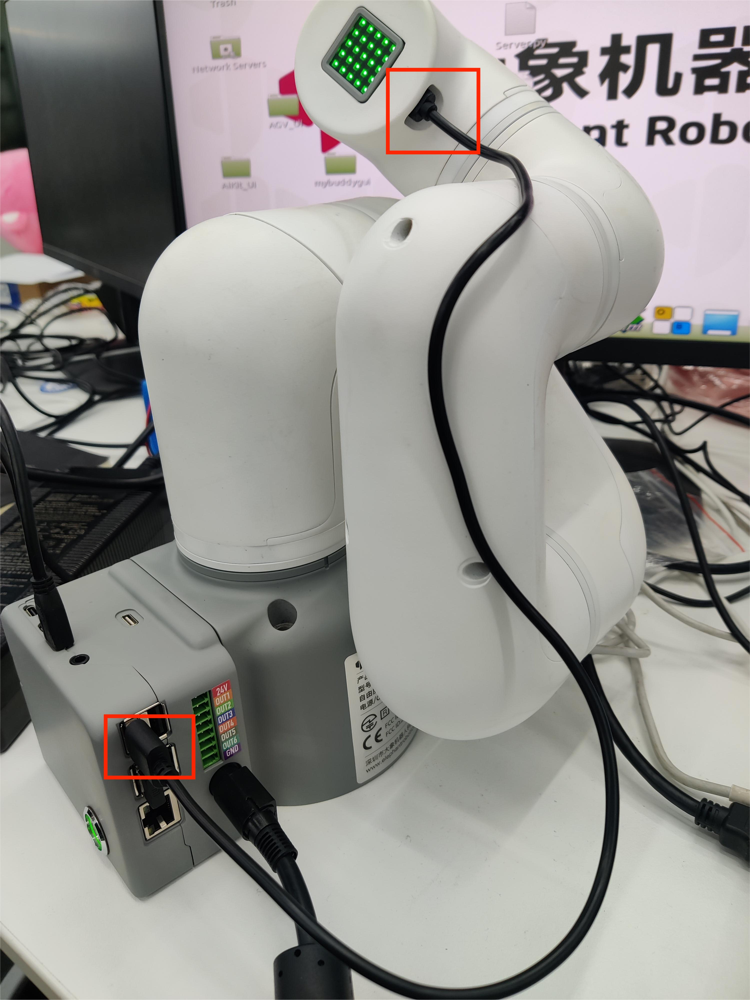
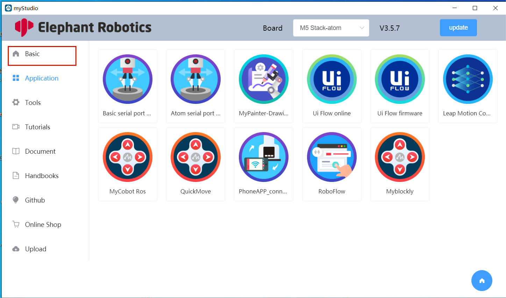
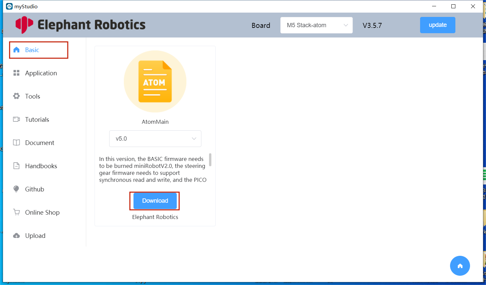
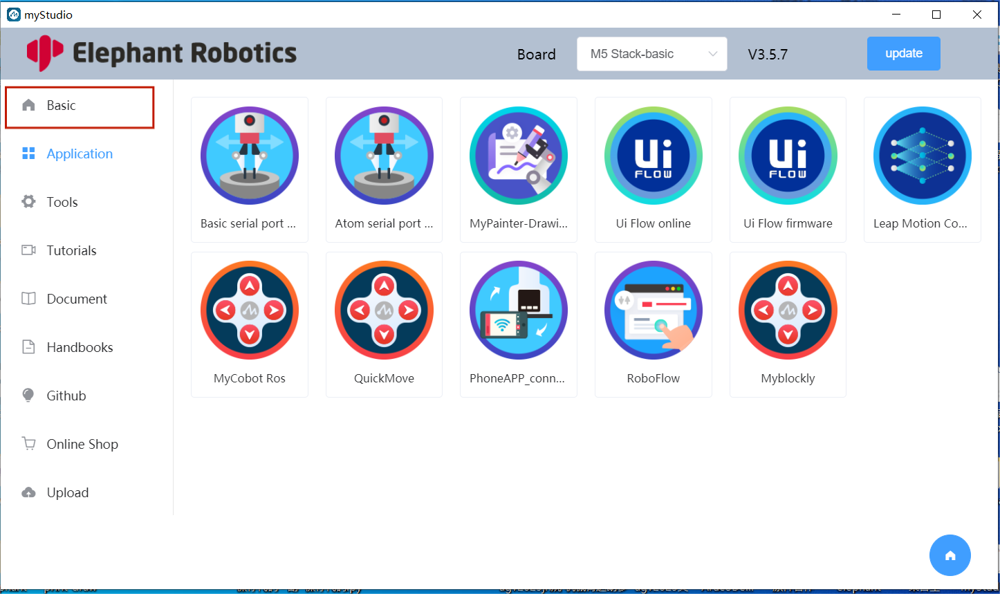

# 3 Burn and update firmware

**[myStudio Video tutorial](https://www.bilibili.com/video/BV1Qr4y1N7B5/)**

## Burn Atom firmware

Step 1:  Connect the Atom at the end with USB.

Step 2 : open myStudio and select Robot `myCobot 320 Pi`

Step 2: Select `ATOM` in the `Board` column, and the Atom firmware will appear in the sidebar `Basic`. There is only one firmware for Atom, just click to `Download` it in.

Step 3:  After download finish, click the `Flash` button to start burn.

### Burning Basic firmware—— picoMain

Step 1: Connect .

​	

Step 2 :Select Robot `myCobot 320 for Pi`,and click `LOGIN` button.

Step 3: After logging in, click `Basic`

Step 4: select picoMain ,after click `Download`    and click `Flash` to burn.

 [← Previous Page](./2-install_driver.md) | [Next Page →](./4-other_function.md)
