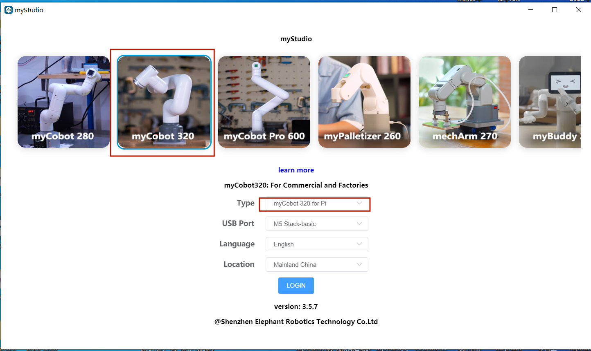

# myStudio

## 1 myStudio design original intention

- myStudio is a one-stop platform for using robots such as myRobot/myCobot.

- It is convenient for users to select different firmware and download it according to their own usage scenarios, while learning relevant teaching materials and browsing tutorial videos online.

## 2 myStudio latest version and supported platforms

- Latest version: V3.5.7

- Available on:

  - Windows
  -  Mac
  -  Linux arm64

## 3 myStudio function

- Burn and update firmware
- Provide robot usage tutorials, such as user manuals, video tutorials, Q&A, etc.
- Information on maintenance and repairs

 [← Previous Section](../../5.2.1-myblockly/320pi/README.md) | [Next Page →](./1-setup.md)