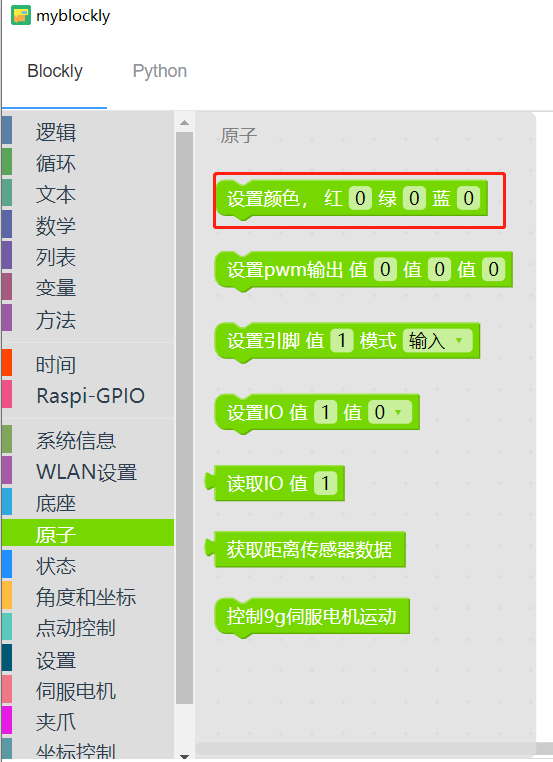

# 2 控制RGB灯板

<i>开始前准备</i>

- 确保机械臂已经连接上电脑

其他系列：确保机器正常

### 本章学习内容

如何使用myBlockly控制RGB灯板

#### API介绍

* 方法模块：`颜色设置`

  

* 参数介绍：

  * 需要设置的参数为 R（`x`）、G（`x`）、 B（`x `），不同的数值代表不同的颜色。

  * 参数范围（具体可以查阅RGB参数表）：

    R：0~255

    G：0~255

    B：0~255

* 目的：控制RGB灯板颜色。

#### 简单演示

* 图形代码如下：

* 实现的内容：

  控制机械臂RGB灯板颜色由“蓝-红-绿”顺序变化，整个过程循环七次。
