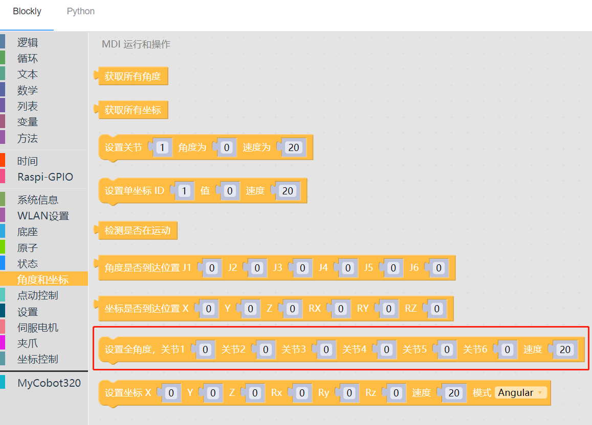
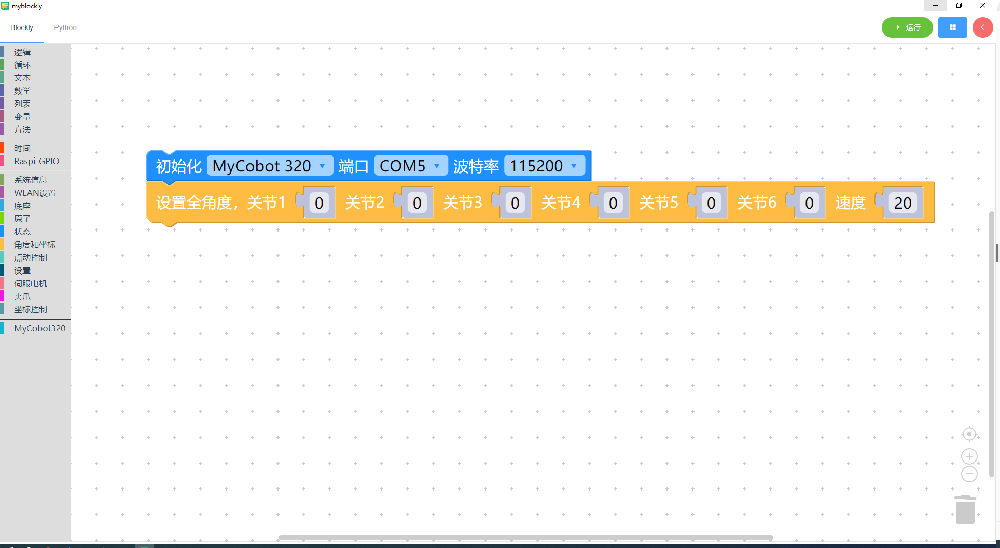

# 3 控制机械臂回到原点

<i>开始前准备</i>

- 确保机械臂已经连接上电脑

其他系列：确保机器正常

### 本章学习内容

如何使用 myBlockly 控制机械臂回到原点

#### API 介绍

- 方法模块：`设置角度`

  

- 参数介绍：

  该模块有两个参数可以调整：

  - 关节角度参数：若使机械臂回到原点，则所有关节角度参数需设置为 0
  - 速度参数：0-100

- 目的：控制机械臂，将机械臂的所有轴的角度回到原点（角度为 0）

#### myCobot

##### 简单演示

- 实现的内容：控制机械臂运动回到原点，让机械臂所有的轴的角度都为 0

---

[← 上一页](4-ControlRGB.md) | [下一页 →](6-ControlSingleJoint.md)
