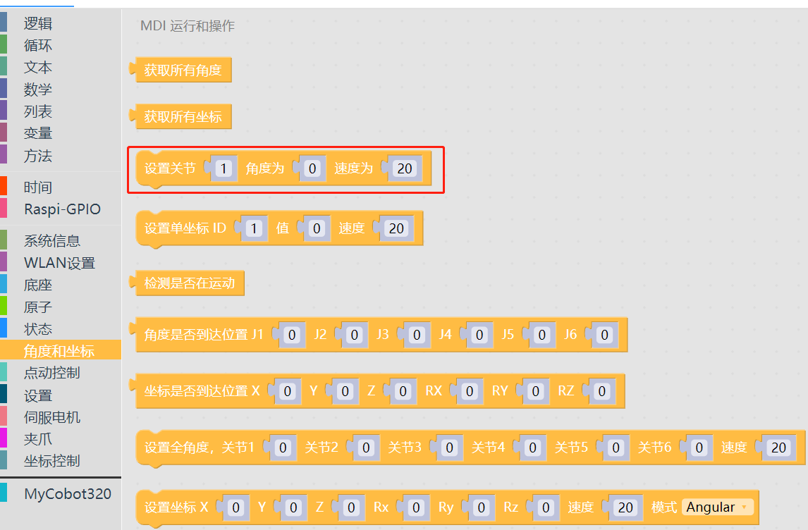
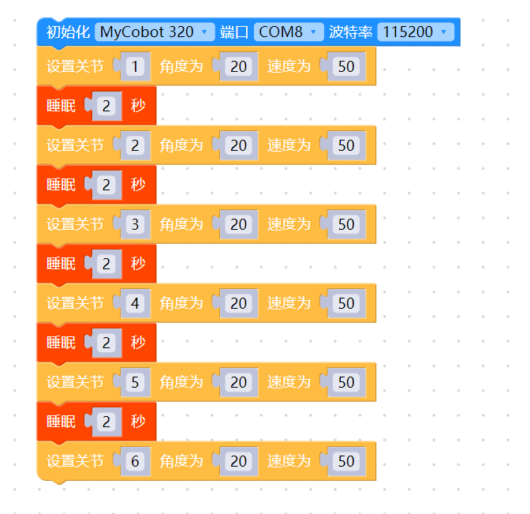

# 4 控制单关节运动

<i>开始前准备</i>

- 确保机械臂已经连接上电脑

其他系列：确保机器正常

### 本章学习内容

如何使用myBlockly，控制机械臂单关节运动

#### API介绍

* 方法模块：`设置关节`

  

* 参数介绍：

  该方法有三个参数可以调整：

  * 关节参数：参数范围为：1-6（对应机械臂的6个关节）；

  - 角度参数：参考对应机型的参数
  - 速度(Speed)：控制机械臂运动的速度，参数范围为：0~100

* 目的：控制机械臂单关节运动

#### 简单演示

* 图形代码如下：

  

* 实现内容：

  控制机械臂关节1以50的速度运行到1关节角度20的位置。1秒后，

  控制机械臂关节2以50的速度移动到2关节角度20的位置，1秒后，

  控制机械臂关节3以50的速度运行到3关节角度20的位置，1秒后，

  控制机械臂关节4以50的速度运行到4关节角度20的位置，1秒后，

  控制机械臂关节5以50的速度运行到5关节角度20的位置，1秒后，
  
  控制机械臂关节6以50的速度运行到6关节角度20的位置
