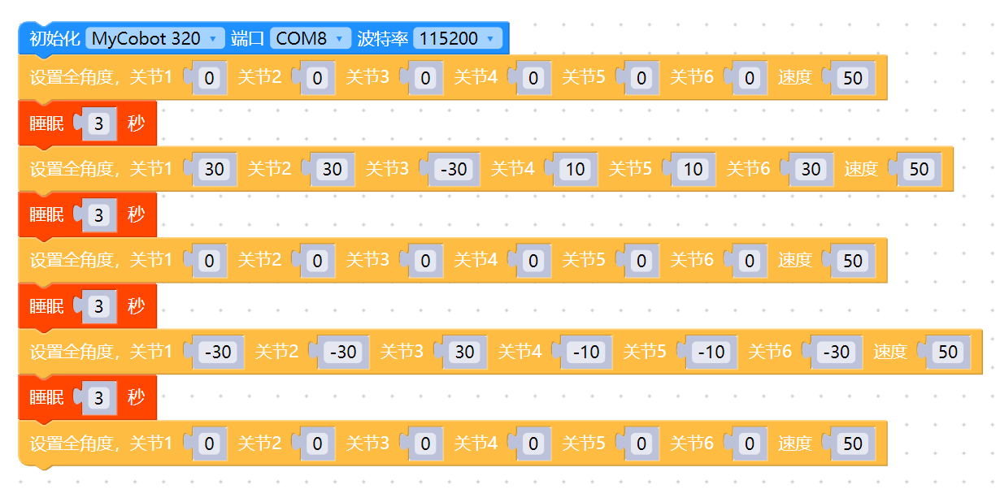

# 5 控制多关节

<i>开始前的准备</i>

- 确保机器已连接电脑

- 确保机器正常

### 本章学习内容

如何使用myBlockly控制机械臂多个关节运动

#### API介绍

* 方法模块：`设置全角度`

  

* 参数介绍：

  该模块有两个参数可以调整：

  * 关节角度参数：可以根据需要在机械臂关节运动范围内设置参数
  * 速度参数：可以根据需要在机械臂运动速度范围设置参数

* 目的：控制机械臂多个关节运动

#### 简单演示

* 图形代码如下：

* 实现内容：

  控制机械臂各关节回原点，三秒后，

  同时控制机械臂1关节、2关节、3关节、4关节、5关节、6关节以50的速度运动到30度、30度、-30度、10度、10度、30度的位置，三秒后，

  机械臂所有关节以50的速度返回原点，三秒后，

  同时控制机械臂1关节、2关节、3关节、4关节、5关节、6关节以50的速度运动到-30度、-30度、30度、-10度、-10度、-30度的位置，三秒后，
  
  控制机械臂各关节回原点
