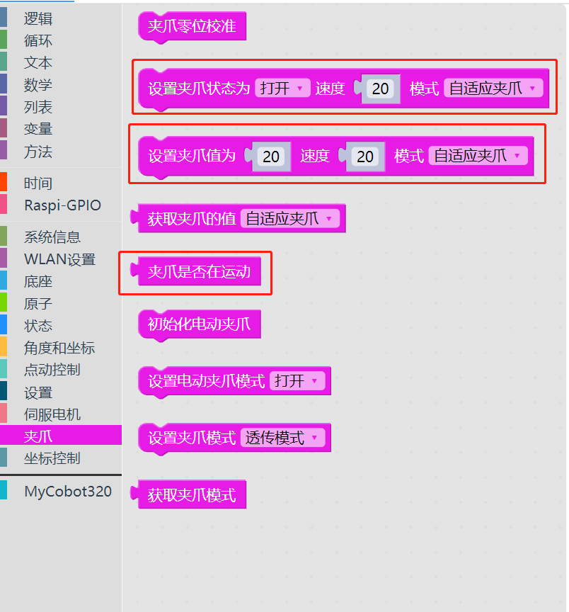
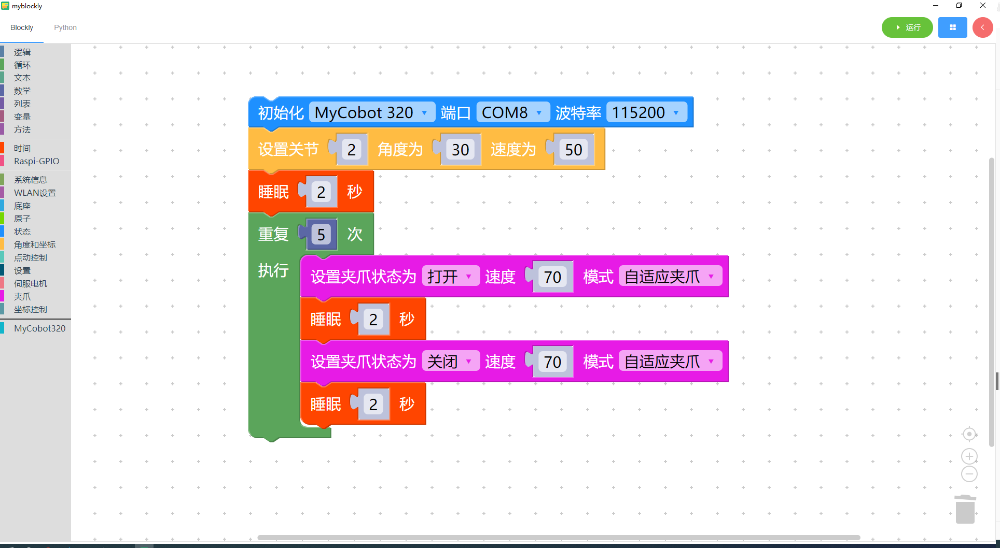

# 8 夹爪的使用

<i>开始前准备</i>

- 确保机械臂已经连接上电脑

其他系列：确保机器正常

夹爪包括自适应夹爪、电动夹爪以及气动夹爪。这里以自适应夹爪，对使用 myBlockly 控制夹爪的方法进行说明。

### 本章学习内容

如何使用 myBlockly 控制 myPalletizer 260 M5Stack 机械臂上连接的自适应夹爪

#### API 展示

- 方法模块**1**：`设置夹爪状态`

  

  参数介绍：

  该模块有两个参数可以调整：

  - 夹爪状态参数：1 表示夹爪合拢状态，0 表示夹爪打开状态
  - 速度参数：表示以多少的速度转动，取值范围 0~100
  - 夹爪类型：可以选择不同的夹爪类型

  目的：使夹爪以指定的速度进入到指定的状态（打开或者闭合）

- 方法模块**2**：`设置夹爪的值`

  

  参数介绍：

  该模块有两个参数可以调整：

  - 夹爪值的参数：表示夹爪所要到达的位置，取值范围 0~100
  - 速度参数：表示以多少的速度转动，取值范围 0~100
  - 夹爪类型：可以选择不同的夹爪类型

  目的： 使夹爪以指定的速度转动到指定的位置

* 方法模块**3**：`夹爪是否在运动`

  

  目的：判断夹爪是否正在运行

#### 简单演示

- 图形代码如下：

- 实现内容：

  把机械臂 2 关节以速度 50 运行至 30 度，过两秒后，

  夹爪以速度 70 打开，过两秒后，

  夹爪以速度 70 关闭，

  夹爪打开闭合的过程循环 5 次后，程序运行结束。

---

[← 上一页](7-ControlSinglesJoint.md) | [下一页 →](9-PumpUse.md)
