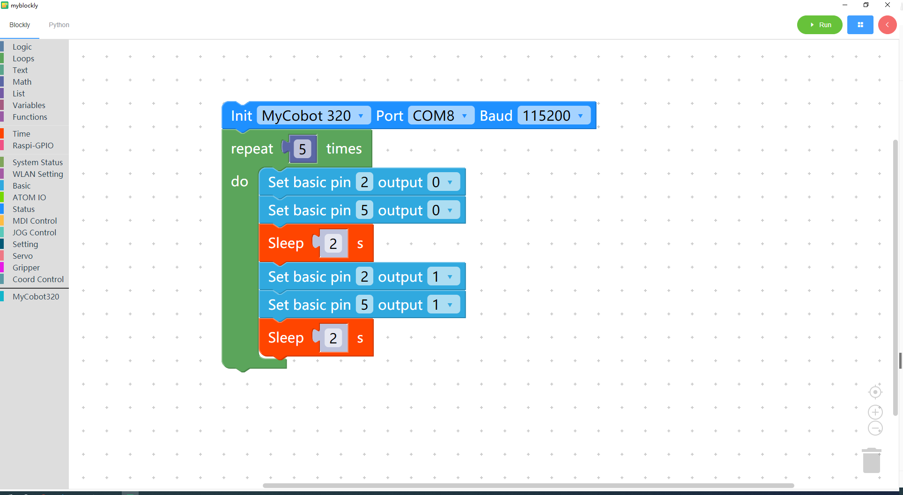

# 9 Use of suction pump

<i>Preparation before you begin</i>

- Make sure the robotic arm is connected to the computer

- Make sure the machine is normal

- Make sure the machine is power on

* ### Learning content of this chapter

  How to use myBlockly to control a suction pump attached to the myCobot 320 M5Stack robotic arm

  #### API display

  - Method module **1**: `Set the bottom pin number status`

  

  

  * Parameter introduction:

    This module has two parameters that can be adjusted:

    * Bottom pin number parameter: the specific pin number at the bottom of the device (only the digital part is taken)
    * Running status parameter: 0 means set to running state, 1 means stopped state

    Purpose: Set the working status of the bottom pin number

#### Simple demonstration

The graphics code is as follows:

* Implementation content:

  The suction pump vibrates and starts working. The suction pump sucks up the object and puts it down after two seconds. After another two seconds, it repeats the previous action until the program ends.
