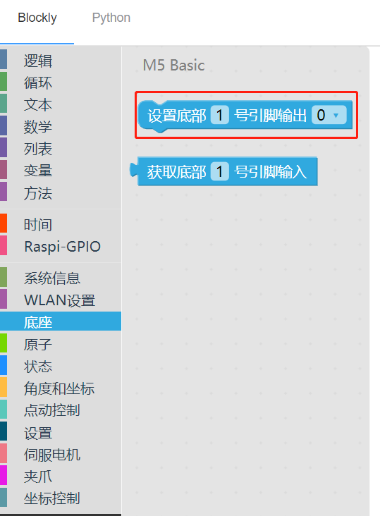

# 9 吸泵的使用

<i>开始前准备</i>

- 确保机械臂已经连接上电脑

- 确保机器正常

### 本章学习内容

如何使用 myBlockly 控制吸泵

#### API 展示

- 方法模块**1**：`设置底部引脚号状态`

  

  

  参数介绍：

  该模块有两个参数可以调整：

  - 底部引脚号参数：设备底部的具体引脚号（仅取数字部分）

  - 运行状态参数：0 表示设置为运行状态，1 表示停止状态

  目的：设置底部引脚号的工作状态

#### 简单演示

图形代码如下：

- 实现内容：

  吸泵发出震动，开始工作。吸泵吸起物体，过两秒后放下，再过两秒后，重复前面动作，直至程序运行结束。

---

[← 上一页](8-GripperUse.md) | [下一页 →](10-Q&A.md)
