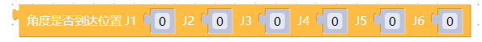
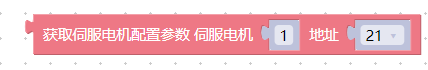

# myblockly 构建模块详解

## 系统信息

### 获取 Basic 固件版本

- **原型**: `get_basic_version()`
- **接口描述**：获取 Basic 固件版本。
- **返回**：返回 Basic 固件版本。

### 获取主控版本信息

- **原型**: `get_system_version()`

- **接口描述**：获取主控版本信息。

- **返回**：返回 Basic 固件版本。

### 获取机器人 id

- **原型**: `get_robot_id()`

- **接口描述**：获取机器人 id。

- **返回**：返回机器人 id。

### 获取机器人 id

- **原型**: `set_robot_id(id)`
- **接口描述**：设置机器人 id。
- **参数**：
  - 机器人 id

## WLAN

### 设置 WLAN 账号密码

- **原型**: `set_ssid_pwd(account,password)`
- **接口描述**：设置 WLAN 账号密码。
- **参数**：
  - wlan 账号
  - wlan 密码

### 获取 WLAN 账号密码

- **原型**: `get_ssid_pwd()`
- **接口描述**：获取 WLAN 账号密码。
- **返回**：
  - wlan 账号
  - wlan 密码

### 设置 WLAN 连接的端口

- **原型**: `set_server_port(port)`
- **接口描述**：设置 WLAN 连接的端口。
- **返回**：
  - 端口号

## 底座

### 设置底座引脚输出

- **原型**: `set_basic_output(id,state)`
- **接口描述**：设置底座引脚输出
- **参数**：
  - 引脚号
  - 选择输出状态

### 获取底座引脚输入

- **原型**: `set_basic_output(id)`
- **接口描述**：获取底座引脚输入
- **返回**：
  - 底座引脚输入状态

## 原子

### 设置颜色

- **原型**: `set_color(r=0,g=0,b=0)`
- **接口描述**：设置末端 LED 灯的颜色。
- **参数**

  - 红

  - 绿

  - 蓝

### 设置 PWM 输出

- **原型**: `set_pwm_output(v1=0,v2=0,v3=0)`
- **接口描述**：设置 PWM 输出。
- **参数**

  - **v1** (_int_)

  - **v2** (_int_)

  - **v3** (_int_)

### 设置末端引脚模式

- **原型**: `set_pin_mode(id,state)`
- **接口描述**：设置末端引脚模式。
- **参数**
  - 引脚号

* 选择模式

### 设置 IO 值

- **原型**: `set_digital_output(id,state)`
- **接口描述**：设置 IO 值
- **参数**

  - io 序号

  - 选择状态 0 或 1

### 读取 IO 值

- **原型**: `get_digital_input(id)`
- **接口描述**：读取 IO 值
- **参数**
  - io 序号

## 状态

### 上电

- **原型**: `power_on()`
- **接口描述**:Atom 开放通信（默认开放）。

### 断电

- **原型**: `power_off()`

- **接口描述**: Atom 关闭通信。

### 检查机械臂是否通电

- **原型**: `is_power_on()`

- **接口描述**: 检查机械臂是否通电。

- **返回**:

  - `1`: power on
  - `0`: power off
  - `-1`: error

### 释放所有关节

- **原型**: `release_all_servos()`
- **接口描述**: 将机器人手臂设置为自由移动模式。

### 设置指令刷新模式

- **原型**: `set_fresh_mode(mode)`
- **接口描述**: 设置指令刷新模式

* **参数**

  - **mode**:
    `Refresh Sport` - 始终首先执行最新的命令.
    `Interpolation` - 以队列的形式顺序执行指令.

### 获取指令刷新模式

- **原型**: `get_fresh_mode()`
- **接口描述**: 获取指令刷新模式

  - **返回**
    - 1 - 始终首先执行最新的命令。
    - 0 - 以队列的形式顺序执行指令。

### 获取机器人错误信息。

- **原型**: `get_error_information()`

- **接口描述**: 获取机器人错误信息。

- **返回**:

  - `0`: 没有错误.
  - `1 ~ 6`: 对应关节超出极限位置.
  - `32`: 运动学逆解无解.
  - `33 ~ 34`: 直线运动没有邻接解.

### 清除机器人错误消息

- **原型**: `clear_error_information()`
- **接口描述**: 清除机器人错误消息。

### 检查 Atom 是否已连接

- **原型**: `is_controller_connected()`
- **接口描述**: 检查 Atom 是否已连接
- **返回**：
  - 0：未连接
  - 1：已连接

### 设置自由模式

- **原型**: `set_free_mode(state)`
- **接口描述**: 是否设置成自由模式
- **参数**：
  - **state**(int)：0 | 1

### 检查是否是自由模式

- **原型**: `is_free_mode()`
- **接口描述**: 检查是否是自由模式
- **返回值**：
  - **state**(int)：0 | 1

## 角度和坐标

### 获取所有角度

- **原型**: `get_angles()`
- **接口描述**: 获取所有关节的度数。
- **返回**：
  - 机器所有关节角度值

### 获取所有坐标

- **原型**: `get_coords()`
- **接口描述**: 获取机器笛卡尔坐标。
- **返回**：
  - 笛卡尔坐标值

### 设置单关节角度

- **原型**: `send_angle(id, degree, speed)`

- **接口描述**: 机器人单关节角度控制。

- **参数**

  - 关节 id：1-6
  - 角度值
  - 速度

### 设置单坐标

- **原型**: `send_coord(id, value, speed)`

- **接口描述**: 机器人单坐标控制。

- **参数**
  - 坐标：1-6 对应 x y z rx ry rz
  - 坐标值
  - 速度

### 检测是否在运动

- **原型**: `is_moving(id, value, speed)`
- **接口描述**: 检测机器是否在运动。
- **返回**：
  - 0 ：机器不处于运动状态
  - 1：机器在运动。

### 角度是否到达位置

- **原型**: `is_in_position([j1,j2,j3,j4,j5,j6],0)`

- **接口描述**: 检查机器角度是否到达指定的位置

- **参数**：

  - j1 角度值

  - j2 角度值

  - j3 角度值

  - j4 角度值

  - j5 角度值

  - j6 角度值

- **返回**：
  - 0 ：未到达指定位置
  - 1：到达指定位置

### 角度是否到达位置

- **原型**: `is_in_position([x,y,z,rx,ry,rz],1)`

- **接口描述**: 检查机器角度是否到达指定的位置

- **参数**：

  - x 坐标值

  - y 坐标值

  - z 坐标值

  - rx 坐标值

  - ry 坐标值

  - rz 坐标值

- **返回**：
  - 0 ：未到达指定位置
  - 1：到达指定位置

### 设置全坐标

- **原型**: `send_angles(angles, speed)`

- **接口描述**: 将所有角度发送到机器人手臂.

- **参数**
  - `angles`: 坐标值列表(`List[float]`).
  - `speed`: (`int`) 0 ~ 100

### 设置全角度

- **原型**: `send_coords(coords, speed, mode)`

- **接口描述**: 将所有坐标发送到机器人手臂.

- **参数**

  - `coords`: 坐标值列表(`List[float]`).
  - `speed`: (`int`) 0 ~ 100
  - `mode`: (`int`): `0` - angular（默认）, `1` - linear

## 点动控制

### 点动控制关节

- **原型**: `jog_angle(joint_id, direction, speed)`

- **接口描述**: Jog control angle

- **Parameters**

  - `joint_id`: (`int`) 1 ~ 6
  - `direction`: `0` - decrease, `1` - increase
  - `speed`: 0 ~ 100

### 点动控制坐标

- **原型**: `jog_coord(coord_id, direction, speed)`

- **接口描述**: Jog control coord.

- **Parameters**

  - `coord_id`: (`int`) 1 ~ 6
  - `direction`: `0` - decrease, `1` - increase
  - `speed`: 0 ~ 100

### 关节绝对控制

- **原型**: `jog_absolue(coord_id, direction, speed)`

- **接口描述**: Step mode.

- **Parameters**

  - `coord_id`: (`int`) 1 ~ 6
  - `direction`:
  - `speed`: 0 ~ 100

### 步进模式

- **原型**: `jog_increment(coord_id, direction, speed)`

- **接口描述**: Step mode.

- **Parameters**

  - `coord_id`: (`int`) 1 ~ 6
  - `direction`:
  - `speed`: 0 ~ 100

### 停止点动运动

- **原型**: `jog_stop()`

- **接口描述**: Stop jog moving.

### 暂停

- **原型**: `pause()`

- **接口描述**: Pause movement.

### 恢复

- **原型**: `resume()`

- **接口描述**: Recovery movement.

### 停止

- **原型**: `stop()`

- **接口描述**: Stop moving.

### is_paused

- **原型**: `is_paused()`

- **接口描述**: Judge whether the manipulator pauses or not.

- **返回**: :

  - `1` - paused
  - `0` - not paused
  - `-1` - error

### 设置伺服电机编码值

- **原型**: `set_encoder(joint_id, encoder)`

- **接口描述**: Set a single joint rotation to the specified potential value.

- **Parameters**

  - `joint_id`: (`int`) 1 ~ 6
  - `encoder`: 0 ~ 4096

### 获取伺服电机编码值

- **原型**: `get_encoder(joint_id)`

- **接口描述**:Obtain the specified joint potential value.

- **Parameters**: `joint_id`: (`int`) 1 ~ 6

- **返回**: `encoder`: 0 ~ 4096

## 设置

### get_speed

- **原型**: `get_speed()`

- **接口描述**: Get speed.

- **返回**: speed: (`int`)

### set_speed

- **原型**: `set_speed(speed)`

- **接口描述**: Set speed.

- **Parameters**: speed: (`int`) 0 ~ 100

### set_joint_min

- **原型**: `set_joint_min(id, angle)`
- **接口描述**: Sets the minimum angle for the specified joint.

- **Parameters**:
  - `id`: (`int`) joint id 1-6.
  - `angle`: 0 - 180.

### set_joint_max

- **原型**: `set_joint_max(id, angle)`
- **接口描述**: Sets the maximum angle of the specified joint.

- **Parameters**:
  - `id`: (`int`) joint id 1-6.
  - `angle`: 0 - 180.

### get_joint_min_angle

- **原型**: `get_joint_min_angle()`
- **接口描述**: Gets the minimum movement angle of the specified joint

- **Parameters**: `joint_id`: (`int`)

- **返回**: angle value (`float`)

### get_joint_max_angle

- **原型**: `get_joint_max_angle()`
- **接口描述**: Gets the maximum movement angle of the specified joint
- **Parameters**: `joint_id`: (`int`)
- **返回**: angle value (`float`)

## Servo control

### is_servo_enable

- **原型**: `is_servo_enable(servo_id)`

- **接口描述**: Determine whether all steering gears are connected

- **Parameters**: `servo_id` (`int`) 1 ~ 6

- **返回**:

  - `0`: disable
  - `1`: enable
  - `-1`: error

### is_all_servo_enable

- **原型**: `is_all_servo_enable()`

- **接口描述**: Determine whether the specified steering gear is connected

- **返回**:

  - `0`: disable
  - `1`: enable
  - `-1`: error

### set_servo_data

- **原型**: `set_servo_data(servo_no, data_id, value)`
- **接口描述**: Set the data parameters of the specified address of the steering gear.

- **Parameters**:
  - `servo_no`: Serial number of articulated steering gear, 1 - 6.
  - `data_id`: Data address.
  - `value`: 0 - 4096

### get_servo_data

- **原型**: `get_servo_data(servo_no, data_id)`
- **接口描述**: Read the data parameter of the specified address of the steering gear.

- **Parameters**:

  - `servo_no`: Serial number of articulated steering gear, 1 - 6.
  - `data_id`: Data address.

- **返回**: `value`: 0 - 4096

  - `0`: disable
  - `1`: enable
  - `-1`: error

### set_servo_calibration

- **原型**: `set_servo_calibration(servo_no)`
- **接口描述**: The current position of the calibration joint actuator is the angle zero point, and the corresponding potential value is 2048.

- **Parameters**:
  - `servo_no`: Serial number of articulated steering gear, 1 - 6.

### release_servo

- **原型**: `release_servo(servo_id)`

- **接口描述**: Power off designated servo

- **Parameters**: `servo_id`: 1 ~ 6

### focus_servo

- **原型**: `focus_servo(servo_id)`
- **接口描述**: Power on designated servo
- **Parameters**: `servo_id`: 1 ~ 6

## 夹爪

### set_gripper_calibration

- **原型**: `set_gripper_calibration()`
- **接口描述**: Set the current position to zero, set current position value is `2048`.

### set_gripper_state

- **原型**: `set_gripper_state(flag, speed, mode)`

- **接口描述**: Set gripper switch state

- **Parameters**

  - `flag` (`int`): 0 - open, 1 - close
  - `speed` (`int`): 0 ~ 100
  - `mode`:gripper

### set_gripper_value

- **原型**: `set_gripper_value(value, speed, mode)`

- **接口描述**: Set gripper value

- **Parameters**

  - `value` (int): 0 ~ 100
  - `speed` (int): 0 ~ 100
  - `mode`:gripper

### get_gripper_value

- **原型**: `get_gripper_value(mode)`
- **接口描述**: Get gripper value
- **Return**: gripper value (int)

### is_gripper_moving

- **原型**: `is_gripper_moving()`

- **接口描述**: Judge whether the gripper is moving or not

- **返回**:

  - `0` : not moving
  - `1` : is moving
  - `-1`: error data

### Init Eletric Gripper

- **原型**: `init_eletric_gripper()`
- **接口描述**:Init Eletric Gripper

### Set Eletric Gripper

- **原型**: `set_eletric_gripper()`
- **接口描述**:Init Eletric Gripper
- **Parameters**

  - 选择打开或关闭

### set_gripper_mode

- **原型**: `set_gripper_mode(status)`

- **接口描述**: Set gripper mode.

- **Parameters**
- `status` (`int`): 0 - transparent transmission. 1 - Port Mode.

### get_gripper_mode

- **原型**: `get_gripper_mode()`

- **接口描述**: Get gripper mode.

- **Return**

  - `status` (`int`): 0 - transparent transmission. 1 - Port Mode.

## 坐标控制

### get_tool_reference

- **原型**: `get_tool_reference()`

- **接口描述**: Get tool coordinate system.

- **Return**: `list` [x, y, z, rx, ry, rz].

### set_tool_reference

- **原型**: `set_tool_reference(coords)`

- **接口描述**: Set tool coordinate system.

- **Parameters**:
  - `coords`: (`list`) [x, y, z, rx, ry, rz].

### get_world_reference

- **原型**: `get_world_reference()`
- **接口描述**: Get world coordinate system.
- **Return**: `list` [x, y, z, rx, ry, rz].

### set_world_reference

- **原型**: `set_world_reference(coords)`

- **接口描述**: Set world coordinate system.

- **Parameters**:
  - `coords`: (`list`) [x, y, z, rx, ry, rz].

### get_reference_frame

- **原型**: `get_reference_frame()`

- **接口描述**: Get base coordinate system.

- **Return**: 0 - base 1 - tool.

### set_reference_frame

- **原型**: `set_reference_frame(rftype)`

- **接口描述**: Set base coordinate system.

- **Parameters**:
  - `rftype`: 0 - base 1 - tool.

### get_movement_type

- **原型**: `get_movement_type()`
- **接口描述**: Get movement type.
- **Return**: 1 - movel, 0 - moveJ.

### set_movement_type

- **原型**: `set_movement_type(move_type)`

- **接口描述**: Set movement type.

- **Parameters**:
  - `move_type`: 1 - movel, 0 - moveJ.

### get_end_type

- **原型**: `get_end_type()`
- **接口描述**: Get end coordinate system.
- **Return**: 0 - flange, 1 - tool.

### set_end_type

- **原型**: `set_end_type(end)`

- **接口描述**: Set end coordinate system.

- **Parameters**:
  - `end`: 0 - flange, 1 - tool.

## MyCobot320

### get_servo_speeds

- **原型**: `get_servo_speeds()`

- **接口描述**: Get joint velocity.

- **Return**: `list` Speed of each joint.

### get_servo_currents

- **原型**: `get_servo_currents()`

- **接口描述**: Get joint current.

- **Return**: `list` Current of each joint.

### get_servo_voltages

- **原型**: `get_servo_voltages()`

- **接口描述**: Get joint voltage.

- **Return**: `list` Voltage of each joint.

### get_servo_status

- **原型**: `get_servo_status()`

- **接口描述**: Get the state of each joint.

- **Return**: `list` the state of each joint.

### get_servo_temps

- **原型**: `get_servo_temps()`

- **接口描述**: Get the temperature of each joint.

- **Return**: `list` temperature of each joint.

---

[← 上一节](../320pi/9-PumpUse.md) | [基础功能页面 →](../../../../5-BasicApplication/README_PI.md)
