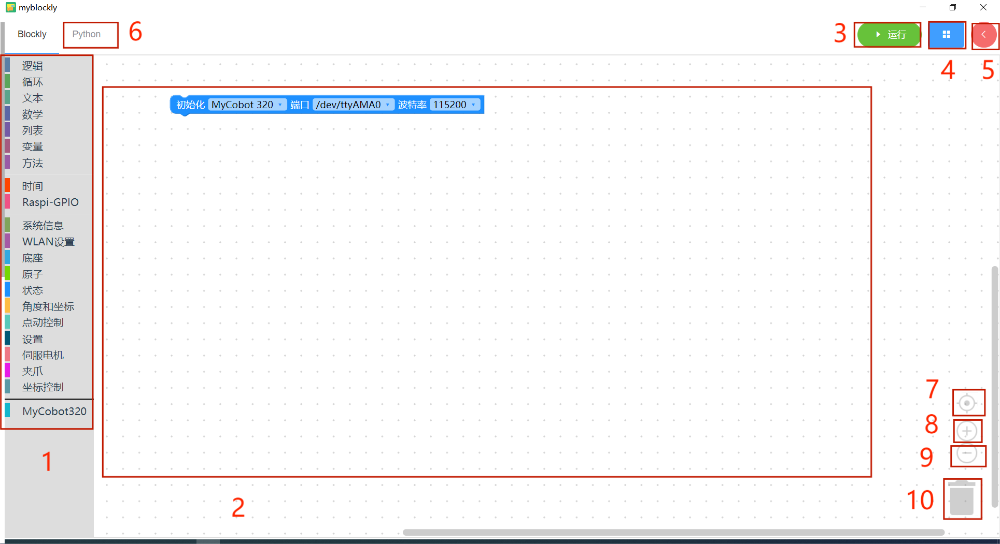
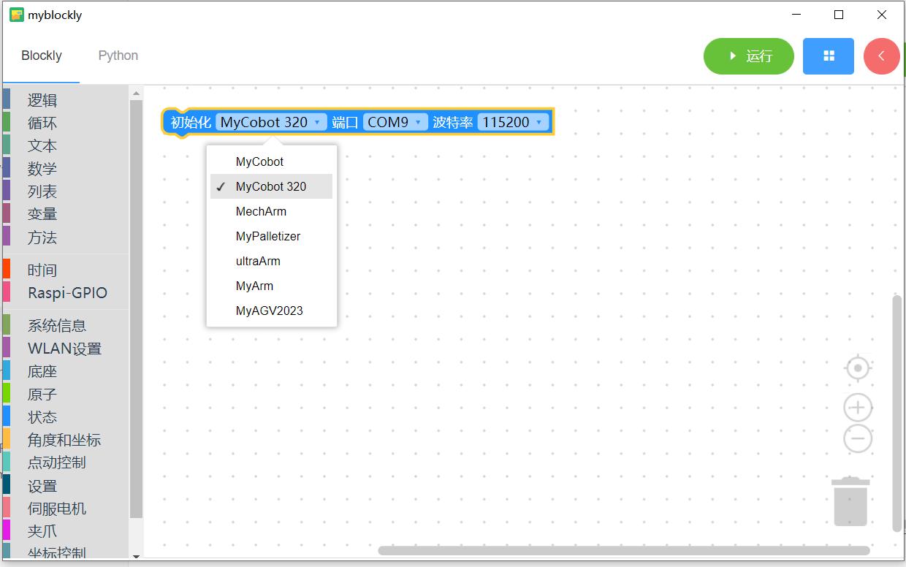

# **myBlockly 界面展示及基础功能的使用**

| **序号** | **说明**                                                                                                                            |
| :------- | :---------------------------------------------------------------------------------------------------------------------------------- |
| 1        | 工具箱栏：点击其中的具体分类可以选择不同的积木块                                                                                    |
| 2        | 工作区：可以将工具箱的积木块拖动到工作区使用                                                                                        |
| 3        | 运行按钮：运行工作区中的代码                                                                                                        |
| 4        | 点击后会弹出下述菜单：  - 保存：保存当前工作区  - 加载：加载已保存的工作区  - 设置：进入设置页面，可以设置语言和主题 |
| 5        | 点击后会弹出控制面板。在面板通过 点击关节控制或坐标控制栏中的“+/-”可以快速控制机械臂移动                                            |
| 6        | 点击后可以查看工作区生成的 python 代码                                                                                              |
| 7        | 工作区居中                                                                                                                          |
| 8        | 放大工作区                                                                                                                          |
| 9        | 缩小工作区                                                                                                                          |
| 10       | 垃圾桶：将工作区中的积木块拖动到此处可以删除积木块；同时点击垃圾桶可以查看和恢复已删除的积木块                                      |

## **程序运行**

正式开始编程使用前，一定要选择对应的**机器型号**，否则容易造成硬件损害。

这里我们选择机型为 `myCobot 320` ，波特率为`115200`

### 小案例

我们用积木块来实现这样一个小案例：让机械臂回到零点，然后一关节移动 30 度。

- 点击工具箱中的`角度和坐标`分类，选中`设置全角度`积木块拖动到工作区

- 点击工具箱中的`时间`分类，选中`睡眠积木块`积木块拖动到工作区；鼠标点击输入框，并将该积木块的输入值改为`5`

- 再次点击工具箱中的`角度和坐标`分类，选中`设置全角度`积木块拖动到工作区；同时将`关节1`的输入值改为 30

- 点击左上角“Python”选项可以查阅对应的 Python 代码，如下图所示。

- 点击`运行`按钮 可以运行代码，观察机械臂运动。

- 程序运行中

- 程序运行结束

- 点击运行弹窗右上角 `x`按钮关闭弹出窗

**注意**：

- 操作机械臂运动的程序是需要时间来完成的，所以在一个动作之后需要接上一个`睡眠`模块，给机械臂运动的时间再进行下一个运动。（自己因情况决定所需的时间，机械臂默认设定跑 myBlockly 最低的睡眠时间不低于 0.5s）否则会导致机械臂无法达到理想的运动。

- 当程序无法运行的时候请检查小工具栏是否断开链接（如下图所示）。

  

  

**控制面板的使用**

用控制面板控制机器时，一定要选择对应的**机器型号**，否则容易造成硬件损害，

这里我们选择机型为 `myCobot 320` ，当前串口为`COM8`,波特率为`115200`

- 选择好机型和波特后点击`打开`按钮，即可连接机械臂

- 读取角度和坐标

  - 点击读取角度按钮，可以读取到机器角度值
  - 点击读取坐标按钮，可以读取到机器坐标值

  - 这里的 J1 至 J6 代表机器的 6 个关节
  - X、Y、Z、RX、RY、RZ 代表机器的笛卡尔坐标

  - 可以通过鼠标点击、长按` -``+ `按钮以及修改数值的方式来控制机械臂关节的运动

## **程序保存和载入**

myBlockly 的程序以\*.json 格式保存，点击界面右上角蓝色方框，出现“保存”选项点击后，即可保存程序。

同样点击蓝色方框，点击”加载“选项，可以导入已保存的程序。

---

[← 上一页](../320pi/2-install_uninstall.md) | [下一页 →](../320pi/4-ControlRGB.md)
