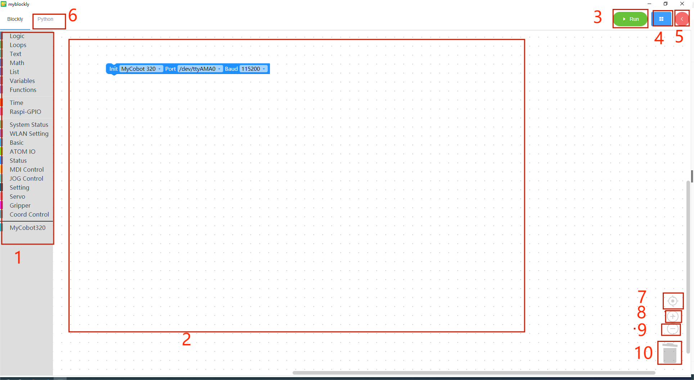

# 3 myBlockly interface display and use of basic functions

| serial number | illustrate                                                   |
| :------------ | ------------------------------------------------------------ |
| 1             | Toolbox bar: Click on a specific category to select different building blocks |
| 2             | Workspace: You can drag the building blocks of the toolbox to the workspace for use |
| 3             | Run button: Run the code in the workspace                    |
| 4             | The following menu will pop up after clicking:  - Save: Save the current workspace  - Load: Load the saved workspace  - Settings: Enter the settings page, where you can set the language and theme |
| 5             | After clicking, the control panel will pop up. In the panel, you can quickly control the movement of the robotic arm by clicking "+/-" in the joint control or coordinate control bar. 6 After clicking, you can view the python code generated in the workspace. 7 Center the workspace. 8 Enlarge the workspace. 9 Reduce the workspace. |
| 6             | Click to view the python code generated by the workspace     |
| 7             | Center the workspace                                         |
| 8             | Zoom into workspace                                          |
| 9             | Reduce work area                                             |
| 10            | Trash can: Drag the building blocks in the workspace here to delete the building blocks; click the trash can at the same time to view and restore the deleted building blocks |

## **Program running**

Before officially starting programming, be sure to select the corresponding **machine model**, otherwise it will easily cause hardware damage.

First connect `myCobot 320 Pi` to our computer through `USB data cable`, then we select the initialization model as `myCobot 320`, the port connected to my computer is `COM8`, and the baud rate is `115200`

#### small case

We use building blocks to implement such a small case: let the robotic arm return to the zero point, and then move a joint 30 degrees.

- Click the `MDI Control` category in the toolbox, select the `Set Angle` building block and drag it to the workspace

- Click the `Time` category in the toolbox, select the `Sleep` building block and drag it to the workspace; click the mouse on the input box and change the input value of the building block to `5`

- Click the `MDI Control` category in the toolbox again, select the `Set Angle` building block and drag it to the workspace; at the same time, change the input value of `J1` to 30

  

  

- Click the "Python" option in the upper left corner to view the corresponding Python code, as shown in the figure below.

- Click the `Run` button to run the code and observe the movement of the robotic arm.

- Program is running

  

- The program ends

  

- Click the `x` button in the upper right corner of the run pop-up window to close the pop-up window

**Notice**:

- The program to operate the robot arm takes time to complete, so a `sleep' module needs to be connected after one action to give the robot arm time to move before proceeding with the next movement. (You decide the time required based on the situation. By default, the robotic arm is set to run myBlockly for a minimum sleep time of no less than 0.5 seconds.) Otherwise, the robotic arm will not be able to achieve the ideal movement.

**Using the control panel**

When using the control panel to control the machine, be sure to select the corresponding **machine model**, otherwise it will easily cause hardware damage.

Here we choose the Robot `myCobot 320` ,`Port` is `COM8`,and the baud rate `115200`

After selecting the model and port, click the `Open` button to connect the robotic arm.

Read angles and coordinates

- Click the read angle button to read the machine angle value

- Click the Read Coordinates button to read the machine coordinates

You can control the movement of the robot arm joints by clicking the mouse, long pressing the `-/+` button, and modifying the values.

## **Program saving and loading**

MyBlockly's program is saved in *.json format. Click the blue box in the upper right corner of the interface. When the "Save" option appears, click it to save the program.

Also click the blue box and click the "Load" option to import the saved program.

