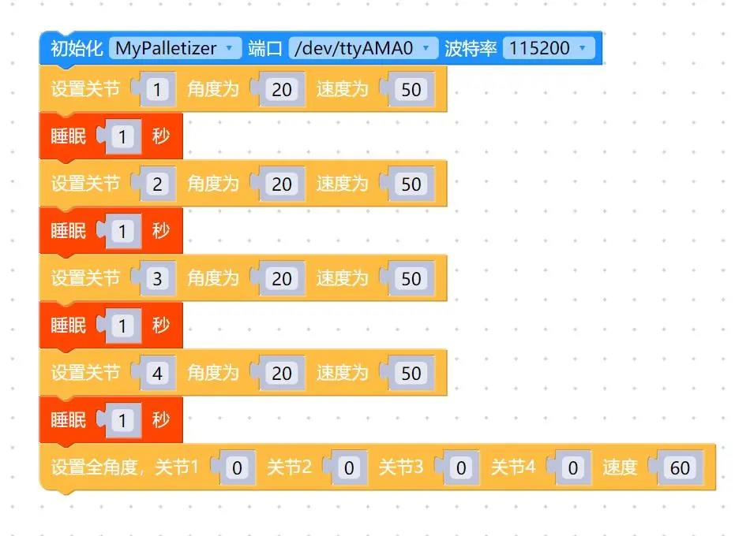

# 控制单关节运动

<i>开始前准备</i>

- 确保机械臂已经连接上电脑

- 确保机器正常

- 确保机器已接通电源

## 本章学习内容

如何使用 myBlockly，控制机械臂单关节运动

### API 介绍

- 方法模块：`设置关节`

- 参数介绍：

  该方法有三个参数可以调整：

  - 关节参数：参数范围为：1-6（对应机械臂的 6 个关节）；

  - 角度参数：参考对应机型的参数（**[产品介绍](https://docs.elephantrobotics.com/docs/gitbook/2-serialproduct/2-buy.html)**）
  - 速度(Speed)：控制机械臂运动的速度，参数范围为：0~100

- 目的：控制机械臂单关节运动

### 简单演示

- 图形代码如下：

  

- 实现内容：

  控制机械臂 1 关节，以速度 50 运行到 1 关节角度 20 的位置，过一秒后，

  控制机械臂 2 关节，以速度 50 运行到 2 关节角度 20 的位置，过一秒后，

  控制机械臂 3 关节，以速度 50 运行到 3 关节角度 20 的位置，过一秒后，

  控制机械臂 4 关节，以速度 50 运行到 4 关节角度 20 的位置，过一秒后，

  将机械臂所有关节以速度 60 回到原点，结束程序。

---

[← 上一节](../320pi/5-ControlRoboticArmBackZero.md) | [下一节 →](../320pi/7-ControlSinglesJoint.md)
