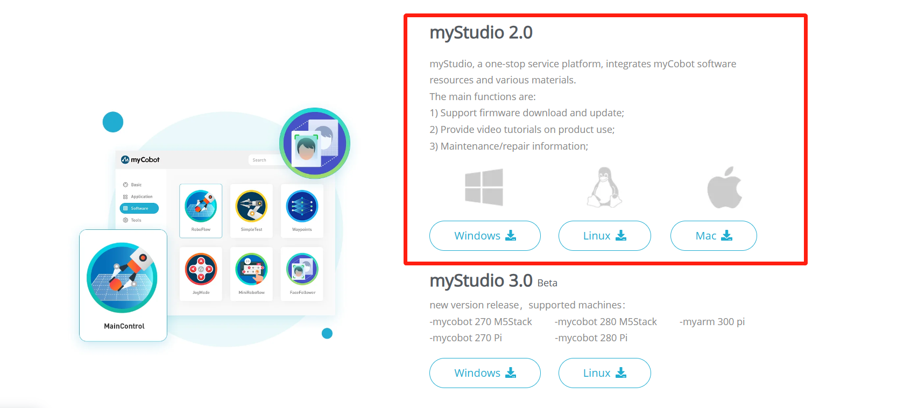

# 1 myStudio 环境搭建

## myStudio 下载

> 注意：myStudio 安装时的安装路径不能有任何空格

下载地址：

**1. [GitHub 地址](https://github.com/elephantrobotics/myStudio)**

- 进入下载地址后，点击右侧`myStudio`，选择相应版本下载即可。

- 不同后缀代表了适用于不同的系统，请下载相应版本：
  - \*.AppImage —— Linux 系统
  - \*.dmg —— Mac 系统
  - \*.exe —— Window 系统

**2. [官网地址](https://www.elephantrobotics.com/download/)**

依据电脑系统自行选择下载`myStudio 2.0`即可。

## 安装

### 对于 Linux 系统安装 myStudio

从官网下载 Linux 版本的 myStudio 可得到一个如下图的安装包

选中`myStudio-latest.AppImage`鼠标右键打开，点击`Properties`打开

点击 进入`Permissions`

`Permissions` 页内勾选`Allow executing file as program`, 后可点击`Close`按钮关闭弹窗

关闭弹窗后 鼠标双击 安装包 `myStudio-latest.AppImage` 即可打开 myStudio

#### 对于 Windows 系统安装 myStudio

双击打开名为`Mystudio_Setup_latest.exe`的文件，然后单击`Run`

点击 `下一步`

点击`安装`后，等待 myStudio 安装完成

安装完成，点击`完成`按钮打开并运行 myStudio

### 对于 Mac 系统安装 myStudio

从官网下载 Mac 版本的 myblockly 可得到一个如下图的安装包，鼠标双击打开即可

**注意**：对于 MacOS，在安装之前确保系统 "偏好设置->安全性和隐私->通用" ，并允许从 App Store 和被认可的开发者。

## 卸载

### 对于 Linux 系统 卸载 myStudio

**直接删除安装包即可**

> 安装包默认名为 `myStudio-latest.AppImage`

### 对于 Mac 系统卸载 myStudio

**在应用程序中将 myStudio 移至 废纸篓 即可 **

### 对于 Windows 系统卸载 myStudio

进入 myStudio 的文件目录，点击运行`Uninstall myStudio.exe`

点击 `下一步`

myblockly 已卸载，点击`完成`退出

## 更新

**在 myStudio 中您可以点击`Update`按钮进行更新**

---

[← 上一页](README.md) | [下一页 →](2-install_driver.md)
