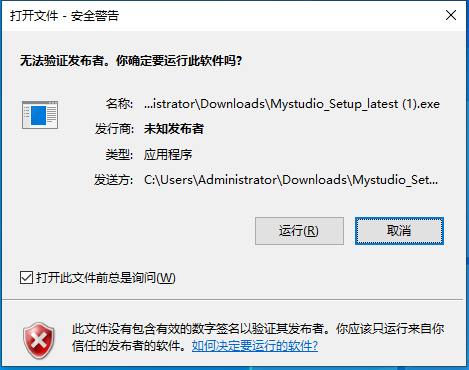

# 1 myStudio environment setup

## Download

>Note: The installation path when installing myStudio cannot have any spaces.

download link:

**1. [GitHub](https://github.com/elephantrobotics/myStudio)**

* After entering the download address, click on `myStudio` on the right and select the corresponding version to download.

* Different suffixes represent different systems, please download the corresponding version:

  - *.AppImage - Linux system

  * *.dmg - Mac system
  * *.exe - Window system

**2. [Official website address](https://www.elephantrobotics.com/download/)**

You can choose to download `myStudio 2.0` according to your computer system.

## Install

### For Linux  install myStudio

Download the Linux version of myStudio from the official website to get an installation package as shown below

Select `myStudio-latest.AppImage` with the right mouse button to open it, click `Properties` to open it

Click to enter `Permissions`

In the `Permissions` page, check `Allow executing file as program`, and then click the `Close` button to close the pop-up window

After closing the pop-up window, double-click the installation package `myStudio-latest.AppImage` to open myStudio

#### For Windows install myStudio

Double-click to open the file named`Mystudio_Setup_latest.exe`,and click to `Run`

click `Next>`

After clicking `Install`, wait for myStudio installation to complete

The installation is complete, click the `Finish` button to open and run myStudio

### For MacOS install myStudio

Download the Mac version of myblockly from the official website to get an installation package as shown below. Double-click to open it.

**Note**: For MacOS, make sure system "Preferences->Security & Privacy->General" and Allow Apps from App Store and Recognized Developers are enabled before installing.

## Uninstall

### For Linux systems uninstall myStudio

**Just delete the installation package directly**

>The default name of the installation package is `myStudio-latest.AppImage`

### Uninstall myStudio for Mac

**Just move myStudio to the Trash in the app**

### Uninstall myStudio for Windows systems

Enter the file directory of myStudio and click to run `Uninstall myStudio.exe`

Click `Next>`

myblockly has been uninstalled, click `Finish` to exit

## Update

**In myStudio you can click the `Update` button to update**

