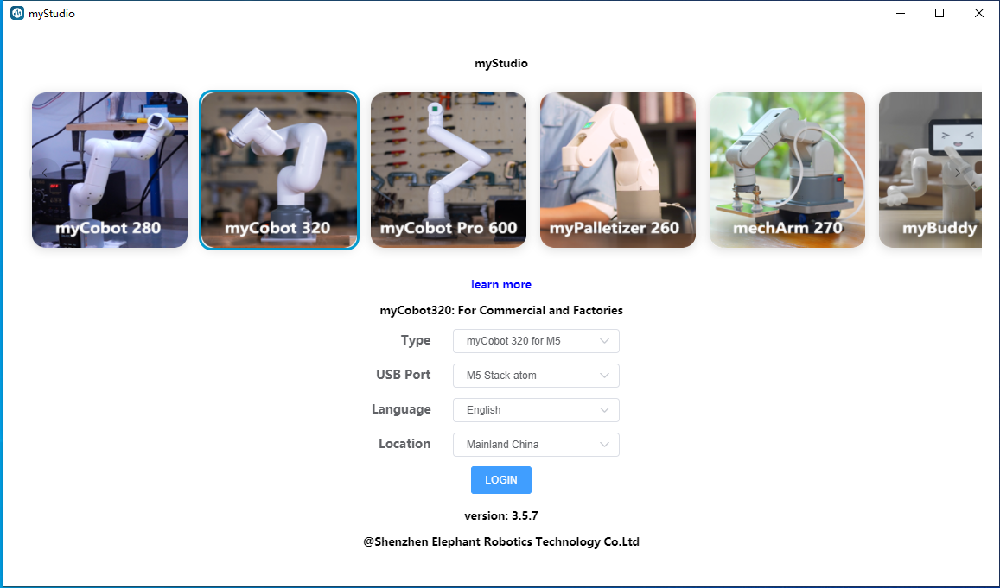
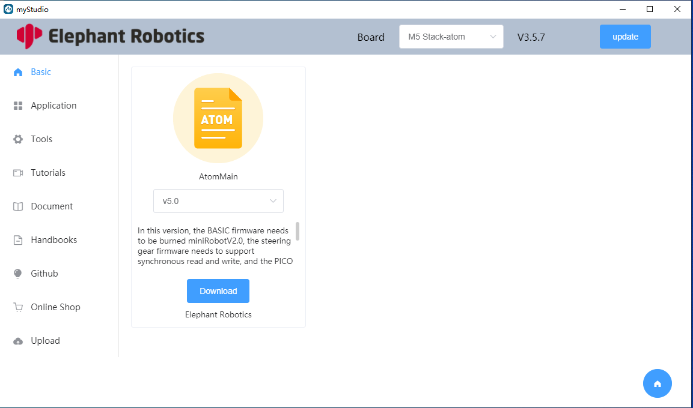
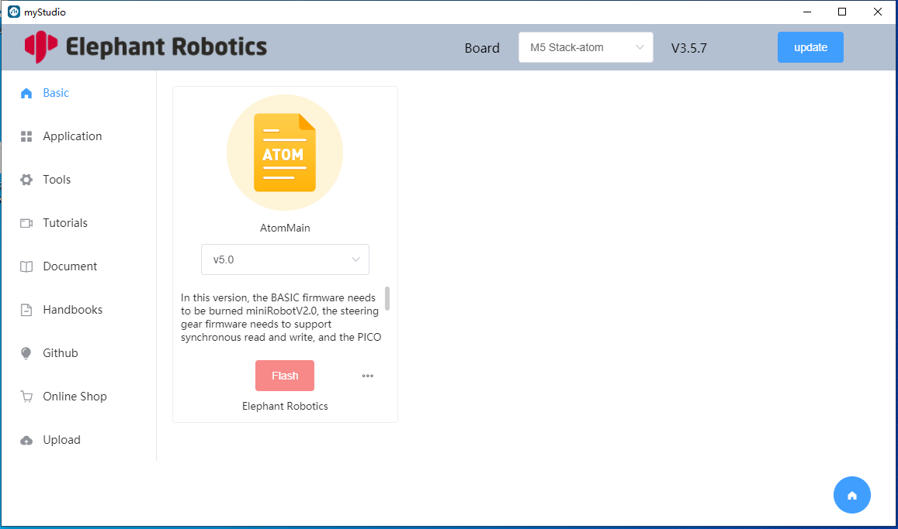
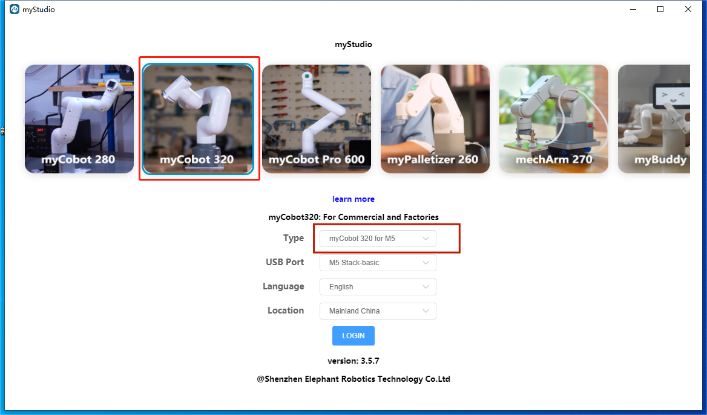
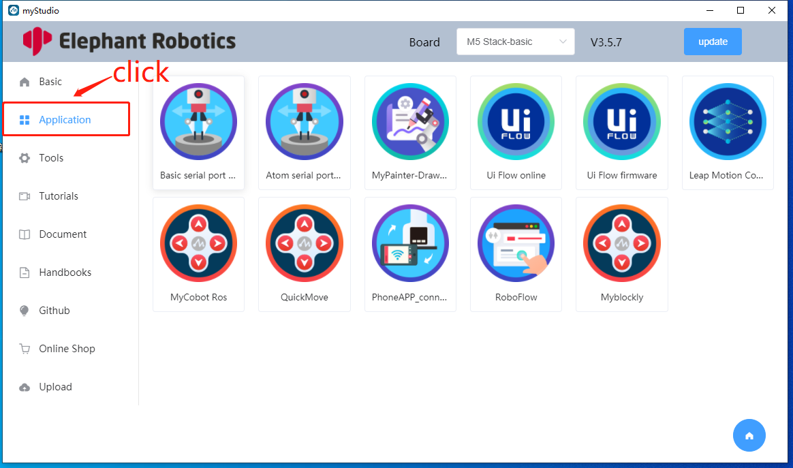

# 2 Burn and update firmware

**[myStudio Video tutorial](https://www.bilibili.com/video/BV1Qr4y1N7B5/)**

## Burn Atom firmware

Step 1: Connect to PC. Connect the Atom at the end with USB.

Step 2 :Select Robot `myCobot 320 M5`

Step 2: Select `ATOM` in the `Board` column, and the Atom firmware will appear in the sidebar `Basic`. There is only one firmware for Atom, just click to `Download` it in.

Step 3:  After download finish, click the `Flash` button to start burn.

### Burning M5Stack-Basic firmware——minirobot

Step 1: Connect M5Stack-Basic to PC.

​	

Step 2 :Select Robot `myCobot 320 for M5`,and click `LOGIN` button.

Step 3: After logging in, click `Basic`

Step 4: select minirobot ,after click `Download`    and click `Flash` to burn.

### Burn pico firmware——picoMain

Step 1: Connect M5Stack-Basic to PC.

Step 2: Select Flash mode in the robot arm base (you can choose to press the `UP` key once or the `Down` key four times), and then the base will sleep with a black screen for about 30 seconds.

Step 3: Enter the myStudio firmware burning page and select picoMain firmware burning.

> **Note: To burn the pico firmware, you need to select Flash mode, that is, to burn in the sleep state. If the sleep time is exceeded, the base display will restart and then burning the pico firmware will fail. Step 2: Step 2 :Select Robot `myCobot 320 for M5`,and click `LOGIN` button.
>
> - Select Robot `myCobot 320 for M5`,and click `LOGIN` button.
>
> 
>
> 
>
> 
>
> -  After logging in, click `Basic`
>   
>
> 
>
> - select picoMain ,after click `Download`    and click `Flash` to burn.
>
> 
>
> 

