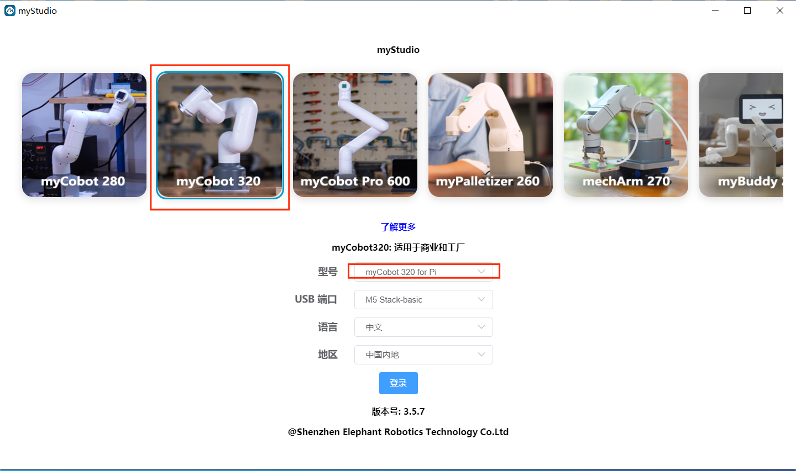

# myStudio

## 1 myStudio设计初衷

- myStudio是一个一站式的myRobot/myCobot等机器人的使用平台。

- 方便用户根据自己的使用场景，选择不同的固件并进行下载，同时学习相关的教材，在线浏览教程视频。

## 2 myStudio最新版本与支持平台

- 最新版本：V3.4.1

- 适用于：Windows、Mac、Linux

## 3 myStudio功能

- 烧录、更新固件
- 提供机器人使用教程，如用户手册、视频教程、Q&A等
- 维护和维修方面的信息

