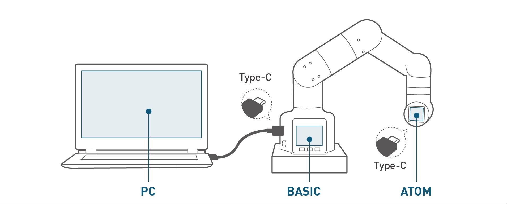

# 基础功能使用

|  | **本章主要解释产品的基本功能用法和基本软件的使用。本章至关重要，应仔细阅读。在实际应用机器人之前，请确保正确理解所述操作。** |
| -------------------------------------------------------------------------------------------------------------- | ---------------------------------------------------------------------------------------------------------------------------- |

针对 myCobot 系列产品，我们推出了专门用于机器人应用和维护的软件，供用户使用。其中，miniRoboflow、myBlockly 和 myStudio 是用户使用机器人的必备工具。本章将详细介绍这三款软件的使用方法。

## 功能说明

myCobot 320 机器人由三个控制器部件组成：Basic（底座上带有按钮的小屏幕，PI 版本没有）、Pico（底座上平面 Type-C 接口内的芯片）和 Atom（机器人末端执行器上的 LED 灯板）。

基本控制器负责处理外部交互，将数据转换为机器人可以识别的信息。因此，您可以通过 Basic Type-C 端口使用 USB 线路连接电脑。（在屏幕左侧）。

Pico 控制器管理机器人运动算法、关节控制和底部 IO 控制。（正常使用时无需连接）。

Atom 控制器负责处理来自工具接口和 IO 控制的数据信息。这三个组件共同协作，确保机器人正常运行。（正常使用时无需连接）。

## 小节跳转

- [5.1 系统使用说明](./5.1-SystemUsageInstructions/320pi/5.1-SystemUsageInstructions.md) 
  本节介绍开发之前所要具备掌握的 Linux 操作系统基础知识，远程连接系统的网络配置和提供刷镜像系统操作的使用说明。

- 5.2 软件使用说明  
  本节说明机器内置提供的软件（myBlockly、myStudio），并且提供使用要求、软件更新和卸载的使用教程，提供软件用户界面的介绍和使用教程，并且说明使用场景。

  - [myBlockly](./5.2-ApplicationUse/myblockly/320pi/README.md)
  - [myStudio](./5.2-ApplicationUse/mystudio/320pi/README.md)

- [5.3 固件功能说明](./5.3-FirmwareUse/pi/1-firmware.md)   
  本节提供固件更新日表格，说明改动后的提升效果，提供刷写固件的使用教程。

---

[← 上一章](../4-FirstInstallAndUse/4.1-Pi/4.1_320_PI_firstUse.md) | [下一章 →](../6-SDKDevelopment/README.md)
