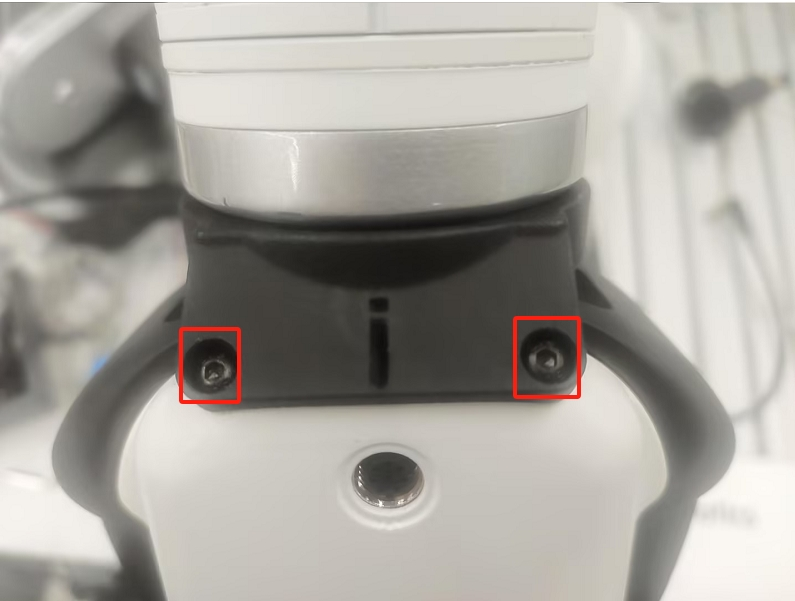
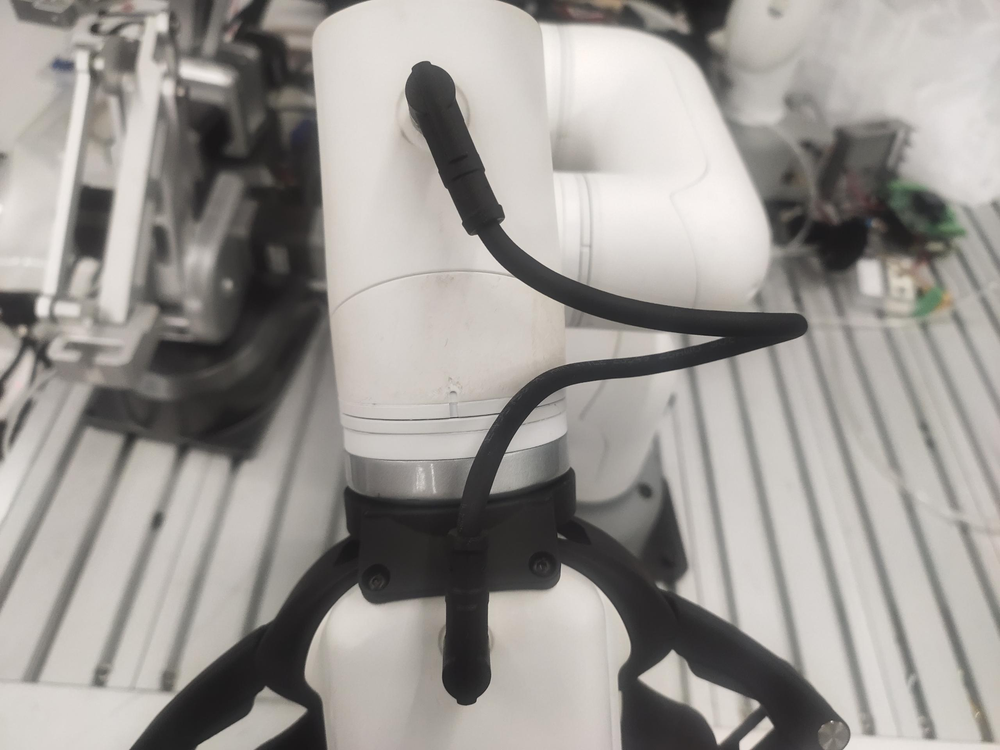

# Robot gripper carrying wood block example

## 1 Functional description
The robot will use the gripper to carry the wood block from point A to point B

## 2 Hardware installation
First install the gripper flange to the end of the robot arm


Then install the gripper on the gripper flange




Then use the gripper cable to connect the gripper box to the end IO of the robot arm. When connecting, be sure to turn off the power of the robot arm first to avoid hot plugging and damage to the gripper.


## 3 Gripper test
Run the following program, the gripper will repeat the action of closing and opening twice
```python
from pymycobot import MyCobot,utils
import time
arm=MyCobot(utils.get_port_list()[0])

if __name__=="__main__":
    arm.set_gripper_mode(0)# Set the gripper to transparent mode
    for i in range(2):
        arm.set_gripper_state(1,100)# Gripper closed
        time.sleep(1)
        arm.set_gripper_state(0,100)# Gripper open
        time.sleep(1)
```
## 4 Software Usage
Use the fast movement function of myblockly to teach the grabbing point and placement point of the wooden block, and record the position information. After teaching, you need to disconnect the serial port connection, otherwise the serial port will be reported when running the python script.


## 5 Composite Applications
```python
from pymycobot import MyCobot,utils
import time

init_angles=[-3.25, -2.46, -95.09, 9.22, 86.39, 93.33]#6 joint angles at the initial position
grab_point=[214.5, -189.9, 185.5, -177.5, 1.91, 173.49]#Coordinates of the grab point
place_point=[214.5, -50.9, 185.5, -177.5, 1.91, 173.49]#Coordinates of the placement point

arm=MyCobot(utils.get_port_list()[0])

if __name__=="__main__":
    arm.set_gripper_state(0,100)#Open the gripper first 
    time.sleep(1) 
    arm.send_angles(init_angles,100)#Move to the initial position
    time.sleep(2)
    arm.send_coords([grab_point[0],grab_point[1],grab_point[2]+70,grab_point[3],grab_point[4],grab_point[5]],100,1)#Move to 70mm above the grab point
    time.sleep(2)
    arm.send_coords([grab_point[0],grab_point[1],grab_point[2],grab_point[3],grab_point[4],grab_point[5]],100,1)#Move to the grab point
    time.sleep(2)
    arm.set_gripper_state(1,100)#Gripper closed
    time.sleep(1)
    arm.send_coords([grab_point[0],grab_point[1],grab_point[2]+70,grab_point[3],grab_point[4],grab_point[5]],100,1)#Move to 70mm above the grab point
    time.sleep(2)
    
    arm.send_coords([place_point[0],place_point[1],place_point[2]+70,place_point[3],place_point[4],place_point[5]],100,1)#Move to 70mm above the placement point
    time.sleep(2)
    arm.send_coords([place_point[0],place_point[1],place_point[2],place_point[3],place_point[4],place_point[5]],100,1)#Move to the placement point
    time.sleep(2)
    arm.set_gripper_state(0,100)#Gripper open
    time.sleep(1)
    arm.send_coords([place_point[0],place_point[1],place_point[2]+70,place_point[3],place_point[4],place_point[5]],100,1)#Move to 70mm above the placement point
    time.sleep(2)
```
## 6 Effect display
