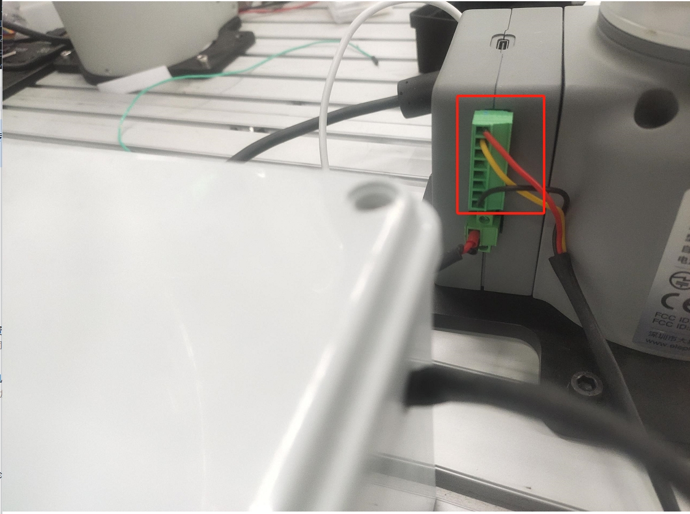
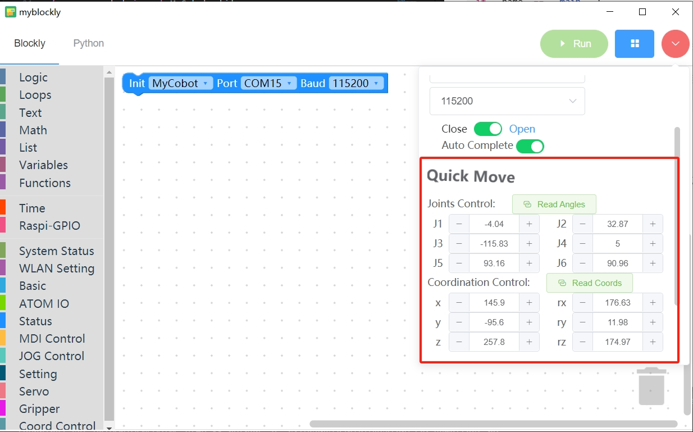

# 机器人吸泵搬运木块案例

## 1 功能说明
机器人会使用吸泵将木块从A点搬运到B点

## 2 硬件安装
先将吸泵安装到机械臂的末端上


然后将吸泵控制盒的线接到机械臂的底座IO上


## 3 吸泵测试
运行下面程序，吸泵会重复2次打开关闭的动作
```python
from pymycobot import MyCobot,utils
import time
arm=MyCobot(utils.get_port_list()[0])
for i in range(2):
    arm.set_basic_output(1,0)#OUT1输出打开
    time.sleep(2)
    arm.set_basic_output(1,1)#OUT1输出关闭
    time.sleep(2)

```
## 4 软件使用
利用myblockly的快速移动功能，对木块的抓取点和放置点进行示教，并且记录下位置信息,示教完后，需要断开串口的连接，否则会在运行python脚本时，报串口被占用的错误


## 5 复合应用
```python
from pymycobot import MyCobot,utils
import time

init_angles=[-3.25, -2.46, -95.09, 9.22, 86.39, 93.33]#初始位置的6个关节角度
grab_point=[196.9, -197.1, 124.5, -178.8, 1.25, 173.32]#抓取点的坐标
place_point=[196.9, -97.1, 124.5, -178.8, 1.25, 173.32]#放置点的坐标

arm=MyCobot(utils.get_port_list()[0])
if __name__=="__main__":    
    arm.set_basic_output(1,1)#先关闭吸泵 
    time.sleep(1)  
    arm.send_angles(init_angles,100)#运动初始位置
    time.sleep(2)
    arm.send_coords([grab_point[0],grab_point[1],grab_point[2]+70,grab_point[3],grab_point[4],grab_point[5]],100,1)#运动到抓取点上方70mm
    time.sleep(2)
    arm.send_coords([grab_point[0],grab_point[1],grab_point[2],grab_point[3],grab_point[4],grab_point[5]],100,1)#运动到抓取点
    time.sleep(2)
    arm.set_basic_output(1,0) #打开吸泵
    time.sleep(1)
    arm.send_coords([grab_point[0],grab_point[1],grab_point[2]+70,grab_point[3],grab_point[4],grab_point[5]],100,1)#运动到抓取点上方70mm
    time.sleep(2)

    arm.send_coords([place_point[0],place_point[1],place_point[2]+70,place_point[3],place_point[4],place_point[5]],100,1)#运动到放置点上方70mm
    time.sleep(2)
    arm.send_coords([place_point[0],place_point[1],place_point[2],place_point[3],place_point[4],place_point[5]],100,1)#运动到放置点
    time.sleep(2)
    arm.set_basic_output(1,1) #关闭吸泵
    time.sleep(1)
    arm.send_coords([place_point[0],place_point[1],place_point[2]+70,place_point[3],place_point[4],place_point[5]],100,1)#运动到放置点上方70mm
    time.sleep(2)
```
## 6 效果展示

