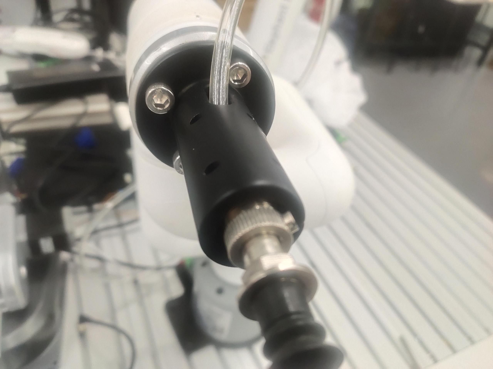
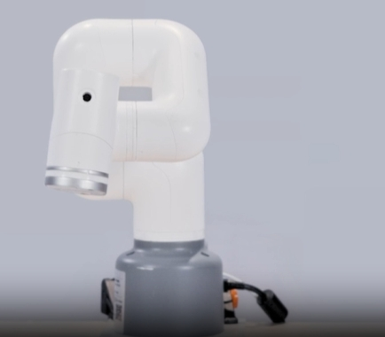
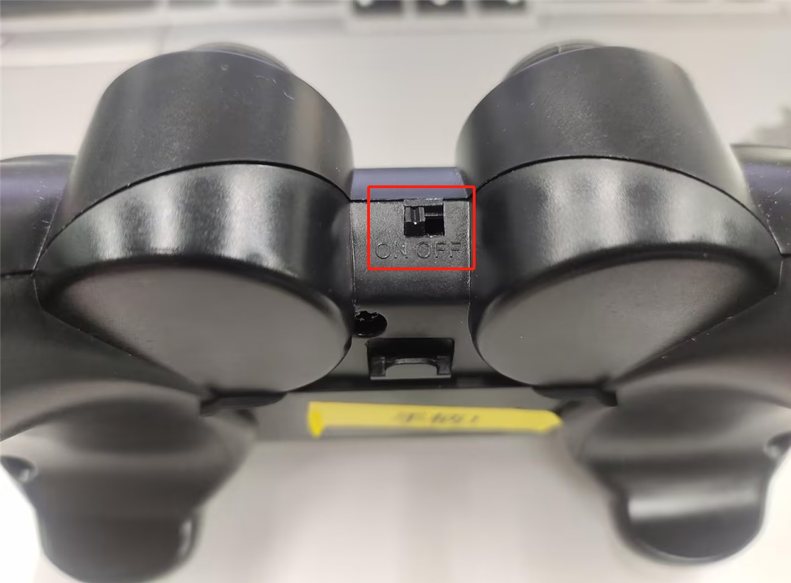
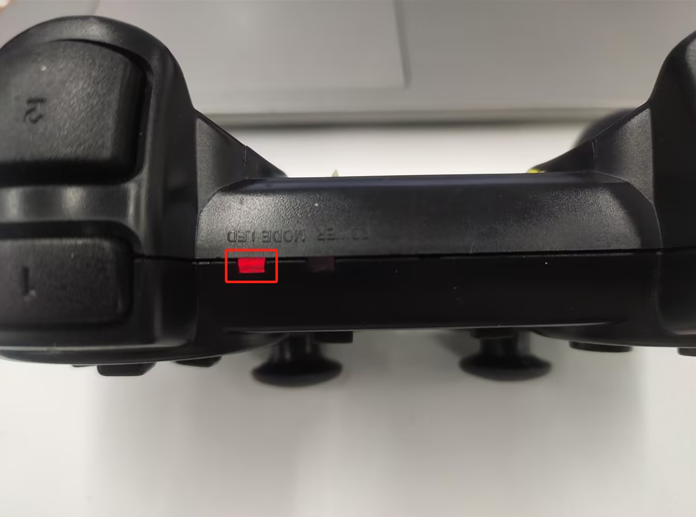
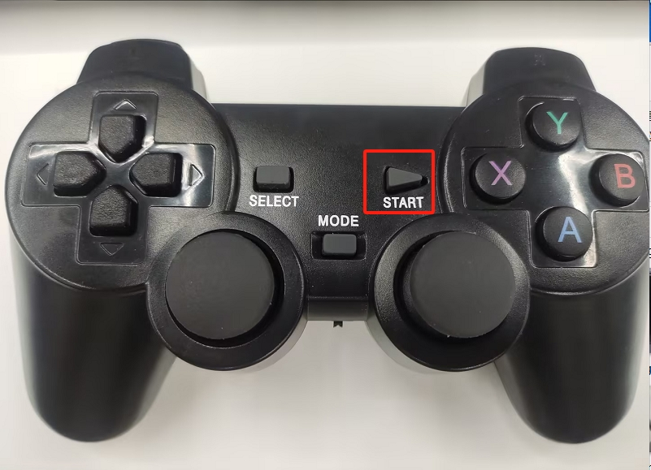

# 320PI 手柄遥控案例

**功能说明**：使用游戏手柄控制机器人进行坐标运动和吸泵开关

## 1 吸泵安装
先将吸泵安装到机械臂的末端上



然后将吸泵控制盒的线接到机械臂的底座IO上


## 2 吸泵测试
```python
from pymycobot import MyCobot,utils
import time
arm=MyCobot(utils.get_port_list()[0])
for i in range(1):
    arm.set_basic_output(1,0)#打开吸泵
    time.sleep(2)
    arm.set_basic_output(1,1)#关闭吸泵
    time.sleep(2)
```

## 3 手柄功能说明
**注意**：手柄需要单独购买，详情请咨询官方客服


将手柄的接收器插到电脑上

|按键|功能|
|---|---|
|按住方向键↑|RY正方向运动|
|按住方向键↓|RY负方向运动|
|按住方向键←|RX正方向运动|
|按住方向键→|RX负方向运动|
|推动左摇杆↑|X正方向运动|
|推动左摇杆↓|X负方向运动|
|推动左摇杆←|Y正方向运动|
|推动左摇杆→|Y负方向运动|
|推动右摇杆↑|Z正方向运动|
|推动右摇杆↓|Z负方向运动|
|推动右摇杆←|RZ正方向运动|
|推动右摇杆→|RZ负方向运动|
|按下Y键|打开吸泵|
|按下A键|关闭吸泵|

**注意事项**：部分手柄按键并未使用到，因此不会对机械臂产生任何效果

## 4 手柄依赖库安装
打开终端，输入下面命令，进行手柄驱动库安装
```bash
pip install pygame
```
## 5 准备工作
将机械臂调成下图姿态，机械臂周围不要有杂物，避免发生碰撞




将手柄的开关打开



注意手柄的MODE LED有没有亮



**注意**：只有MODE LED亮灯，才可以控制机械臂，如果手柄长时间不使用会进入待机状态，可以按一下手柄的START按键进行激活




## 5 案例程序
```python
import pygame
import sys
from pymycobot import MyCobot,utils
mc=MyCobot(utils.get_port_list()[0])
init_angles=[0, 0, -90, 0, 90, 0]
mc.sync_send_angles(init_angles,50)
pygame.init()
pygame.joystick.init()
button_pressed = False
hat_pressed=False
previous_state = [0,0,0,0,0,0] 

def joy_handler():
        global button_pressed
        global hat_pressed
        global previous_state
        if event.type == pygame.JOYAXISMOTION:
            axis = event.axis  
            value = round(event.value, 2)  
            if abs(value) > 0.1:  
                flag = True
                previous_state[axis] = value  
                if axis==0 and value==-1.00:
                    mc.jog_coord(2,1,50)
                elif axis==0 and value==1.00:
                    mc.jog_coord(2,0,50)
                if axis==1 and value==1.00:
                    mc.jog_coord(1,0,50)
                elif axis==1 and value==-1.00:
                    mc.jog_coord(1,1,50)
                if axis==3 and value==1.00:
                    mc.jog_coord(6,1,50)
                elif axis==3 and value==-1.00:
                    mc.jog_coord(6,0,50)                    
                if axis==4 and value==1.00:
                    mc.jog_coord(3,0,50)
                elif axis==4 and value==-1.00:
                    mc.jog_coord(3,1,50)
            else:
                if previous_state[axis] != 0:  
                    mc.stop()
                    previous_state[axis] = 0  

        if event.type == pygame.JOYBUTTONDOWN:
            if joystick.get_button(3)==1:
                mc.set_basic_output(1,0)
            if joystick.get_button(0)==1:
                mc.set_basic_output(1,1)
                    
        if event.type == pygame.JOYHATMOTION:
            hat_value = joystick.get_hat(0) 
            if hat_value ==(0,-1):
                mc.jog_coord(5,1,50)
            elif hat_value ==(0,1):
                mc.jog_coord(5,0,50)
            elif hat_value ==(-1,0):
                mc.jog_coord(4,0,50)
            elif hat_value ==(1,0):
                mc.jog_coord(4,1,50)
            if hat_value != (0, 0):
                hat_pressed = True
            else:
                if hat_pressed:  
                    mc.stop()
                    hat_pressed = False  

if pygame.joystick.get_count() > 0:
    joystick = pygame.joystick.Joystick(0) 
    joystick.init()
else:
    print("没有检测到手柄")
    pygame.quit()
    sys.exit()
running = True
while running:
    for event in pygame.event.get():
        if event.type == pygame.QUIT:
            running = False       
        joy_handler()
pygame.quit()
```

# 6 效果展示

